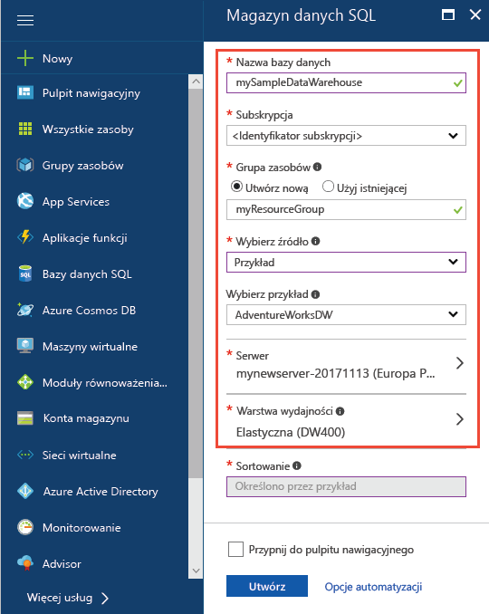
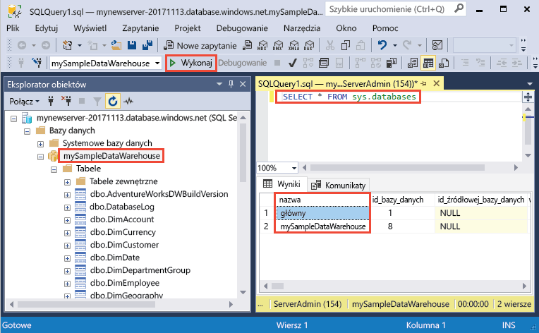
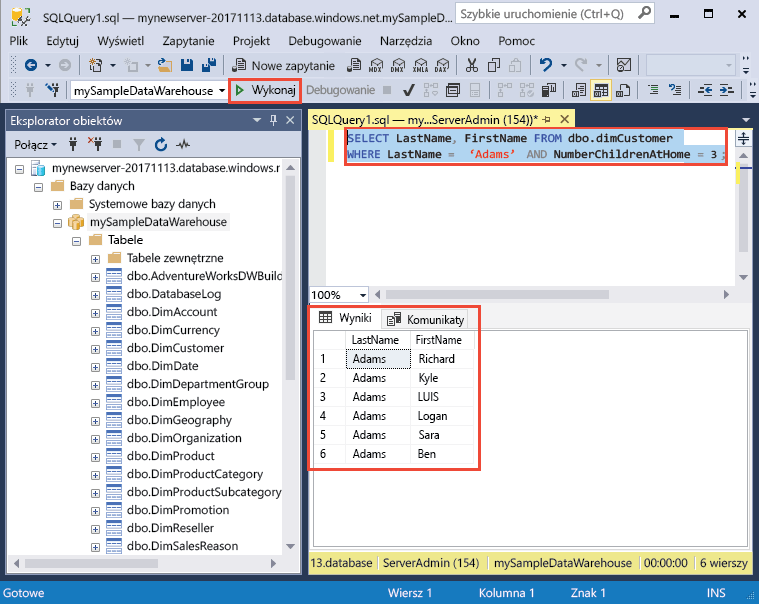

# <a name="create-an-azure-sql-data-warehouse-in-the-azure-portal"></a>Utwórz magazyn danych Azure SQL w portalu Azure

Ten samouczek szybki start tworzy hurtowni danych przy użyciu usługi Azure SQL Data Warehouse i inicjuje go z danymi przykładowymi AdventureWorksDW. Następnie należy połączyć się z magazynem danych i uruchom zapytania na danych. W samouczku [portalu Azure](https://portal.azure.com) i [programu SQL Server Management Studio](/sql/ssms/download-sql-server-management-studio-ssms.md) (SSMS)

Jeśli nie masz subskrypcji platformy Azure, przed rozpoczęciem utwórz [bezpłatne](https://azure.microsoft.com/free/) konto.

## <a name="before-you-begin"></a>Przed rozpoczęciem

Przed rozpoczęciem tego przewodnika Szybki Start Pobierz i zainstaluj najnowszą wersję [programu SQL Server Management Studio](/sql/ssms/download-sql-server-management-studio-ssms.md) (SSMS).

## <a name="log-in-to-the-azure-portal"></a>Logowanie do witryny Azure Portal

Zaloguj się do witryny [Azure Portal](https://portal.azure.com/).

## <a name="create-a-data-warehouse"></a>Tworzenie magazynu danych

Magazyn danych Azure SQL jest tworzony z zdefiniowanym zestawem [zasoby obliczeniowe](performance-tiers.md). Baza danych została utworzona w ramach [grupy zasobów platformy Azure](../azure-resource-manager/resource-group-overview.md) i [serwera logicznego Azure SQL](../sql-database/sql-database-features.md). 

Wykonaj następujące kroki, aby utworzyć magazyn danych SQL, który zawiera przykładowe dane AdventureWorksDW. 

1. Kliknij przycisk **nowy** przycisk w lewym górnym rogu portalu Azure.

2. Wybierz **baz danych** z **nowy** i wybrać opcję **SQL Data Warehouse** w obszarze **proponowanym** na **nowy**strony.

    

3. Wypełnij formularz magazyn danych SQL z następującymi informacjami:   

    | Ustawienie | Sugerowana wartość | Opis | 
    | ------- | --------------- | ----------- | 
    | **Nazwa bazy danych** | mySampleDataWarehouse | Prawidłowe nazwy baz danych opisano w artykule [Database Identifiers](/sql/relational-databases/databases/database-identifiers) (Identyfikatory baz danych). Uwaga: Magazyn danych jest typ bazy danych.| 
    | **Subskrypcja** | Twoja subskrypcja  | Aby uzyskać szczegółowe informacje o subskrypcjach, zobacz [Subskrypcje](https://account.windowsazure.com/Subscriptions). |
    | **Grupa zasobów** | myResourceGroup | Prawidłowe nazwy grup zasobów opisano w artykule [Naming rules and restrictions](https://docs.microsoft.com/azure/architecture/best-practices/naming-conventions) (Reguły i ograniczenia nazewnictwa). |
    | **Wybierz źródło** | Przykład | Określa, aby załadować przykładowej bazy danych. Uwaga: Magazyn danych jest jeden typ bazy danych. |
    | **Wybierz przykład** | Bazy danych AdventureWorksDW | Określa, aby załadować przykładową bazę danych AdventureWorksDW.  |

    

4. Kliknij pozycję **Serwer**, aby utworzyć i skonfigurować nowy serwer dla nowej bazy danych. Wypełnianie **nowy formularz serwera** z następującymi informacjami: 

    | Ustawienie | Sugerowana wartość | Opis | 
    | ------------ | ------------------ | ------------------------------------------------- | 
    | **Nazwa serwera** | Dowolna nazwa unikatowa w skali globalnej | Prawidłowe nazwy serwera opisano w artykule [Naming rules and restrictions](https://docs.microsoft.com/azure/architecture/best-practices/naming-conventions) (Reguły i ograniczenia nazewnictwa). | 
    | **Identyfikator logowania administratora serwera** | Dowolna prawidłowa nazwa | Prawidłowe nazwy identyfikatorów logowania opisano w artykule [Database Identifiers](https://docs.microsoft.com/sql/relational-databases/databases/database-identifiers) (Identyfikatory baz danych).|
    | **Hasło** | Dowolne prawidłowe hasło | Hasło musi mieć co najmniej ośmiu znaków i musi zawierać znaki z trzech z następujących kategorii: wielkich liter, małych liter, cyfr i znaków innych niż alfanumeryczne. |
    | **Lokalizacja** | Dowolna prawidłowa lokalizacja | Aby uzyskać informacje na temat regionów, zobacz temat [Regiony systemu Azure](https://azure.microsoft.com/regions/). |

    

5. Kliknij pozycję **Wybierz**.

6. Kliknij przycisk **warstwę wydajności** można określić, czy magazyn danych jest optymalizowany elastyczność lub obliczeniowych oraz liczbę danych magazynu jednostki. 

7. W tym samouczku, wybierz **zoptymalizowane pod kątem elastyczność** warstwy usług. Suwak, domyślnie jest ustawiony na **DW400**.  Spróbuj przenieść w górę i w dół, aby zobaczyć, jak działa. 

    

8. Kliknij przycisk **Zastosuj**.

9. Teraz po uzupełnieniu formularza SQL Database kliknij przycisk **Utwórz**, aby aprowizować bazę danych. Aprowizacja zajmuje kilka minut. 

    

10. Na pasku narzędzi kliknij pozycję **Powiadomienia**, aby monitorować proces wdrażania.
    
     

## <a name="create-a-server-level-firewall-rule"></a>Tworzenie reguły zapory na poziomie serwera

Usługa SQL Data Warehouse tworzy zapory na poziomie serwera, które uniemożliwiają połączenie z serwerem lub żadnych baz danych na serwerze aplikacji zewnętrznych i narzędzia. Aby umożliwić łączność, można dodać reguły zapory, które umożliwiają połączenie dla określonych adresów IP.  Wykonaj następujące kroki, aby utworzyć [regułę zapory poziomu serwera](../sql-database/sql-database-firewall-configure.md) dla adresu IP klienta. 

> [!NOTE]
> Usługa SQL Data Warehouse komunikuje się za pośrednictwem portu 1433. Jeśli próbujesz się połączyć z sieci firmowej, ruch wychodzący przez port 1433 nie może być dozwolone przez zaporę w sieci. Jeśli nastąpi taka sytuacja, nie będzie można nawiązać połączenia z serwerem usługi Azure SQL Database, chyba że dział IT otworzy port 1433.
>

1. Po ukończeniu wdrażania kliknij pozycję **Bazy danych SQL** w menu po lewej stronie i kliknij bazę danych **mySampleDatabase** na stronie **Bazy danych SQL**. Zostanie otwarta strona Przegląd bazy danych, wyświetlając nazwę FQDN serwera (takich jak **mynewserver 20171113.database.windows.net**) i udostępnia opcje dla dalszej konfiguracji. 

2. Skopiuj tę w pełni kwalifikowaną nazwę serwera w celu nawiązania połączenia z serwerem i jego bazami danych w kolejnych przewodnikach Szybki start. Następnie kliknij nazwę serwera, aby otworzyć ustawienia serwera.

    

3. Kliknij nazwę serwera, aby otworzyć ustawienia serwera.

    

5. Kliknij przycisk **Pokaż ustawienia zapory**. Zostanie otwarta strona **Ustawienia zapory** dla serwera SQL Database. 

    

4. Kliknij pozycję **Dodaj adres IP klienta** na pasku narzędzi, aby dodać bieżący adres IP do nowej reguły zapory. Reguła zapory może otworzyć port 1433 dla pojedynczego adresu IP lub zakresu adresów IP.

5. Kliknij pozycję **Zapisz**. Dla bieżącego adresu IP zostanie utworzona reguła zapory na poziomie serwera otwierająca port 1433 na serwerze logicznym.

6. Kliknij przycisk **OK**, a następnie zamknij stronę **Ustawienia zapory**.

Teraz można podłączyć do programu SQL server i jego magazynów danych przy użyciu tego adresu IP. Połączenie działa z programu SQL Server Management Studio lub dowolnego innego narzędzia. Po połączeniu, użyj utworzone wcześniej konto administratora serwera.  

> [!IMPORTANT]
> Domyślnie dostęp za pośrednictwem zapory usługi SQL Database jest włączony dla wszystkich usług platformy Azure. Kliknij przycisk **OFF** na tej stronie, a następnie kliknij przycisk **zapisać** wyłączenie zapory dla wszystkich usług platformy Azure.

## <a name="get-the-fully-qualified-server-name"></a>Pobierz nazwę FQDN serwera

Pobierz nazwę FQDN serwera programu SQL server w portalu Azure. Później będzie używać w pełni kwalifikowana nazwa podczas nawiązywania połączenia z serwerem.

1. Zaloguj się do witryny [Azure Portal](https://portal.azure.com/).
2. Wybierz opcję **Bazy danych SQL** z menu po lewej stronie, a następnie kliknij bazę danych na stronie **Bazy danych SQL**. 
3. W okienku **Essentials** na stronie bazy danych w witrynie Azure Portal zlokalizuj i skopiuj **nazwę serwera**. W tym przykładzie w pełni kwalifikowana nazwa jest mynewserver 20171113.database.windows.net. 

      

## <a name="connect-to-the-server-as-server-admin"></a>Nawiąż połączenie z serwerem jako administrator serwera

Ta sekcja używa [programu SQL Server Management Studio](/sql/ssms/download-sql-server-management-studio-ssms.md) (SSMS) w celu nawiązania połączenia z serwerem Azure SQL.

1. Otwórz program SQL Server Management Studio.

2. W oknie dialogowym **Połącz z serwerem** wprowadź następujące informacje:

   | Ustawienie       | Sugerowana wartość | Opis | 
   | ------------ | ------------------ | ------------------------------------------------- | 
   | Typ serwera | Aparat bazy danych | Ta wartość jest wymagana |
   | Nazwa serwera | W pełni kwalifikowana nazwa serwera | Nazwa powinna być podobny do następującego: **mynewserver 20171113.database.windows.net**. |
   | Authentication | Uwierzytelnianie programu SQL Server | Uwierzytelnianie SQL to jedyny typ uwierzytelniania skonfigurowany w tym samouczku. |
   | Login | Konto administratora serwera | To konto określono podczas tworzenia serwera. |
   | Hasło | Hasło konta administratora serwera | To hasło określono podczas tworzenia serwera. |

    

4. Kliknij przycisk **Połącz**. W programie SSMS zostanie otwarte okno Eksplorator obiektów. 

5. W Eksploratorze obiektów rozwiń **baz danych**. Następnie rozwiń węzeł **mySampleDatabase** Aby wyświetlić obiekty w nowej bazy danych.

     

## <a name="run-some-queries"></a>Uruchom kilka zapytań

Usługa SQL Data Warehouse używa T-SQL jako język zapytań. Aby otworzyć okno kwerendy i uruchom kilka zapytań T-SQL, wykonaj następujące kroki.

1. Kliknij prawym przyciskiem myszy **mySampleDataWarehouse** i wybierz **nowe zapytanie**.  Otworzy się okno nowego zapytania.
2. W oknie zapytania wprowadź następujące polecenie, aby wyświetlić listę baz danych.

    ```sql
    SELECT * FROM sys.databases
    ```

3. Kliknij przycisk **Execute** (Wykonaj).  Wyniki zapytania Pokaż dwóch baz danych: **wzorca** i **mySampleDataWarehouse**.

    

4. Aby zobaczyć niektóre dane, wpisz następujące polecenie aby wyświetlić liczbę klientów nazwisko Zawadzki, który ma trzy elementy podrzędne w domu. Klientów sześciu listy wyników. 

    ```sql
    SELECT LastName, FirstName FROM dbo.dimCustomer
    WHERE LastName = 'Adams' AND NumberChildrenAtHome = 3;
    ```

    

## <a name="clean-up-resources"></a>Oczyszczanie zasobów

Czy są naliczane opłaty za zasoby obliczeniowe i dane, które są ładowane do magazynu danych. Te są rozliczane oddzielnie. 

- Jeśli chcesz przechowywać dane w magazynie podczas korzystania z magazynu danych nie można wstrzymać obliczeń. Dzięki wstrzymanie obliczeniowe można tylko opłaty za magazyn danych i będzie możliwe wznowienie mocy obliczeniowej, gdy wszystko będzie gotowe do pracy z danymi.
- Jeśli chcesz usunąć opłat w przyszłości, można usunąć magazynu danych. 

Wykonaj następujące kroki, aby wyczyścić zasoby, jak chcesz.

1. Zaloguj się do [portalu Azure](https://portal.azure.com), kliknij polecenie w magazynie danych.

    

1. Aby wstrzymać obliczeń, kliknij przycisk **wstrzymać** przycisku. Magazyn danych jest wstrzymana, zobaczysz **Start** przycisku.  Aby wznowić operacje obliczeniowe, kliknij przycisk **Start**.

2. Aby usunąć hurtowni danych, więc nie zostanie obciążona obliczeń lub magazynu, kliknij przycisk **usunąć**.

3. Aby usunąć serwer SQL został utworzony, kliknij przycisk **mynewserver 20171113.database.windows.net** poprzedniej ilustracji, a następnie kliknij polecenie **usunąć**.  Należy zachować ostrożność przy jako usunięcie serwera spowoduje usunięcie wszystkich baz danych do serwera.

4. Aby usunąć grupę zasobów, kliknij przycisk **myResourceGroup**, a następnie kliknij przycisk **Usuń grupę zasobów**.


## <a name="next-steps"></a>Następne kroki

Teraz, gdy już masz bazę danych, możesz nawiązać z nią połączenie i uruchamiać zapytania za pomocą ulubionych narzędzi. Dowiedz się więcej, wybierając narzędzie poniżej:

- [SQL Server Management Studio](../sql-database/sql-database-connect-query-ssms.md?toc=%2fazure%2fsql-data-warehouse%2ftoc.json)
- [Visual Studio Code](../sql-database/sql-database-connect-query-vscode.md?toc=%2fazure%2fsql-data-warehouse%2ftoc.json)
- [.NET](../sql-database/sql-database-connect-query-dotnet.md?toc=%2fazure%2fsql-data-warehouse%2ftoc.json)
- [PHP](../sql-database/sql-database-connect-query-php.md?toc=%2fazure%2fsql-data-warehouse%2ftoc.json)
- [Node.js](../sql-database/sql-database-connect-query-nodejs.md?toc=%2fazure%2fsql-data-warehouse%2ftoc.json)
- [Java](../sql-database/sql-database-connect-query-java.md?toc=%2fazure%2fsql-data-warehouse%2ftoc.json)
- [Python](../sql-database/sql-database-connect-query-python.md?toc=%2fazure%2fsql-data-warehouse%2ftoc.json)
- [Ruby](../sql-database/sql-database-connect-query-ruby.md?toc=%2fazure%2fsql-data-warehouse%2ftoc.json)