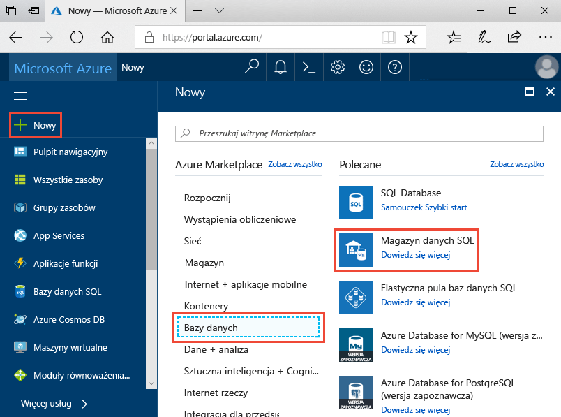
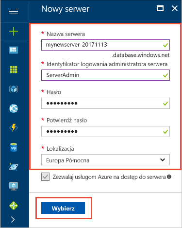
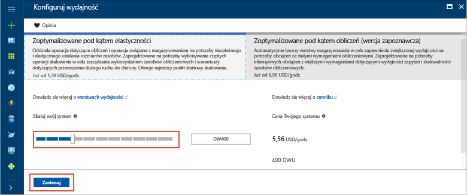
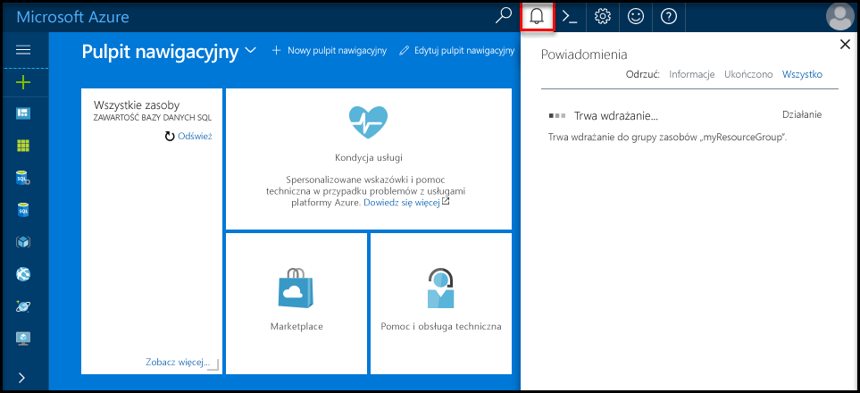
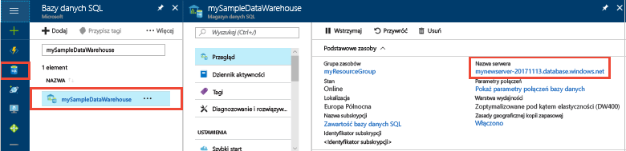
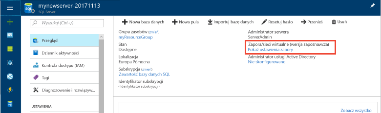
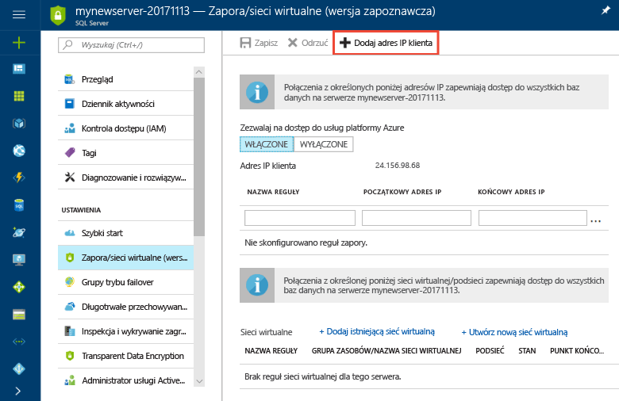
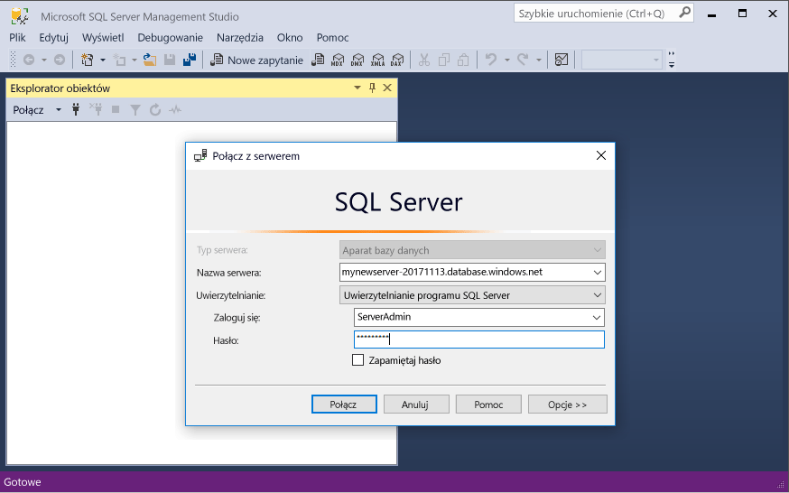
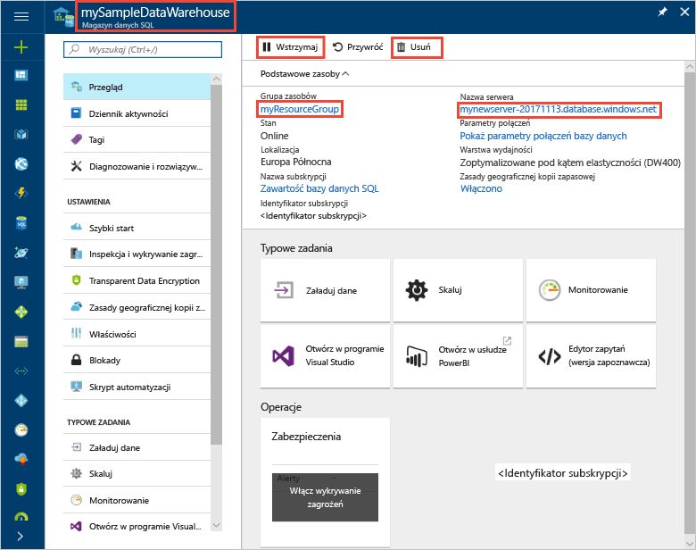

# <a name="tutorial-use-polybase-to-load-data-from-azure-blob-storage-to-azure-sql-data-warehouse"></a>Samouczek: ładowanie danych z usługi Azure Blob Storage do usługi Azure SQL Data Warehouse przy użyciu technologii PolyBase

PolyBase to standardowa technologia ładowania umożliwiająca pobranie danych do usługi SQL Data Warehouse. W tym samouczku załadujesz dane dotyczące taksówek w Nowym Jorku z usługi Azure Blob Storage do usługi Azure SQL Data Warehouse za pomocą technologii PolyBase. W tym samouczku użyto witryny [Azure Portal](https://portal.azure.com) i programu [SQL Server Management Studio](/sql/ssms/download-sql-server-management-studio-ssms.md) (SSMS), aby wykonać następujące czynności: 

> [!div class="checklist"]
> * Tworzenie magazynu danych w witrynie Azure Portal
> * Konfigurowanie reguły zapory na poziomie serwera w witrynie Azure Portal
> * Nawiązywanie połączenia z magazynem danych za pomocą programu SSMS
> * Tworzenie użytkownika wyznaczonego do ładowania danych
> * Tworzenie tabel zewnętrznych dla danych w usłudze Azure Blob Storage
> * Ładowanie danych do magazynu danych za pomocą instrukcji CTAS T-SQL
> * Wyświetlanie postępu ładowania danych
> * Tworzenie statystyk dotyczących nowo załadowanych danych

Jeśli nie masz subskrypcji platformy Azure, przed rozpoczęciem [utwórz bezpłatne konto](https://azure.microsoft.com/free/).

## <a name="before-you-begin"></a>Przed rozpoczęciem

Zanim rozpoczniesz ten samouczek, pobierz i zainstaluj najnowszą wersję programu [SQL Server Management Studio](/sql/ssms/download-sql-server-management-studio-ssms.md) (SSMS).


## <a name="log-in-to-the-azure-portal"></a>Logowanie do witryny Azure Portal

Zaloguj się do witryny [Azure Portal](https://portal.azure.com/).

## <a name="create-a-blank-sql-data-warehouse"></a>Tworzenie pustego magazynu danych SQL

Magazyn danych Azure SQL Data Warehouse jest tworzony ze zdefiniowanym zestawem [zasobów obliczeniowych](performance-tiers.md). Baza danych jest tworzona w [grupie zasobów platformy Azure](../azure-resource-manager/resource-group-overview.md) oraz na [serwerze logicznym SQL platformy Azure](../sql-database/sql-database-features.md). 

Wykonaj poniższe czynności, aby utworzyć pusty magazyn danych SQL. 

1. W lewym górnym rogu witryny Azure Portal kliknij przycisk **Utwórz zasób**.

2. Na stronie **Nowy** wybierz pozycję **Bazy danych**, a następnie na stronie **Nowy** w obszarze **Polecane** wybierz pozycję **SQL Data Warehouse**.

    

3. Wypełnij formularz magazynu danych SQL Data Warehouse, używając następujących informacji:   

   | Ustawienie | Sugerowana wartość | Opis | 
   | ------- | --------------- | ----------- | 
   | **Nazwa bazy danych** | mySampleDataWarehouse | Prawidłowe nazwy baz danych opisano w artykule [Database Identifiers](/sql/relational-databases/databases/database-identifiers) (Identyfikatory baz danych). | 
   | **Subskrypcja** | Twoja subskrypcja  | Aby uzyskać szczegółowe informacje o subskrypcjach, zobacz [Subskrypcje](https://account.windowsazure.com/Subscriptions). |
   | **Grupa zasobów** | myResourceGroup | Prawidłowe nazwy grup zasobów opisano w artykule [Naming rules and restrictions](https://docs.microsoft.com/azure/architecture/best-practices/naming-conventions) (Reguły i ograniczenia nazewnictwa). |
   | **Wybierz źródło** | Pusta baza danych | Określa, że ma zostać utworzona pusta baza danych. Pamiętaj, że magazyn danych jest jednym z typów bazy danych.|

    

4. Kliknij pozycję **Serwer**, aby utworzyć i skonfigurować nowy serwer dla nowej bazy danych. Wypełnij **formularz nowego serwera**, używając następujących informacji: 

    | Ustawienie | Sugerowana wartość | Opis | 
    | ------- | --------------- | ----------- |
    | **Nazwa serwera** | Dowolna nazwa unikatowa w skali globalnej | Prawidłowe nazwy serwera opisano w artykule [Naming rules and restrictions](https://docs.microsoft.com/azure/architecture/best-practices/naming-conventions) (Reguły i ograniczenia nazewnictwa). | 
    | **Identyfikator logowania administratora serwera** | Dowolna prawidłowa nazwa | Prawidłowe nazwy identyfikatorów logowania opisano w artykule [Database Identifiers](https://docs.microsoft.com/sql/relational-databases/databases/database-identifiers) (Identyfikatory baz danych).|
    | **Hasło** | Dowolne prawidłowe hasło | Hasło musi mieć co najmniej osiem znaków i musi zawierać znaki z trzech z następujących kategorii: wielkie litery, małe litery, cyfry i znaki inne niż alfanumeryczne. |
    | **Lokalizacja** | Dowolna prawidłowa lokalizacja | Aby uzyskać informacje na temat regionów, zobacz temat [Regiony systemu Azure](https://azure.microsoft.com/regions/). |

    

5. Kliknij pozycję **Wybierz**.

6. Kliknij pozycję **Warstwa wydajności**, aby określić, czy magazyn danych jest zoptymalizowany pod kątem elastyczności, czy obliczeń, oraz podać liczbę jednostek magazynu danych. 

7. Na potrzeby tego samouczka wybierz warstwę usług **Optymalizacja pod kątem elastyczności**. Suwak jest domyślnie ustawiony na pozycję **DW400**.  Spróbuj przesunąć go w górę i w dół, aby zobaczyć, jak działa. 

    

8. Kliknij przycisk **Zastosuj**.
9. Na stronie usługi SQL Data Warehouse wybierz **sortowanie** dla pustej bazy danych. Na potrzeby tego samouczka użyj wartości domyślnej. Aby uzyskać więcej informacji na temat sortowań, zobacz [Sortowania](/sql/t-sql/statements/collations.md)

11. Teraz po uzupełnieniu formularza SQL Database kliknij przycisk **Utwórz**, aby aprowizować bazę danych. Aprowizacja zajmuje kilka minut. 

    

12. Na pasku narzędzi kliknij pozycję **Powiadomienia**, aby monitorować proces wdrażania.
    
     

## <a name="create-a-server-level-firewall-rule"></a>Tworzenie reguły zapory na poziomie serwera

Usługa SQL Data Warehouse tworzy zaporę na poziomie serwera, która uniemożliwia zewnętrznym aplikacjom i narzędziom łączenie się z serwerem i wszelkimi bazami danych na tym serwerze. Aby umożliwić łączność, możesz dodać reguły zezwalające na połączenia dla konkretnych adresów IP.  Wykonaj następujące kroki, aby utworzyć [regułę zapory na poziomie serwera](../sql-database/sql-database-firewall-configure.md) dla Twojego adresu IP klienta. 

> [!NOTE]
> Usługa SQL Data Warehouse komunikuje się przez port 1433. Jeśli próbujesz nawiązać połączenie z sieci firmowej, ruch wychodzący na porcie 1433 może być blokowany przez zaporę sieciową. Jeśli nastąpi taka sytuacja, nie będzie można nawiązać połączenia z serwerem usługi Azure SQL Database, chyba że dział IT otworzy port 1433.
>

1. Po ukończeniu wdrażania kliknij pozycję **Bazy danych SQL** w menu po lewej stronie i kliknij bazę danych **mySampleDatabase** na stronie **Bazy danych SQL**. Zostanie otwarta strona przeglądu bazy danych zawierająca w pełni kwalifikowaną nazwę serwera (na przykład **mynewserver-20171113.database.windows.net**) i opcje dalszej konfiguracji. 

2. Skopiuj tę w pełni kwalifikowaną nazwę serwera w celu nawiązania połączenia z serwerem i jego bazami danych w kolejnych przewodnikach Szybki start. Następnie kliknij nazwę serwera, aby otworzyć ustawienia serwera.

     

3. Kliknij nazwę serwera, aby otworzyć ustawienia serwera.

     

5. Kliknij pozycję **Pokaż ustawienia zapory**. Zostanie otwarta strona **Ustawienia zapory** dla serwera SQL Database. 

     

4. Kliknij pozycję **Dodaj adres IP klienta** na pasku narzędzi, aby dodać bieżący adres IP do nowej reguły zapory. Reguła zapory może otworzyć port 1433 dla pojedynczego adresu IP lub zakresu adresów IP.

5. Kliknij pozycję **Zapisz**. Dla bieżącego adresu IP zostanie utworzona reguła zapory na poziomie serwera otwierająca port 1433 na serwerze logicznym.

6. Kliknij przycisk **OK**, a następnie zamknij stronę **Ustawienia zapory**.

Teraz możesz łączyć się z serwerem SQL i jego magazynami danych przy użyciu tego adresu IP. Połączenie działa z programu SQL Server Management Studio lub dowolnego innego narzędzia. Przy łączeniu się używaj wcześniej utworzonego konta administratora serwera.  

> [!IMPORTANT]
> Domyślnie dostęp za pośrednictwem zapory usługi SQL Database jest włączony dla wszystkich usług platformy Azure. Kliknij pozycję **WYŁĄCZ** na tej stronie, a następnie kliknij przycisk **Zapisz**, aby wyłączyć zaporę dla wszystkich usług platformy Azure.

## <a name="get-the-fully-qualified-server-name"></a>Uzyskiwanie w pełni kwalifikowanej nazwy serwera

Uzyskaj w pełni kwalifikowaną nazwę serwera dla swojego serwera SQL w witrynie Azure Portal. Nazwa ta będzie używana później przy nawiązywaniu połączenia z serwerem.

1. Zaloguj się do witryny [Azure Portal](https://portal.azure.com/).
2. Wybierz opcję **Bazy danych SQL** z menu po lewej stronie, a następnie kliknij bazę danych na stronie **Bazy danych SQL**. 
3. W okienku **Essentials** na stronie bazy danych w witrynie Azure Portal zlokalizuj i skopiuj **nazwę serwera**. W tym przykładzie w pełni kwalifikowana nazwa to mynewserver-20171113.database.windows.net. 

      

## <a name="connect-to-the-server-as-server-admin"></a>Nawiąż połączenie z serwerem jako administrator serwera

W tej sekcji używany jest program [SQL Server Management Studio](/sql/ssms/download-sql-server-management-studio-ssms.md) (SSMS) do nawiązywania połączenia z serwerem SQL platformy Azure.

1. Otwórz program SQL Server Management Studio.

2. W oknie dialogowym **Połącz z serwerem** wprowadź następujące informacje:

    | Ustawienie      | Sugerowana wartość | Opis | 
    | ------------ | --------------- | ----------- | 
    | Typ serwera | Aparat bazy danych | Ta wartość jest wymagana |
    | Nazwa serwera | W pełni kwalifikowana nazwa serwera | Nazwa może mieć taką formę: **mynewserver-20171113.database.windows.net**. |
    | Authentication | Uwierzytelnianie programu SQL Server | Uwierzytelnianie SQL to jedyny typ uwierzytelniania skonfigurowany w tym samouczku. |
    | Login | Konto administratora serwera | To konto określono podczas tworzenia serwera. |
    | Hasło | Hasło konta administratora serwera | To hasło określono podczas tworzenia serwera. |

    

4. Kliknij przycisk **Połącz**. W programie SSMS zostanie otwarte okno Eksplorator obiektów. 

5. W Eksploratorze obiektów rozwiń pozycję **Bazy danych**. Następnie rozwiń węzły **Systemowe bazy danych** i **master**, aby wyświetlić obiekty w bazie danych master.  Rozwiń węzeł **mySampleDatabase**, aby wyświetlić obiekty w nowej bazie danych.

     

## <a name="create-a-user-for-loading-data"></a>Tworzenie użytkownika do ładowania danych

Konto administratora serwera jest przeznaczone do wykonywania operacji zarządzania i nie jest odpowiednie do wykonywania zapytań względem danych użytkownika. Operacja ładowania danych bardzo obciąża pamięć. [Maksymalne ustawienia pamięci](performance-tiers.md#memory-maximums) są zdefiniowane zgodnie z [warstwą wydajności](performance-tiers.md) i [klasą zasobów](resource-classes-for-workload-management.md). 

Najlepszym rozwiązaniem jest utworzenie identyfikatora logowania i użytkownika, które są przeznaczone do ładowania danych. Następnie należy dodać użytkownika ładującego do [klasy zasobów](resource-classes-for-workload-management.md), która umożliwia odpowiednią maksymalną alokację pamięci.

Obecnie łączysz się jako administrator serwera, dlatego możesz tworzyć identyfikatory logowania i użytkowników. Wykonaj następujące czynności, aby utworzyć identyfikator logowania i użytkownika o nazwie **LoaderRC20**. Następnie przypisz tego użytkownika do klasy zasobów **staticrc20**. 

1.  W programie SSMS kliknij prawym przyciskiem myszy pozycję **master**, aby wyświetlić menu rozwijane, i wybierz polecenie **Nowe zapytanie**. Otworzy się okno nowego zapytania.

    

2. W oknie zapytania wprowadź następujące polecenia języka T-SQL, aby utworzyć identyfikator logowania i użytkownika o nazwie LoaderRC20, podając własne hasło zamiast hasła „a123STRONGpassword!”. 

    ```sql
    CREATE LOGIN LoaderRC20 WITH PASSWORD = 'a123STRONGpassword!';
    CREATE USER LoaderRC20 FOR LOGIN LoaderRC20;
    ```

3. Kliknij przycisk **Execute** (Wykonaj).

4. Kliknij prawym przyciskiem myszy pozycję **mySampleDataWarehouse** i wybierz pozycję **Nowe zapytanie**. Zostanie otwarte okno nowego zapytania.  

    
 
5. Wprowadź następujące polecenia języka T-SQL, aby utworzyć użytkownika bazy danych o nazwie LoaderRC20 dla identyfikatora logowania LoaderRC20. Drugi wiersz przyznaje nowemu użytkownikowi uprawnienia kontrolne (CONTROL) do nowego magazynu danych.  Te uprawnienia dają użytkownikowi możliwości podobne do tych, które miałby jako właściciel bazy danych. Trzeci wiersz dodaje nowego użytkownika jako członka [klasy zasobów](resource-classes-for-workload-management.md) staticrc20.

    ```sql
    CREATE USER LoaderRC20 FOR LOGIN LoaderRC20;
    GRANT CONTROL ON DATABASE::[mySampleDataWarehouse] to LoaderRC20;
    EXEC sp_addrolemember 'staticrc20', 'LoaderRC20';
    ```

6. Kliknij przycisk **Execute** (Wykonaj).

## <a name="connect-to-the-server-as-the-loading-user"></a>Nawiązywanie połączenia z serwerem jako użytkownik ładujący

Pierwszym krokiem do załadowania danych jest zalogowanie się jako użytkownik LoaderRC20.  

1. W Eksploratorze obiektów kliknij menu rozwijane **Połącz** i wybierz polecenie **Aparat bazy danych**. Zostanie wyświetlone okno dialogowe **Nawiązywanie połączenia z serwerem**.

    

2. Wprowadź w pełni kwalifikowaną nazwę serwera i jako nazwę logowania wprowadź identyfikator **LoaderRC20**.  Wprowadź hasło dla użytkownika LoaderRC20.

3. Kliknij przycisk **Połącz**.

4. Gdy połączenie będzie gotowe, w Eksploratorze obiektów zobaczysz dwa połączenia z serwerem. Jedno połączenie jako ServerAdmin i jedno połączenie jako MedRCLogin.

    

## <a name="create-external-tables-for-the-sample-data"></a>Tworzenie tabel zewnętrznych dla przykładowych danych

Wszystko jest gotowe do rozpoczęcia procesu ładowania danych do nowego magazynu danych. W tym samouczku pokazano, jak załadować dane taksówek w Nowym Jorku z usługi Azure Storage Blob za pomocą technologii [Polybase](/sql/relational-databases/polybase/polybase-guide.md). Aby dowiedzieć się, jak przesłać dane do usługi Azure Blob Storage lub załadować je bezpośrednio ze źródła do usługi SQL Data Warehouse, zobacz [omówienie ładowania](sql-data-warehouse-overview-load.md).

Uruchom następujące skrypty SQL, podając informacje o danych do załadowania. Informacje te obejmują obecną lokalizację danych, format zawartości danych i definicję tabel dla danych. 

1. W poprzedniej sekcji zalogowano się do magazynu danych jako użytkownik LoaderRC20. W programie SSMS kliknij prawym przyciskiem myszy połączenie użytkownika LoaderRC20, a następnie wybierz polecenie **Nowe zapytanie**.  Zostanie otwarte okno nowego zapytania. 

    

2. Porównaj to okno zapytania z poprzednią ilustracją.  Sprawdź, czy okno nowego zapytania zostało uruchomione dla użytkownika LoaderRC20 i czy zapytania są wykonywane względem bazy danych MySampleDataWarehouse. Wszystkie kroki ładowania wykonaj w tym oknie zapytania.

3. Utwórz klucz główny dla bazy danych MySampleDataWarehouse. Musisz utworzyć klucz główny tylko raz dla danej bazy danych. 

    ```sql
    CREATE MASTER KEY;
    ```

4. Uruchom następującą instrukcję [CREATE EXTERNAL DATA SOURCE](/sql/t-sql/statements/create-external-data-source-transact-sql.md), aby określić lokalizację obiektu blob platformy Azure. Jest to lokalizacja zewnętrznych danych dotyczących taksówek.  Aby uruchomić polecenie dołączone do okna zapytania, wyróżnij polecenia, które chcesz uruchomić, a następnie kliknij przycisk **Wykonaj**.

    ```sql
    CREATE EXTERNAL DATA SOURCE NYTPublic
    WITH
    (
        TYPE = Hadoop,
        LOCATION = 'wasbs://2013@nytaxiblob.blob.core.windows.net/'
    );
    ```

5. Uruchom następującą instrukcję języka T-SQL [CREATE EXTERNAL FILE FORMAT](/sql/t-sql/statements/create-external-file-format-transact-sql.md), aby określić opcje i właściwości formatowania dla zewnętrznego pliku danych. Ta instrukcja określa, że dane zewnętrzne są przechowywane jako tekst, a wartości są oddzielane znakiem kreski pionowej („|”). Plik zewnętrzny jest skompresowany za pomocą narzędzia Gzip. 

    ```sql
    CREATE EXTERNAL FILE FORMAT uncompressedcsv
    WITH (
        FORMAT_TYPE = DELIMITEDTEXT,
        FORMAT_OPTIONS ( 
            FIELD_TERMINATOR = ',',
            STRING_DELIMITER = '',
            DATE_FORMAT = '',
            USE_TYPE_DEFAULT = False
        )
    );
    CREATE EXTERNAL FILE FORMAT compressedcsv
    WITH ( 
        FORMAT_TYPE = DELIMITEDTEXT,
        FORMAT_OPTIONS ( FIELD_TERMINATOR = '|',
            STRING_DELIMITER = '',
        DATE_FORMAT = '',
            USE_TYPE_DEFAULT = False
        ),
        DATA_COMPRESSION = 'org.apache.hadoop.io.compress.GzipCodec'
    );
    ```

6.  Uruchom następującą instrukcję [CREATE SCHEMA](/sql/t-sql/statements/create-schema-transact-sql.md), aby utworzyć schemat dla formatu pliku zewnętrznego. Schemat umożliwia organizowanie tabel zewnętrznych, które wkrótce utworzysz.

    ```sql
    CREATE SCHEMA ext;
    ```

7. Utwórz tabele zewnętrzne. Definicje tabel są przechowywane w usłudze SQL Data Warehouse, ale tabele odwołują się do danych przechowywanych w usłudze Azure Blob Storage. Uruchom poniższe polecenia T-SQL, aby utworzyć tabele zewnętrzne wskazujące obiekt blob platformy Azure zdefiniowany wcześniej w naszym zewnętrznym źródle danych.

    ```sql
    CREATE EXTERNAL TABLE [ext].[Date] 
    (
        [DateID] int NOT NULL,
        [Date] datetime NULL,
        [DateBKey] char(10) COLLATE SQL_Latin1_General_CP1_CI_AS NULL,
        [DayOfMonth] varchar(2) COLLATE SQL_Latin1_General_CP1_CI_AS NULL,
        [DaySuffix] varchar(4) COLLATE SQL_Latin1_General_CP1_CI_AS NULL,
        [DayName] varchar(9) COLLATE SQL_Latin1_General_CP1_CI_AS NULL,
        [DayOfWeek] char(1) COLLATE SQL_Latin1_General_CP1_CI_AS NULL,
        [DayOfWeekInMonth] varchar(2) COLLATE SQL_Latin1_General_CP1_CI_AS NULL,
        [DayOfWeekInYear] varchar(2) COLLATE SQL_Latin1_General_CP1_CI_AS NULL,
        [DayOfQuarter] varchar(3) COLLATE SQL_Latin1_General_CP1_CI_AS NULL,
        [DayOfYear] varchar(3) COLLATE SQL_Latin1_General_CP1_CI_AS NULL,
        [WeekOfMonth] varchar(1) COLLATE SQL_Latin1_General_CP1_CI_AS NULL,
        [WeekOfQuarter] varchar(2) COLLATE SQL_Latin1_General_CP1_CI_AS NULL,
        [WeekOfYear] varchar(2) COLLATE SQL_Latin1_General_CP1_CI_AS NULL,
        [Month] varchar(2) COLLATE SQL_Latin1_General_CP1_CI_AS NULL,
        [MonthName] varchar(9) COLLATE SQL_Latin1_General_CP1_CI_AS NULL,
        [MonthOfQuarter] varchar(2) COLLATE SQL_Latin1_General_CP1_CI_AS NULL,
        [Quarter] char(1) COLLATE SQL_Latin1_General_CP1_CI_AS NULL,
        [QuarterName] varchar(9) COLLATE SQL_Latin1_General_CP1_CI_AS NULL,
        [Year] char(4) COLLATE SQL_Latin1_General_CP1_CI_AS NULL,
        [YearName] char(7) COLLATE SQL_Latin1_General_CP1_CI_AS NULL,
        [MonthYear] char(10) COLLATE SQL_Latin1_General_CP1_CI_AS NULL,
        [MMYYYY] char(6) COLLATE SQL_Latin1_General_CP1_CI_AS NULL,
        [FirstDayOfMonth] date NULL,
        [LastDayOfMonth] date NULL,
        [FirstDayOfQuarter] date NULL,
        [LastDayOfQuarter] date NULL,
        [FirstDayOfYear] date NULL,
        [LastDayOfYear] date NULL,
        [IsHolidayUSA] bit NULL,
        [IsWeekday] bit NULL,
        [HolidayUSA] varchar(50) COLLATE SQL_Latin1_General_CP1_CI_AS NULL
    )
    WITH
    (
        LOCATION = 'Date',
        DATA_SOURCE = NYTPublic,
        FILE_FORMAT = uncompressedcsv,
        REJECT_TYPE = value,
        REJECT_VALUE = 0
    ); 
    CREATE EXTERNAL TABLE [ext].[Geography]
    (
        [GeographyID] int NOT NULL,
        [ZipCodeBKey] varchar(10) COLLATE SQL_Latin1_General_CP1_CI_AS NOT NULL,
        [County] varchar(50) COLLATE SQL_Latin1_General_CP1_CI_AS NULL,
        [City] varchar(50) COLLATE SQL_Latin1_General_CP1_CI_AS NULL,
        [State] varchar(50) COLLATE SQL_Latin1_General_CP1_CI_AS NULL,
        [Country] varchar(50) COLLATE SQL_Latin1_General_CP1_CI_AS NULL,
        [ZipCode] varchar(50) COLLATE SQL_Latin1_General_CP1_CI_AS NULL
    )
    WITH
    (
        LOCATION = 'Geography',
        DATA_SOURCE = NYTPublic,
        FILE_FORMAT = uncompressedcsv,
        REJECT_TYPE = value,
        REJECT_VALUE = 0 
    );      
    CREATE EXTERNAL TABLE [ext].[HackneyLicense]
    (
        [HackneyLicenseID] int NOT NULL,
        [HackneyLicenseBKey] varchar(50) COLLATE SQL_Latin1_General_CP1_CI_AS NOT NULL,
        [HackneyLicenseCode] varchar(50) COLLATE SQL_Latin1_General_CP1_CI_AS NULL
    )
    WITH
    (
        LOCATION = 'HackneyLicense',
        DATA_SOURCE = NYTPublic,
        FILE_FORMAT = uncompressedcsv,
        REJECT_TYPE = value,
        REJECT_VALUE = 0
    );
    CREATE EXTERNAL TABLE [ext].[Medallion]
    (
        [MedallionID] int NOT NULL,
        [MedallionBKey] varchar(50) COLLATE SQL_Latin1_General_CP1_CI_AS NOT NULL,
        [MedallionCode] varchar(50) COLLATE SQL_Latin1_General_CP1_CI_AS NULL
    )
    WITH
    (
        LOCATION = 'Medallion',
        DATA_SOURCE = NYTPublic,
        FILE_FORMAT = uncompressedcsv,
        REJECT_TYPE = value,
        REJECT_VALUE = 0
    )
    ;  
    CREATE EXTERNAL TABLE [ext].[Time]
    (
        [TimeID] int NOT NULL,
        [TimeBKey] varchar(8) COLLATE SQL_Latin1_General_CP1_CI_AS NOT NULL,
        [HourNumber] tinyint NOT NULL,
        [MinuteNumber] tinyint NOT NULL,
        [SecondNumber] tinyint NOT NULL,
        [TimeInSecond] int NOT NULL,
        [HourlyBucket] varchar(15) COLLATE SQL_Latin1_General_CP1_CI_AS NOT NULL,
        [DayTimeBucketGroupKey] int NOT NULL,
        [DayTimeBucket] varchar(100) COLLATE SQL_Latin1_General_CP1_CI_AS NOT NULL
    )
    WITH
    (
        LOCATION = 'Time',
        DATA_SOURCE = NYTPublic,
        FILE_FORMAT = uncompressedcsv,
        REJECT_TYPE = value,
        REJECT_VALUE = 0
    );
    CREATE EXTERNAL TABLE [ext].[Trip]
    (
        [DateID] int NOT NULL,
        [MedallionID] int NOT NULL,
        [HackneyLicenseID] int NOT NULL,
        [PickupTimeID] int NOT NULL,
        [DropoffTimeID] int NOT NULL,
        [PickupGeographyID] int NULL,
        [DropoffGeographyID] int NULL,
        [PickupLatitude] float NULL,
        [PickupLongitude] float NULL,
        [PickupLatLong] varchar(50) COLLATE SQL_Latin1_General_CP1_CI_AS NULL,
        [DropoffLatitude] float NULL,
        [DropoffLongitude] float NULL,
        [DropoffLatLong] varchar(50) COLLATE SQL_Latin1_General_CP1_CI_AS NULL,
        [PassengerCount] int NULL,
        [TripDurationSeconds] int NULL,
        [TripDistanceMiles] float NULL,
        [PaymentType] varchar(50) COLLATE SQL_Latin1_General_CP1_CI_AS NULL,
        [FareAmount] money NULL,
        [SurchargeAmount] money NULL,
        [TaxAmount] money NULL,
        [TipAmount] money NULL,
        [TollsAmount] money NULL,
        [TotalAmount] money NULL
    )
    WITH
    (
        LOCATION = 'Trip2013',
        DATA_SOURCE = NYTPublic,
        FILE_FORMAT = compressedcsv,
        REJECT_TYPE = value,
        REJECT_VALUE = 0
    );
    CREATE EXTERNAL TABLE [ext].[Weather]
    (
        [DateID] int NOT NULL,
        [GeographyID] int NOT NULL,
        [PrecipitationInches] float NOT NULL,
        [AvgTemperatureFahrenheit] float NOT NULL
    )
    WITH
    (
        LOCATION = 'Weather',
        DATA_SOURCE = NYTPublic,
        FILE_FORMAT = uncompressedcsv,
        REJECT_TYPE = value,
        REJECT_VALUE = 0
    )
    ;
    ```

8. W Eksploratorze obiektów rozwiń węzeł mySampleDataWarehouse, aby wyświetlić listę właśnie utworzonych tabel zewnętrznych.

    

## <a name="load-the-data-into-your-data-warehouse"></a>Ładowanie danych do magazynu danych

W tej sekcji właśnie zdefiniowane tabele zewnętrzne są używane w celu załadowania przykładowych danych z usługi Azure Storage Blob do usługi SQL Data Warehouse.  

> [!NOTE]
> W tym samouczku dane są ładowane bezpośrednio do tabeli końcowej. W środowisku produkcyjnym zazwyczaj używa się instrukcji CREATE TABLE AS SELECT, aby załadować dane do tabeli przejściowej. Gdy dane znajdują się w tabeli przejściowej, można wykonać wszelkie niezbędne przekształcenia. Aby dołączyć dane z tabeli przejściowej do tabeli produkcyjnej, można użyć instrukcji INSERT...SELECT. Aby uzyskać więcej informacji, zobacz [Wstawianie danych do tabeli produkcyjnej](guidance-for-loading-data.md#inserting-data-into-a-production-table).
> 

W skrypcie użyto instrukcji języka T-SQL [CREATE TABLE AS SELECT (CTAS)](/sql/t-sql/statements/create-table-as-select-azure-sql-data-warehouse.md), aby załadować dane z usługi Azure Storage Blob do nowych tabel w magazynie danych. Instrukcja CTAS tworzy nową tabelę na podstawie wyników instrukcji select. Nowa tabela ma takie same kolumny i typy danych jak wyniki instrukcji select. Gdy instrukcja select wybiera dane z tabeli zewnętrznej, usługa SQL Data Warehouse importuje dane do tabeli relacyjnej w magazynie danych. 

1. Uruchom następujący skrypt, aby załadować dane do nowych tabel w magazynie danych.

    ```sql
    CREATE TABLE [dbo].[Date]
    WITH
    ( 
        DISTRIBUTION = ROUND_ROBIN,
        CLUSTERED COLUMNSTORE INDEX
    )
    AS SELECT * FROM [ext].[Date]
    OPTION (LABEL = 'CTAS : Load [dbo].[Date]')
    ;
    CREATE TABLE [dbo].[Geography]
    WITH
    ( 
        DISTRIBUTION = ROUND_ROBIN,
        CLUSTERED COLUMNSTORE INDEX
    )
    AS
    SELECT * FROM [ext].[Geography]
    OPTION (LABEL = 'CTAS : Load [dbo].[Geography]')
    ;
    CREATE TABLE [dbo].[HackneyLicense]
    WITH
    ( 
        DISTRIBUTION = ROUND_ROBIN,
        CLUSTERED COLUMNSTORE INDEX
    )
    AS SELECT * FROM [ext].[HackneyLicense]
    OPTION (LABEL = 'CTAS : Load [dbo].[HackneyLicense]')
    ;
    CREATE TABLE [dbo].[Medallion]
    WITH
    (
        DISTRIBUTION = ROUND_ROBIN,
        CLUSTERED COLUMNSTORE INDEX
    )
    AS SELECT * FROM [ext].[Medallion]
    OPTION (LABEL = 'CTAS : Load [dbo].[Medallion]')
    ;
    CREATE TABLE [dbo].[Time]
    WITH
    (
        DISTRIBUTION = ROUND_ROBIN,
        CLUSTERED COLUMNSTORE INDEX
    )
    AS SELECT * FROM [ext].[Time]
    OPTION (LABEL = 'CTAS : Load [dbo].[Time]')
    ;
    CREATE TABLE [dbo].[Weather]
    WITH
    ( 
        DISTRIBUTION = ROUND_ROBIN,
        CLUSTERED COLUMNSTORE INDEX
    )
    AS SELECT * FROM [ext].[Weather]
    OPTION (LABEL = 'CTAS : Load [dbo].[Weather]')
    ;
    CREATE TABLE [dbo].[Trip]
    WITH
    (
        DISTRIBUTION = ROUND_ROBIN,
        CLUSTERED COLUMNSTORE INDEX
    )
    AS SELECT * FROM [ext].[Trip]
    OPTION (LABEL = 'CTAS : Load [dbo].[Trip]')
    ;
    ```

2. Wyświetlaj dane podczas ładowania. Ładowane jest kilka gigabajtów danych, które są kompresowane do wysoce wydajnych indeksów magazynu kolumn klastra. Uruchom następujące zapytanie korzystające z dynamicznych widoków zarządzania (DMV), aby wyświetlić stan ładowania. Po uruchomieniu zapytania można zrobić sobie przerwę, podczas gdy usługa SQL Data Warehouse będzie wykonywała skomplikowane obliczenia.

    ```sql
    SELECT
        r.command,
        s.request_id,
        r.status,
        count(distinct input_name) as nbr_files,
        sum(s.bytes_processed)/1024/1024/1024 as gb_processed
    FROM 
        sys.dm_pdw_exec_requests r
        INNER JOIN sys.dm_pdw_dms_external_work s
        ON r.request_id = s.request_id
    WHERE
        r.[label] = 'CTAS : Load [dbo].[Date]' OR
        r.[label] = 'CTAS : Load [dbo].[Geography]' OR
        r.[label] = 'CTAS : Load [dbo].[HackneyLicense]' OR
        r.[label] = 'CTAS : Load [dbo].[Medallion]' OR
        r.[label] = 'CTAS : Load [dbo].[Time]' OR
        r.[label] = 'CTAS : Load [dbo].[Weather]' OR
        r.[label] = 'CTAS : Load [dbo].[Trip]'
    GROUP BY
        r.command,
        s.request_id,
        r.status
    ORDER BY
        nbr_files desc, 
        gb_processed desc;
    ```

3. Wyświetl wszystkie zapytania systemowe.

    ```sql
    SELECT * FROM sys.dm_pdw_exec_requests;
    ```

4. Korzystaj z danych poprawnie załadowanych do magazynu danych.

    

## <a name="create-statistics-on-newly-loaded-data"></a>Tworzenie statystyk dotyczących nowo załadowanych danych

Usługa SQL Data Warehouse nie tworzy ani nie aktualizuje statystyk w sposób automatyczny. Dlatego, aby uzyskać wysoką wydajność zapytań, ważne jest tworzenie statystyk dotyczących poszczególnych kolumn każdej tabeli po pierwszym załadowaniu. Istotne jest również aktualizowanie statystyk po wprowadzeniu istotnych zmian w danych.

Uruchom następujące polecenia, aby utworzyć statystyki dotyczące kolumn, które prawdopodobnie będą używane w sprzężeniach.

    ```sql
    CREATE STATISTICS [dbo.Date DateID stats] ON dbo.Date (DateID);
    CREATE STATISTICS [dbo.Trip DateID stats] ON dbo.Trip (DateID);
    ```

## <a name="clean-up-resources"></a>Oczyszczanie zasobów

Opłaty są naliczane za zasoby obliczeniowe i dane załadowane do magazynu danych. Są one rozliczane osobno. 

- Jeśli chcesz przechowywać dane w magazynie, możesz wstrzymać obliczenia, gdy nie korzystasz z magazynu danych. Dzięki wstrzymaniu obliczeń opłaty będą naliczane tylko za przechowywanie danych. Obliczenia możesz wznowić w dowolnym momencie, gdy będziesz chcieć pracować z danymi.
- Aby uniknąć opłat w przyszłości, możesz usunąć magazyn danych. 

Wykonaj następujące kroki, aby wyczyścić zasoby zgodnie z potrzebami.

1. Zaloguj się do witryny [Azure Portal](https://portal.azure.com) i kliknij swój magazyn danych.

    

2. Aby wstrzymać obliczenia, kliknij przycisk **Wstrzymaj**. Gdy magazyn danych jest wstrzymany, widoczny jest przycisk **Uruchom**.  Aby wznowić obliczenia, kliknij przycisk **Uruchom**.

3. Aby usunąć magazyn danych i nie płacić za obliczenia oraz magazynowanie, kliknij przycisk **Usuń**.

4. Aby usunąć utworzony serwer SQL, kliknij pozycję **mynewserver-20171113.database.windows.net** na poprzednim obrazie, a następnie kliknij przycisk **Usuń**.  Należy zachować ostrożność, ponieważ usunięcie serwera spowoduje usunięcie wszystkich baz danych przypisanych do tego serwera.

5. Aby usunąć grupę zasobów, kliknij pozycję **myResourceGroup**, a następnie kliknij pozycję **Usuń grupę zasobów**.

## <a name="next-steps"></a>Następne kroki 
W tym samouczku przedstawiono sposób tworzenia magazynu danych i tworzenia użytkownika wyznaczonego do ładowania danych. Utworzono tabele zewnętrzne w celu zdefiniowania struktury danych przechowywanych w usłudze Azure Storage Blob, a następnie użyto instrukcji CREATE TABLE AS SELECT technologii PolyBase w celu załadowania danych do magazynu danych. 

Zostały wykonane następujące zadania:
> [!div class="checklist"]
> * Utworzenie magazynu danych w witrynie Azure Portal
> * Skonfigurowanie reguły zapory na poziomie serwera w witrynie Azure Portal
> * Nawiązanie połączenia z magazynem danych za pomocą programu SSMS
> * Utworzenie użytkownika wyznaczonego do ładowania danych
> * Utworzenie tabel zewnętrznych dla danych w usłudze Azure Storage Blob
> * Załadowanie danych do magazynu danych za pomocą instrukcji CTAS T-SQL
> * Wyświetlenie postępu ładowania danych
> * Utworzenie statystyk dotyczących nowo załadowanych danych

Przejdź do omówienia migracji, aby dowiedzieć się, jak przeprowadzić migrację istniejącej bazy danych do usługi SQL Data Warehouse.

> [!div class="nextstepaction"]
>[Dowiedz się, jak przeprowadzić migrację istniejącej bazy danych do usługi SQL Data Warehouse](sql-data-warehouse-overview-migrate.md)
