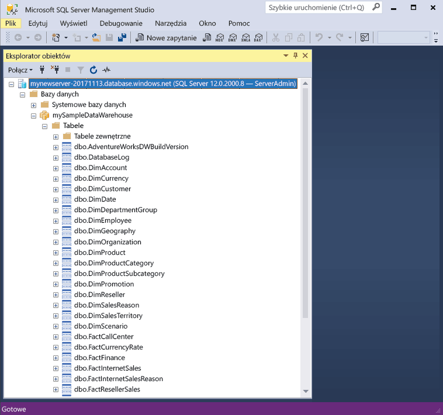

# <a name="quickstart-scale-compute-in-azure-sql-data-warehouse-using-t-sql"></a>Szybki Start: Skalowanie możliwości obliczeniowych w magazynie danych SQL Azure za pomocą T-SQL

Skalowanie możliwości obliczeniowych w magazynie danych SQL Azure przy użyciu T-SQL i programu SQL Server Management Studio (SSMS). [Skalowanie w poziomie obliczeń](sql-data-warehouse-manage-compute-overview.md) dla lepszą wydajność i skalę kopii obliczeń w celu ograniczenia kosztów. 

Jeśli nie masz subskrypcji platformy Azure, przed rozpoczęciem utwórz [bezpłatne](https://azure.microsoft.com/free/) konto.

## <a name="before-you-begin"></a>Przed rozpoczęciem

Pobierz i zainstaluj najnowszą wersję programu [SQL Server Management Studio](/sql/ssms/download-sql-server-management-studio-ssms.md) (SSMS).

Przyjęto założenie, że zostały wykonane [Szybki Start: tworzenie i łączenie - portal](create-data-warehouse-portal.md). Po zakończeniu procedury szybkiego startu tworzenie i połącz wiesz, jak połączyć się z: utworzony magazyn danych o nazwie **mySampleDataWarehouse**, utworzyć regułę zapory umożliwiającą naszych klientów dostępu do serwera, zainstalowane.
 
## <a name="create-a-data-warehouse"></a>Tworzenie magazynu danych

Użyj [Szybki Start: tworzenie i łączenie - portal](create-data-warehouse-portal.md) można utworzyć magazynu danych o nazwie **mySampleDataWarehouse**. Zakończ szybkiego startu, aby upewnić się, reguła zapory i połączyć się z magazynu danych w ramach programu SQL Server Management Studio.

## <a name="connect-to-the-server-as-server-admin"></a>Nawiąż połączenie z serwerem jako administrator serwera

W tej sekcji używany jest program [SQL Server Management Studio](/sql/ssms/download-sql-server-management-studio-ssms.md) (SSMS) do nawiązywania połączenia z serwerem SQL platformy Azure.

1. Otwórz program SQL Server Management Studio.

2. W oknie dialogowym **Połącz z serwerem** wprowadź następujące informacje:

   | Ustawienie       | Sugerowana wartość | Opis | 
   | ------------ | ------------------ | ------------------------------------------------- | 
   | Typ serwera | Aparat bazy danych | Ta wartość jest wymagana |
   | Nazwa serwera | W pełni kwalifikowana nazwa serwera | Oto przykład: **mynewserver-20171113.database.windows.net**. |
   | Authentication | Uwierzytelnianie programu SQL Server | Uwierzytelnianie SQL to jedyny typ uwierzytelniania skonfigurowany w tym samouczku. |
   | Login | Konto administratora serwera | To konto określono podczas tworzenia serwera. |
   | Hasło | Hasło konta administratora serwera | To hasło określono podczas tworzenia serwera. |

    

4. Kliknij przycisk **Połącz**. W programie SSMS zostanie otwarte okno Eksplorator obiektów. 

5. W Eksploratorze obiektów rozwiń pozycję **Bazy danych**. Następnie rozwiń pozycję **mySampleDatabase**, aby wyświetlić obiekty w nowej bazy danych.

     

## <a name="view-service-objective"></a>Cel usługi widoku
Ustawienie celu usługi zawiera liczbę jednostek magazynu danych dla hurtowni danych. 

Aby wyświetlić bieżące jednostki magazynu danych do magazynu danych:

1. W obszarze połączenia **mynewserver 20171113.database.windows.net**, rozwiń węzeł **systemowych baz danych**.
2. Kliknij prawym przyciskiem myszy **wzorca** i wybierz **nowe zapytanie**. Otworzy się okno nowego zapytania.
3. Uruchom następującą kwerendę, aby dokonać wyboru spośród sys.database_service_objectives dynamiczny widok zarządzania. 

    ```sql
    SELECT
        db.name [Database]
    ,   ds.edition [Edition]
    ,   ds.service_objective [Service Objective]
    FROM
        sys.database_service_objectives ds
    JOIN
        sys.databases db ON ds.database_id = db.database_id
    WHERE 
        db.name = 'mySampleDataWarehouse'
    ```

4. Pokaż wyniki następujące **mySampleDataWarehouse** ma celem usługi DW400. 

    


## <a name="scale-compute"></a>Skalowanie zasobów obliczeniowych
W usłudze SQL Data Warehouse można zwiększyć lub zmniejszyć zasoby obliczeniowe przez dostosowanie wartości właściwości jednostki magazynu danych. [Tworzenie i Connect - portal](create-data-warehouse-portal.md) utworzony **mySampleDataWarehouse** i zainicjować go od 400 jednostek dwu. Poniższe kroki Dostosuj liczbę jednostek dwu dla **mySampleDataWarehouse**.

Aby zmienić jednostki magazynu danych:

1. Kliknij prawym przyciskiem myszy **wzorca** i wybierz **nowe zapytanie**.
2. Użyj [ALTER DATABASE](/sql/t-sql/statements/alter-database-azure-sql-database) instrukcji T-SQL, aby zmodyfikować cel usługi. Uruchom następującą kwerendę, aby zmienić celu usługi do DW300. 

```Sql
ALTER DATABASE mySampleDataWarehouse
MODIFY (SERVICE_OBJECTIVE = 'DW300')
;
```

## <a name="check-database-state"></a>Sprawdź stan bazy danych

Aby sprawdzić stan bazy danych, uruchom następujące zapytanie **wzorca** bazy danych.

```sql
SELECT name AS "Database Name", state_desc AS "Status" 
FROM sys.databases db
WHERE db.name = 'mySampleDataWarehouse'
;
```

Po uruchomieniu tego polecenia powinien otrzymać wartość stanu Online, wstrzymywanie, wznawianie, skalowanie lub wstrzymana.

## <a name="check-operation-status"></a>Sprawdź stan operacji

Zwraca informacje dotyczące różnych operacji zarządzania na SQL Data Warehouse, uruchom następujące zapytanie [sys.dm_operation_status](/sql/relational-databases/system-dynamic-management-views/sys-dm-operation-status-azure-sql-database) DMV. Na przykład zwraca operacji i stan operacji, która będzie IN_PROGRESS lub UKOŃCZONA.

```sql
SELECT *
FROM
    sys.dm_operation_status
WHERE
    resource_type_desc = 'Database'
AND 
    major_resource_id = 'MySQLDW'
```


## <a name="next-steps"></a>Kolejne kroki
Teraz uzyskanych jak skalować obliczeń do magazynu danych. Aby dowiedzieć się więcej na temat usługi Azure SQL Data Warehouse, przejdź do samouczka na temat ładowania danych.

> [!div class="nextstepaction"]
>[Ładowanie danych do magazynu danych SQL Data Warehouse](load-data-from-azure-blob-storage-using-polybase.md)
