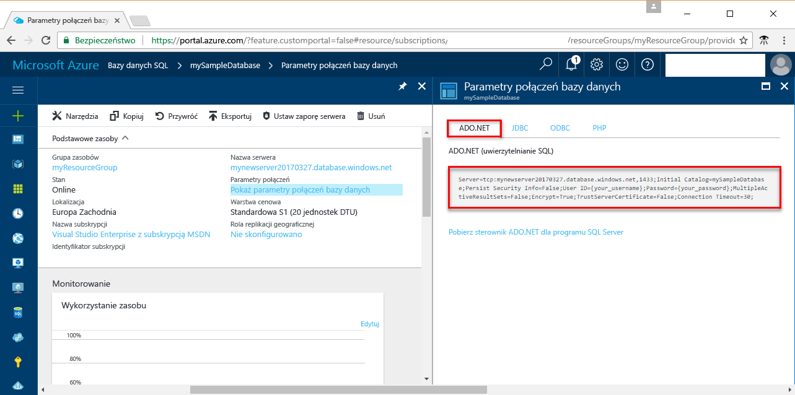

# <a name="use-net-core-c-to-query-an-azure-sql-database"></a>Korzystanie z platformy .NET Core (C#) do wykonywania zapytań w bazie danych Azure SQL Database

W tym przewodniku Szybki start pokazano, jak używać platformy [.NET Core](https://www.microsoft.com/net/) w systemach operacyjnych Windows/Linux/macOS w celu utworzenia programu w języku C# służącego do nawiązywania połączenia z bazą danych Azure SQL Database, a następnie, korzystając z instrukcji Transact-SQL, wysyłać zapytania o dane.

## <a name="prerequisites"></a>Wymagania wstępne

Aby ukończyć ten samouczek Szybki start, upewnij się, że dysponujesz następującymi elementami:

[!INCLUDE [prerequisites-create-db](../../includes/sql-database-connect-query-prerequisites-create-db-includes.md)]

- [Reguła zapory poziomu serwera](sql-database-get-started-portal.md#create-a-server-level-firewall-rule) dla publicznego adresu IP komputera, który będzie używany w tym samouczku Szybki start.

- W systemie operacyjnym zainstalowano platformę [.NET Core](https://www.microsoft.com/net/core). 

## <a name="sql-server-connection-information"></a>Informacje o połączeniu z serwerem SQL

[!INCLUDE [prerequisites-server-connection-info](../../includes/sql-database-connect-query-prerequisites-server-connection-info-includes.md)]

#### <a name="for-adonet"></a>Dla sterownika ADO.NET

1. Kontynuuj, klikając pozycję **Pokaż parametry połączenia bazy danych**.

2. Sprawdź pełne parametry połączenia sterownika **ADO.NET**.

    

> [!IMPORTANT]
> W przypadku publicznego adresu IP komputera, na którym jest wykonywany ten samouczek, niezbędne jest posiadanie reguły zapory. Jeśli pracujesz na innym komputerze lub masz inny publiczny adres IP, utwórz [regułę zapory poziomu serwera przy użyciu portalu Azure](sql-database-get-started-portal.md#create-a-server-level-firewall-rule). 
>
  
## <a name="create-a-new-net-project"></a>Tworzenie nowego projektu .NET

1. Otwórz wiersz polecenia i utwórz folder o nazwie *sqltest*. Przejdź do utworzonego folderu i uruchom następujące polecenie:

    ```
    dotnet new console
    ```

2. Otwórz plik ***sqltest.csproj*** w ulubionym edytorze tekstów i dodaj pozycję System.Data.SqlClient jako zależność, używając następującego kodu:

    ```xml
    <ItemGroup>
        <PackageReference Include="System.Data.SqlClient" Version="4.4.0" />
    </ItemGroup>
    ```

## <a name="insert-code-to-query-sql-database"></a>Wstawianie kodu zapytania bazy danych SQL

1. W środowisku projektowym lub ulubionym edytorze tekstów utwórz nowy plik o nazwie **Program.cs**.

2. Zastąp jego zawartość następującym kodem i dodaj odpowiednie wartości dla serwera, bazy danych, użytkownika i hasła.

```csharp
using System;
using System.Data.SqlClient;
using System.Text;

namespace sqltest
{
    class Program
    {
        static void Main(string[] args)
        {
            try 
            { 
                SqlConnectionStringBuilder builder = new SqlConnectionStringBuilder();
                builder.DataSource = "your_server.database.windows.net"; 
                builder.UserID = "your_user";            
                builder.Password = "your_password";     
                builder.InitialCatalog = "your_database";

                using (SqlConnection connection = new SqlConnection(builder.ConnectionString))
                {
                    Console.WriteLine("\nQuery data example:");
                    Console.WriteLine("=========================================\n");
                    
                    connection.Open();       
                    StringBuilder sb = new StringBuilder();
                    sb.Append("SELECT TOP 20 pc.Name as CategoryName, p.name as ProductName ");
                    sb.Append("FROM [SalesLT].[ProductCategory] pc ");
                    sb.Append("JOIN [SalesLT].[Product] p ");
                    sb.Append("ON pc.productcategoryid = p.productcategoryid;");
                    String sql = sb.ToString();

                    using (SqlCommand command = new SqlCommand(sql, connection))
                    {
                        using (SqlDataReader reader = command.ExecuteReader())
                        {
                            while (reader.Read())
                            {
                                Console.WriteLine("{0} {1}", reader.GetString(0), reader.GetString(1));
                            }
                        }
                    }                    
                }
            }
            catch (SqlException e)
            {
                Console.WriteLine(e.ToString());
            }
            Console.ReadLine();
        }
    }
}
```

## <a name="run-the-code"></a>Uruchamianie kodu

1. W wierszu polecenia uruchom następujące polecenia:

   ```csharp
   dotnet restore
   dotnet run
   ```

2. Sprawdź, czy zostało zwróconych 20 pierwszych wierszy, a następnie zamknij okno aplikacji.


## <a name="next-steps"></a>Następne kroki

- [Rozpoczynanie pracy z platformą .NET Core w systemie Windows/Linux/macOS przy użyciu wiersza polecenia](/dotnet/core/tutorials/using-with-xplat-cli).
- Dowiedz się, jak [uzyskać połączenie i wykonywać zapytania bazy danych Azure SQL przy użyciu platformy .NET i programu Visual Studio](sql-database-connect-query-dotnet-visual-studio.md).  
- Dowiedz się, jak [zaprojektować pierwszą bazę danych Azure SQL przy użyciu narzędzia SSMS](sql-database-design-first-database.md) lub [zaprojektować pierwszą bazę danych Azure SQL przy użyciu platformy .NET](sql-database-design-first-database-csharp.md).
- Aby uzyskać więcej informacji na temat platformy .NET, zobacz [.NET documentation](https://docs.microsoft.com/dotnet/) (Dokumentacja platformy .NET).
