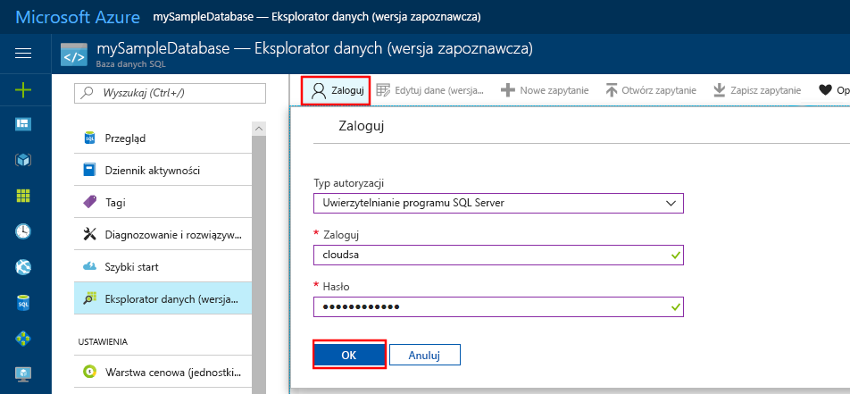
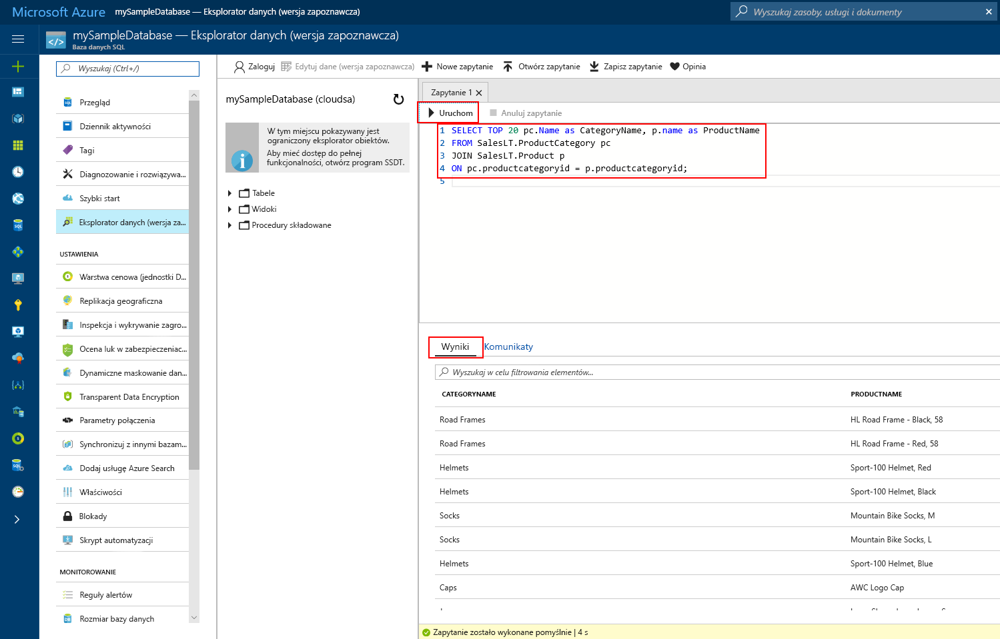

# <a name="azure-portal-use-the-sql-query-editor-to-connect-and-query-data"></a>Witryna Azure Portal: używanie edytora zapytań SQL do nawiązywania połączenia i wykonywania zapytań o dane

Edytor zapytań SQL jest przeglądarkowym narzędziem do wykonywania zapytań, które zapewnia wydajny i nieskomplikowany sposób wykonywania zapytań SQL do bazy danych Azure SQL lub magazynu danych Azure SQL bez opuszczania witryny Azure Portal. W tym przewodniku Szybki start pokazano, jak używać edytora zapytań w celu nawiązywania połączenia z bazą danych SQL, a następnie, korzystając z instrukcji Transact-SQL, wysyłać zapytania o dane oraz wstawiać, aktualizować i usuwać dane z bazy danych. 

## <a name="prerequisites"></a>Wymagania wstępne

Ten przewodnik Szybki start używa jako punktu początkowego zasobów utworzonych w jednym z poniższych przewodników Szybki start:

[!INCLUDE [prerequisites-create-db](../../includes/sql-database-connect-query-prerequisites-create-db-includes.md)]

## <a name="log-in-to-the-azure-portal"></a>Logowanie do witryny Azure Portal

Zaloguj się do witryny [Azure Portal](https://portal.azure.com/).


## <a name="connect-using-sql-authentication"></a>Nawiązywanie połączenia przy użyciu uwierzytelniania SQL
> [!NOTE]
> Upewnij się, że opcja „Zezwalaj na dostęp do usług platformy Azure” jest ustawiona na „WŁ.” w ustawieniach zapory serwera SQL Server. Ta opcja zapewnia edytorowi zapytań SQL dostęp do Twoich baz danych i magazynów danych.

1. Kliknij pozycję **Bazy danych SQL** w menu po lewej stronie, a następnie kliknij bazę danych, do której chcesz wykonać zapytanie.

2. Na stronie Twojej bazy danych SQL kliknij pozycję **Narzędzia** na pasku narzędzi. Zostanie otwarta strona Narzędzia.

    

3. Kliknij pozycję **Edytor zapytań (wersja zapoznawcza)**, kliknij pole wyboru **Warunki dotyczące wersji zapoznawczej**, a następnie kliknij przycisk **OK**. Zostanie otwarta strona Edytor zapytań.

4. Kliknij pozycję **Zaloguj**, a następnie po wyświetleniu monitu wybierz pozycję **Uwierzytelnianie na serwerze SQL Server** i podaj identyfikator oraz hasło logowania administratora serwera, które zostały podane podczas tworzenia bazy danych.

     

5. Kliknij przycisk **OK, aby się zalogować**.


## <a name="connect-using-azure-ad"></a>Nawiązywanie połączenia przy użyciu usługi AD platformy Azure

Skonfigurowanie administratora usługi Active Directory umożliwia skorzystanie z jednej tożsamości do logowania się do witryny Azure Portal i swojej bazy danych SQL. Wykonaj poniższe kroki, aby skonfigurować administratora usługi Active Directory dla utworzonego serwera SQL.

> [!NOTE]
> Konta e-mail (na przykład outlook.com, hotmail.com, live.com, gmail.com, yahoo.com) nie są jeszcze obsługiwane jako administratorzy usługi Active Directory. Upewnij się, aby wybrać użytkownika, który został utworzony natywnie w usłudze Azure Active Directory lub sfederowany z usługą Azure Active Directory.

1. Wybierz pozycję **Serwery SQL** z menu po lewej stronie, a następnie wybierz swój serwer z listy serwerów.

2. Wybierz ustawienie **Administrator usługi Active Directory** z menu ustawień swojego serwera SQL Server.

3. W bloku administratora usługi Active Directory kliknij polecenie **Ustaw administratora**, a następnie wybierz użytkownika lub grupę, która będzie administratorem usługi Active Directory.

     

4. W górnej części bloku administratora usługi Active Directory kliknij polecenie **Zapisz**, aby ustawić swojego administratora usługi Active Directory.

Przejdź do bazy danych SQL, do której chcesz wykonać zapytanie, kliknij **polecenie Narzędzia** na pasku narzędzi i wybierz opcję **Edytor zapytań (wersja zapoznawcza)**. Zostanie otwarta strona edytora zapytań i automatycznie zostanie nawiązane połączenie z bazą danych.


## <a name="run-query-using-query-editor"></a>Uruchamianie zapytania przy użyciu edytora zapytań

Po uwierzytelnieniu w okienku edytora zapytań wpisz następujące zapytanie, aby wykonać zapytanie o 20 najważniejszych produktów według kategorii.

```sql
 SELECT TOP 20 pc.Name as CategoryName, p.name as ProductName
 FROM SalesLT.ProductCategory pc
 JOIN SalesLT.Product p
 ON pc.productcategoryid = p.productcategoryid;
```

Kliknij pozycję **Uruchom**, a następnie przejrzyj wyniki zapytania w okienku **Wyniki**.



## <a name="insert-data-using-query-editor"></a>Wstawianie danych przy użyciu edytora zapytań

Użyj następującego kodu, aby wstawić nowy produkt do tabeli SalesLT.Product przy użyciu instrukcji [INSERT](https://msdn.microsoft.com/library/ms174335.aspx) języka Transact-SQL.

1. W oknie zapytania zastąp poprzednie zapytanie następującym zapytaniem:

   ```sql
   INSERT INTO [SalesLT].[Product]
           ( [Name]
           , [ProductNumber]
           , [Color]
           , [ProductCategoryID]
           , [StandardCost]
           , [ListPrice]
           , [SellStartDate]
           )
     VALUES
           ('myNewProduct'
           ,123456789
           ,'NewColor'
           ,1
           ,100
           ,100
           ,GETDATE() );
   ```

2. Na pasku narzędzi kliknij pozycję **Uruchom**, aby wstawić nowy wiersz w tabeli Product.

## <a name="update-data-using-query-editor"></a>Aktualizowanie danych przy użyciu edytora zapytań

Użyj następującego kodu, aby zaktualizować nowy, wcześniej dodany produkt przy użyciu instrukcji [UPDATE](https://msdn.microsoft.com/library/ms177523.aspx) języka Transact-SQL.

1. W oknie zapytania zastąp poprzednie zapytanie następującym zapytaniem:

   ```sql
   UPDATE [SalesLT].[Product]
   SET [ListPrice] = 125
   WHERE Name = 'myNewProduct';
   ```

2. Na pasku narzędzi kliknij opcję **Uruchom**, aby zaktualizować określony wiersz w tabeli Product.

## <a name="delete-data-using-query-editor"></a>Usuwanie danych przy użyciu edytora zapytań

Użyj następującego kodu, aby usunąć nowy, wcześniej dodany produkt przy użyciu instrukcji [DELETE](https://msdn.microsoft.com/library/ms189835.aspx) języka Transact-SQL.

1. W oknie zapytania zastąp poprzednie zapytanie następującym zapytaniem:

   ```sql
   DELETE FROM [SalesLT].[Product]
   WHERE Name = 'myNewProduct';
   ```

2. Na pasku narzędzi kliknij opcję **Uruchom**, aby usunąć określony wiersz w tabeli Product.


## <a name="query-editor-considerations"></a>Zagadnienia dotyczące edytora zapytań

Istnieje kilka kwestii, które należy wiedzieć podczas pracy z edytorem zapytań, gdy pozostaje on w stanie wersji zapoznawczej:

1. Upewnij się, że opcja „Zezwalaj na dostęp do usług platformy Azure” w ustawieniach zapory serwera SQL Server jest ustawiona na „WŁ.”. Ta opcja zapewnia edytorowi zapytań SQL dostęp do Twoich baz danych SQL i magazynów danych.

2. Logowanie administratora usługi Azure Active Directory nie działa dla kont, które mają włączone uwierzytelnianie 2-składnikowe. 

3. Konta e-mail (na przykład outlook.com, hotmail.com, live.com, gmail.com, yahoo.com) nie są jeszcze obsługiwane jako administratorzy usługi Active Directory. Upewnij się, aby wybrać użytkownika, który został utworzony natywnie w usłudze Azure Active Directory lub sfederowany z usługą Azure Active Directory

4. Typy zapytań o dane przestrzenne nie są jeszcze obsługiwane w edytorze zapytań. Wykonanie zapytania o kolumny przestrzenne spowoduje błąd „System.IO.FileNotFoundException”.

5. Tabele i widoki bazy danych nie obsługują funkcji IntelliSense. Jednak edytor obsługuje funkcję automatycznego uzupełniania dla nazw, które zostały już wpisane. 

6. Naciśnięcie klawisza F5 spowoduje odświeżenie strony edytora zapytań i utratę zapytania, które było opracowywane. Do wykonywania zapytań służy przycisk Uruchom na pasku narzędzi.


## <a name="next-steps"></a>Następne kroki

- Aby dowiedzieć się więcej o języku Transact-SQL obsługiwanym w bazach danych Azure SQL, zobacz [Transact-SQL differences in SQL database (Różnice języka Transact-SQL w bazie danych SQL)](sql-database-transact-sql-information.md).
