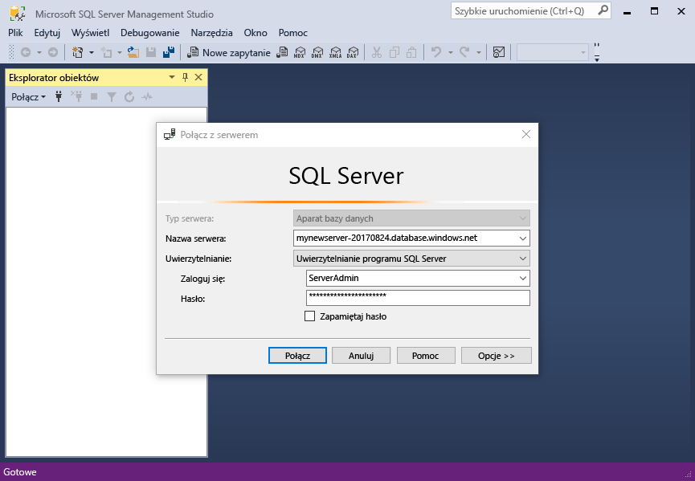
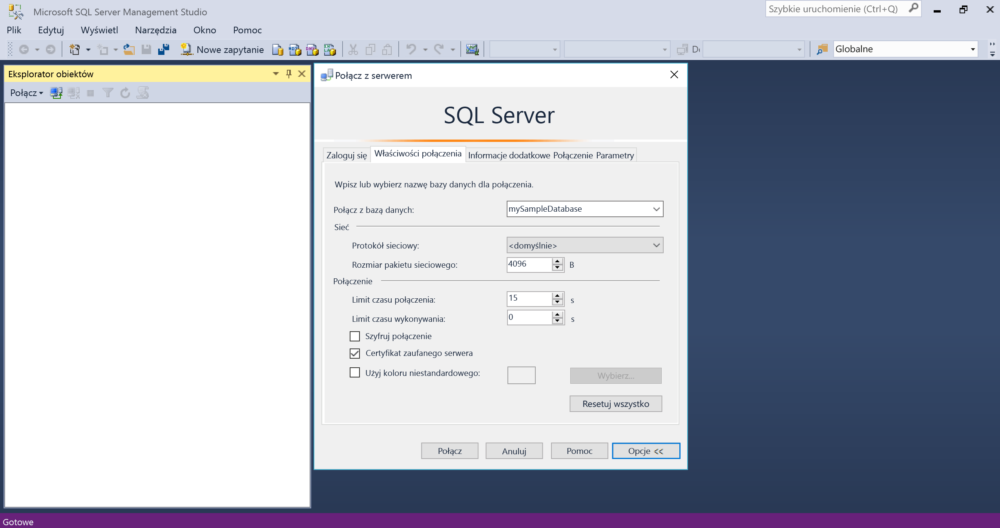
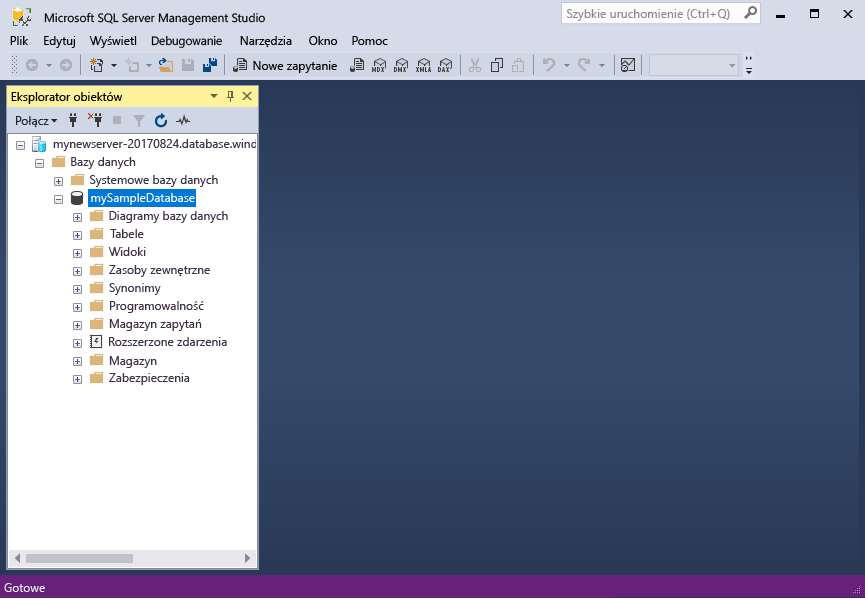
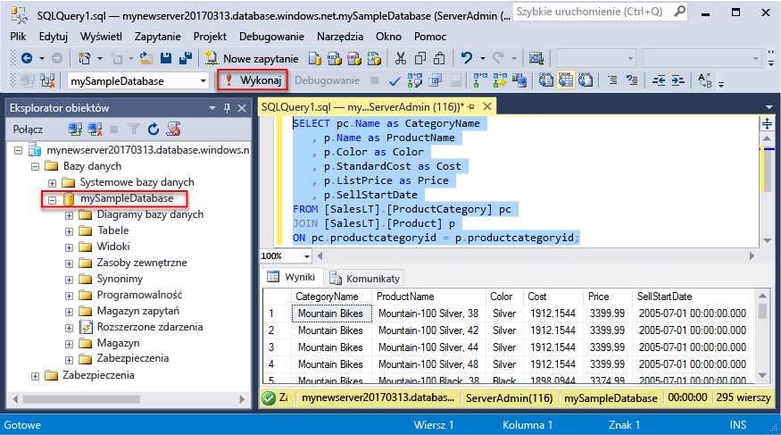
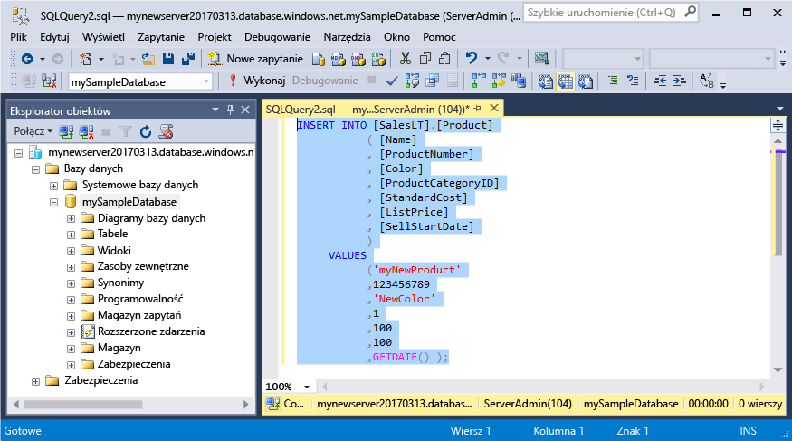
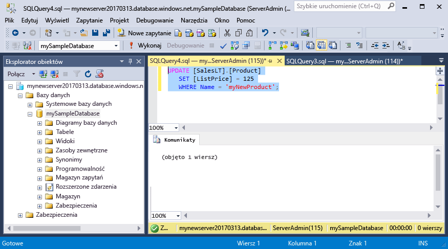
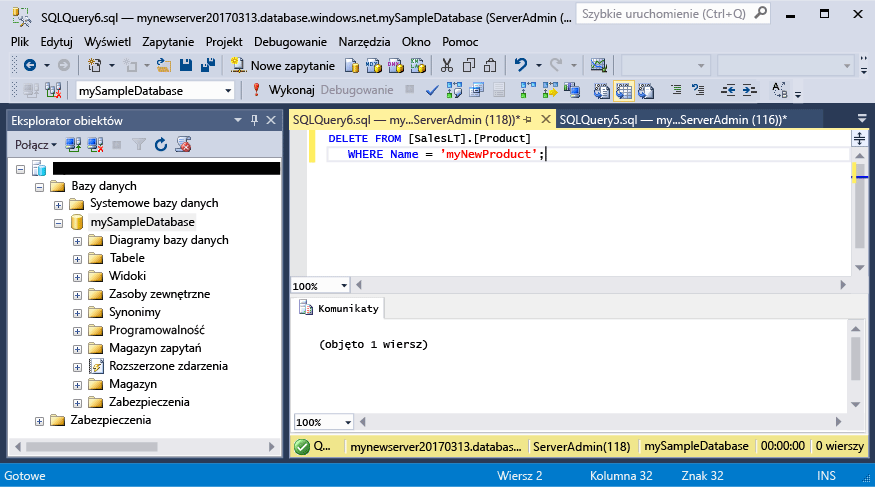

# <a name="azure-sql-database-use-sql-server-management-studio-to-connect-and-query-data"></a>Azure SQL Database: używanie programu SQL Server Management Studio do nawiązywania połączenia i wykonywania zapytań dotyczących danych

[SQL Server Management Studio](https://msdn.microsoft.com/library/ms174173.aspx) (SSMS) to zintegrowane środowisko do zarządzania dowolną infrastrukturą SQL — od programu SQL Server po usługę SQL Database dla systemu Microsoft Windows. W tym przewodniku Szybki start pokazano, jak używać narzędzia SSMS w celu nawiązywania połączenia z usługą Azure SQL Database, a następnie, korzystając z instrukcji Transact-SQL, wysyłać zapytania o dane, a także wstawiać, aktualizować i usuwać dane z bazy danych. 

## <a name="prerequisites"></a>Wymagania wstępne

Ten przewodnik Szybki start używa jako punktu początkowego zasobów utworzonych w jednym z poniższych przewodników Szybki start:

- [Tworzenie bazy danych — portal](sql-database-get-started-portal.md)
- [Tworzenie bazy danych — interfejs wiersza polecenia](sql-database-get-started-cli.md)
- [Tworzenie bazy danych — PowerShell](sql-database-get-started-powershell.md)

Przed rozpoczęciem upewnij się, że zainstalowano najnowszą wersję programu [SSMS](https://msdn.microsoft.com/library/mt238290.aspx). 

## <a name="sql-server-connection-information"></a>Informacje o połączeniu z serwerem SQL

Uzyskaj parametry połączenia potrzebne do nawiązania połączenia z bazą danych Azure SQL. W następnych procedurach będą potrzebne w pełni kwalifikowana nazwa serwera, nazwa bazy danych i informacje logowania.

1. Zaloguj się do witryny [Azure Portal](https://portal.azure.com/).
2. Wybierz opcję **Bazy danych SQL** z menu po lewej stronie, a następnie kliknij bazę danych na stronie **Bazy danych SQL**. 
3. Na stronie **Przegląd** bazy danych zweryfikuj w pełni kwalifikowaną nazwę serwera, jak pokazano na poniższej ilustracji. Możesz umieścić kursor na nazwie serwera w celu wywołania opcji **Kliknij, aby skopiować**.

    

4. Jeśli nie pamiętasz informacji logowania dla serwera Azure SQL Database, przejdź do strony serwera SQL Database, aby wyświetlić nazwę administratora oraz, w razie konieczności, zresetować hasło. 

## <a name="connect-to-your-database"></a>Nawiązywanie połączenia z bazą danych

Użyj programu SQL Server Management Studio, aby nawiązać połączenie z serwerem Azure SQL Database. 

> [!IMPORTANT]
> Serwer logiczny usługi Azure SQL Database nasłuchuje na porcie 1433. Jeśli próbujesz nawiązać połączenie z serwerem logicznym usługi Azure SQL Database za pośrednictwem zapory firmowej, to aby połączenie się powiodło, ten port musi być otwarty w zaporze firmowej.
>

1. Otwórz program SQL Server Management Studio.

2. W oknie dialogowym **Połącz z serwerem** wprowadź następujące informacje:

   | Ustawienie       | Sugerowana wartość | Opis | 
   | ------------ | ------------------ | ------------------------------------------------- | 
   | **Typ serwera** | Aparat bazy danych | Ta wartość jest wymagana. |
   | **Nazwa serwera** | W pełni kwalifikowana nazwa serwera | Nazwa może mieć taką formę: **mynewserver20170313.database.windows.net**. |
   | **Uwierzytelnianie** | Uwierzytelnianie programu SQL Server | Uwierzytelnianie SQL to jedyny typ uwierzytelniania skonfigurowany w tym samouczku. |
   | **Logowanie** | Konto administratora serwera | To konto określono podczas tworzenia serwera. |
   | **Hasło** | Hasło konta administratora serwera | To hasło określono podczas tworzenia serwera. |

     

3. Kliknij przycisk **Opcje** w oknie dialogowym **Połącz z serwerem**. W sekcji **Nawiązywanie połączenia z bazą danych** wprowadź ciąg **mySampleDatabase**, aby nawiązać połączenie z tą bazą danych.

     

4. Kliknij przycisk **Połącz**. W programie SSMS zostanie otwarte okno Eksplorator obiektów. 

     

5. W Eksploratorze obiektów rozwiń pozycję **Bazy danych**, a następnie rozwiń pozycję **mySampleDatabase**, aby wyświetlić obiekty w przykładowej bazie danych.

## <a name="query-data"></a>Zapytania o dane

Użyj następującego kodu, aby wykonać zapytanie o 20 najpopularniejszych produktów według kategorii, używając instrukcji [SELECT](https://msdn.microsoft.com/library/ms189499.aspx) języka Transact-SQL.

1. W Eksploratorze obiektów kliknij prawym przyciskiem myszy pozycję **mySampleDatabase** i kliknij opcję **Nowe zapytanie**. Zostanie otwarte puste okno zapytania, które jest połączone z Twoją bazą danych.
2. W oknie zapytania wprowadź następujące zapytanie:

   ```sql
   SELECT pc.Name as CategoryName, p.name as ProductName
   FROM [SalesLT].[ProductCategory] pc
   JOIN [SalesLT].[Product] p
   ON pc.productcategoryid = p.productcategoryid;
   ```

3. Na pasku narzędzi kliknij opcję **Wykonaj**, aby pobrać dane z tabel Product i ProductCategory.

    

## <a name="insert-data"></a>Wstawianie danych

Użyj następującego kodu, aby wstawić nowy produkt do tabeli SalesLT.Product przy użyciu instrukcji [INSERT](https://msdn.microsoft.com/library/ms174335.aspx) języka Transact-SQL.

1. W oknie zapytania zastąp poprzednie zapytanie następującym zapytaniem:

   ```sql
   INSERT INTO [SalesLT].[Product]
           ( [Name]
           , [ProductNumber]
           , [Color]
           , [ProductCategoryID]
           , [StandardCost]
           , [ListPrice]
           , [SellStartDate]
           )
     VALUES
           ('myNewProduct'
           ,123456789
           ,'NewColor'
           ,1
           ,100
           ,100
           ,GETDATE() );
   ```

2. Na pasku narzędzi kliknij opcję **Wykonaj**, aby wstawić nowy wiersz w tabeli Product.

    

## <a name="update-data"></a>Aktualizowanie danych

Użyj następującego kodu, aby zaktualizować nowy, wcześniej dodany produkt przy użyciu instrukcji [UPDATE](https://msdn.microsoft.com/library/ms177523.aspx) języka Transact-SQL.

1. W oknie zapytania zastąp poprzednie zapytanie następującym zapytaniem:

   ```sql
   UPDATE [SalesLT].[Product]
   SET [ListPrice] = 125
   WHERE Name = 'myNewProduct';
   ```

2. Na pasku narzędzi kliknij opcję **Wykonaj**, aby zaktualizować określony wiersz w tabeli Product.

    

## <a name="delete-data"></a>Usuwanie danych

Użyj następującego kodu, aby usunąć nowy, wcześniej dodany produkt przy użyciu instrukcji [DELETE](https://msdn.microsoft.com/library/ms189835.aspx) języka Transact-SQL.

1. W oknie zapytania zastąp poprzednie zapytanie następującym zapytaniem:

   ```sql
   DELETE FROM [SalesLT].[Product]
   WHERE Name = 'myNewProduct';
   ```

2. Na pasku narzędzi kliknij opcję **Wykonaj**, aby usunąć określony wiersz w tabeli Product.

    

## <a name="next-steps"></a>Następne kroki

- Aby dowiedzieć się więcej na temat tworzenia serwerów i baz danych oraz zarządzania nimi przy użyciu języka Transact-SQL, zobacz [Learn about Azure SQL Database servers and databases](sql-database-servers-databases.md) (Informacje na temat serwerów i baz danych usługi Azure SQL Database).
- Aby uzyskać więcej informacji o programie SSMS, zobacz [Korzystanie z programu SQL Server Management Studio](https://msdn.microsoft.com/library/ms174173.aspx).
- Aby nawiązywać połączenia i wykonywać zapytania za pomocą programu Visual Studio Code, zobacz [Connect and query with Visual Studio Code](sql-database-connect-query-vscode.md) (Nawiązywanie połączeń i wykonywanie zapytań za pomocą programu Visual Studio Code).
- Aby nawiązywać połączenia i wykonywać zapytania za pomocą platformy .NET, zobacz [Connect and query with .NET](sql-database-connect-query-dotnet.md) (Nawiązywanie połączeń i wykonywanie zapytań za pomocą platformy .NET).
- Aby nawiązywać połączenia i wykonywać zapytania za pomocą języka PHP, zobacz [Connect and query with PHP](sql-database-connect-query-php.md) (Nawiązywanie połączeń i wykonywanie zapytań za pomocą języka PHP).
- Aby nawiązywać połączenia i wykonywać zapytania za pomocą oprogramowania Node.js, zobacz [Connect and query with Node.js](sql-database-connect-query-nodejs.md) (Nawiązywanie połączeń i wykonywanie zapytań za pomocą oprogramowania Node.js).
- Aby nawiązywać połączenia i wykonywać zapytania za pomocą języka Java, zobacz [Connect and query with Java](sql-database-connect-query-java.md) (Nawiązywanie połączeń i wykonywanie zapytań za pomocą języka Java).
- Aby nawiązywać połączenia i wykonywać zapytania za pomocą języka Python, zobacz [Connect and query with Python](sql-database-connect-query-python.md) (Nawiązywanie połączeń i wykonywanie zapytań za pomocą języka Python).
- Aby nawiązywać połączenia i wykonywać zapytania za pomocą języka Ruby, zobacz [Connect and query with Ruby](sql-database-connect-query-ruby.md) (Nawiązywanie połączeń i wykonywanie zapytań za pomocą języka Ruby).
