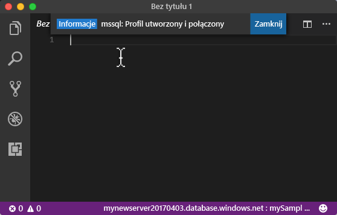
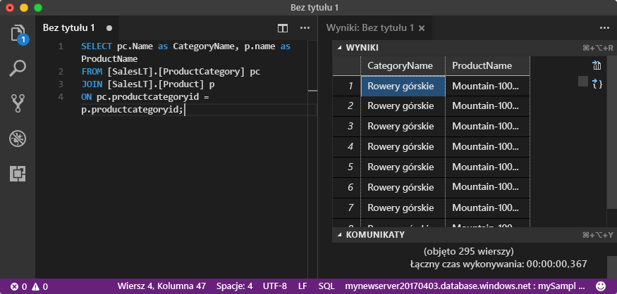

# <a name="azure-sql-database-use-visual-studio-code-to-connect-and-query-data"></a>Baza danych Azure SQL Database: używanie programu Visual Studio Code do nawiązywania połączenia i wysyłania zapytań dotyczących danych

[Visual Studio Code](https://code.visualstudio.com/docs) jest graficznym edytorem kodu dla systemów Linux, MacOS i Windows, który obsługuje rozszerzenia. Użyj programu Visual Studio Code z [rozszerzeniem mssql](https://aka.ms/mssql-marketplace), aby nawiązać połączenie z bazą danych Azure SQL i wysyłać do niej zapytania. Ten przewodnik zawiera szczegółowe informacje o używaniu programu Visual Studio Code do nawiązywania połączenia z bazą danych Azure SQL, a następnie wykonywania instrukcji zapytań, wstawiania, aktualizowania i usuwania.

Ten przewodnik Szybki start używa jako punktu początkowego zasobów utworzonych w jednym z poniższych przewodników Szybki start:

- [Tworzenie bazy danych — portal](sql-database-get-started-portal.md)
- [Tworzenie bazy danych — interfejs wiersza polecenia](sql-database-get-started-cli.md)

Przed rozpoczęciem upewnij się, że zainstalowano najnowszą wersję programu [Visual Studio Code](https://code.visualstudio.com/Download) i załadowano [rozszerzenie mssql](https://aka.ms/mssql-marketplace). Aby uzyskać wskazówki dotyczące instalacji rozszerzenia mssql, zobacz [Instalacja programu VS Code](https://docs.microsoft.com/sql/linux/sql-server-linux-develop-use-vscode#install-vs-code). 

## <a name="get-connection-information"></a>Pobieranie informacji o połączeniu

Pobierz w pełni kwalifikowaną nazwę serwera dla serwera Azure SQL Database w witrynie Azure Portal. W pełni kwalifikowanej nazwy serwera używa się do nawiązywania połączenia z serwerem przy użyciu programu Visual Studio Code.

1. Zaloguj się do witryny [Azure Portal](https://portal.azure.com/).
2. Wybierz opcję **Bazy danych SQL** z menu po lewej stronie, a następnie kliknij bazę danych na stronie **Bazy danych SQL**. 
3. W okienku **Essentials** na stronie bazy danych w witrynie Azure Portal zlokalizuj i skopiuj **nazwę serwera**, aby wykorzystać ją później w tym przewodniku Szybki start.

    

## <a name="set-language-mode-to-sql"></a>Ustawianie trybu języka na SQL

Ustaw tryb języka na **SQL** w programie Visual Studio Code, aby włączyć polecenia mssql i T-SQL IntelliSense.

1. Otwórz nowe okno programu Visual Studio Code. 

2. Naciśnij klawisze **CTRL+K, M**, wpisz **SQL** i naciśnij klawisz **ENTER**, aby ustawić tryb języka na SQL. 


## <a name="connect-to-the-server"></a>Nawiązywanie połączenia z serwerem

Użyj programu Visual Studio Code, aby nawiązać połączenie z serwerem Azure SQL Database.

1. W programie VS Code naciśnij klawisze **CTRL + SHIFT + P** (lub klawisz **F1**), aby otworzyć paletę poleceń.

2. Wpisz **sqlcon** i naciśnij klawisz **ENTER**.

3. Kliknij przycisk **Tak**, aby ustawić język na **SQL**.

4. Naciśnij klawisz **ENTER**, aby wybrać opcję **Utwórz profil połączenia**. W ten sposób zostanie utworzony profil połączenia dla wystąpienia programu SQL Server.

5. Postępuj zgodnie z monitami, aby określić właściwości połączenia dla nowego profilu połączenia. Po określeniu każdej wartości naciśnij klawisz **ENTER**, aby kontynuować. 

   Poniższa tabela opisuje właściwości profilu połączenia.

   | Ustawienie | Opis |
   |-----|-----|
   | **Nazwa serwera** | Wprowadź w pełni kwalifikowaną nazwę serwera, np. **mynewserver20170313.database.windows.net** |
   | **Nazwa bazy danych** | Wprowadź nazwę bazy danych, np. **mySampleDatabase** |
   | **Uwierzytelnianie** | Wybierz identyfikator logowania SQL |
   | **Nazwa użytkownika** | Wprowadź nazwę konta administratora serwera |
   | **Hasło (identyfikator logowania SQL)** | Wprowadź hasło konta administratora serwera | 
   | **Zapisać hasło?** | Wybierz opcję **Tak** lub **Nie** |
   | **[Opcjonalnie] Wprowadź nazwę dla tego profilu** | Wprowadź nazwę profilu połączenia, np. **mySampleDatabase**. 

6. Naciśnij klawisz **ESC**, aby zamknąć komunikat z informacją o utworzeniu profilu i nawiązaniu z nim połączenia.

7. Sprawdź połączenie na pasku stanu.

   

## <a name="query-data"></a>Zapytania o dane

Użyj instrukcji Transact-SQL [SELECT](https://msdn.microsoft.com/library/ms189499.aspx), aby wykonać zapytanie dotyczące danych w bazie danych Azure SQL.

1. W oknie **Edytor** wprowadź następujące zapytanie w pustym oknie zapytania:

   ```sql
   SELECT pc.Name as CategoryName, p.name as ProductName
   FROM [SalesLT].[ProductCategory] pc
   JOIN [SalesLT].[Product] p
   ON pc.productcategoryid = p.productcategoryid;
   ```

3. Naciśnij klawisze **CTRL+SHIFT+E**, aby pobrać dane z tabel Product i ProductCategory.

    

## <a name="insert-data"></a>Wstawianie danych

Użyj instrukcji Transact-SQL [INSERT](https://msdn.microsoft.com/library/ms174335.aspx), aby wstawić dane do bazy danych Azure SQL.

1. W oknie **Edytor** usuń poprzednie zapytanie i wprowadź następujące:

   ```sql
   INSERT INTO [SalesLT].[Product]
           ( [Name]
           , [ProductNumber]
           , [Color]
           , [ProductCategoryID]
           , [StandardCost]
           , [ListPrice]
           , [SellStartDate]
           )
     VALUES
           ('myNewProduct'
           ,123456789
           ,'NewColor'
           ,1
           ,100
           ,100
           ,GETDATE() );
   ```

3. Naciśnij klawisze **CTRL+SHIFT+E**, aby wstawić nowy wiersz w tabeli Product.

## <a name="update-data"></a>Aktualizowanie danych

Użyj instrukcji Transact-SQL [UPDATE](https://msdn.microsoft.com/library/ms177523.aspx), aby zaktualizować dane w bazie danych Azure SQL.

1.  W oknie **Edytor** usuń poprzednie zapytanie i wprowadź następujące:

   ```sql
   UPDATE [SalesLT].[Product]
   SET [ListPrice] = 125
   WHERE Name = 'myNewProduct';
   ```

3. Naciśnij klawisze **CTRL+SHIFT+E**, aby zaktualizować wiersz w tabeli Product.

## <a name="delete-data"></a>Usuwanie danych

Użyj instrukcji Transact-SQL [DELETE](https://msdn.microsoft.com/library/ms189835.aspx), aby usunąć dane w bazie danych Azure SQL.

1. W oknie **Edytor** usuń poprzednie zapytanie i wprowadź następujące:

   ```sql
   DELETE FROM [SalesLT].[Product]
   WHERE Name = 'myNewProduct';
   ```

3. Naciśnij klawisze **CTRL+SHIFT+E**, aby usunąć wiersz w tabeli Product.

## <a name="next-steps"></a>Następne kroki

- Aby uzyskać więcej informacji o programie Visual Studio Code, zobacz [Visual Studio Code](https://code.visualstudio.com/docs)
- Aby uzyskać więcej informacji o wysyłaniu zapytań i edytowaniu danych przy użyciu programu SQL Server Management Studio, zobacz [SSMS](https://msdn.microsoft.com/library/ms174173.aspx).

