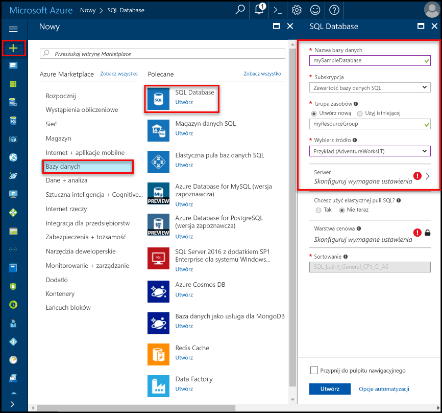
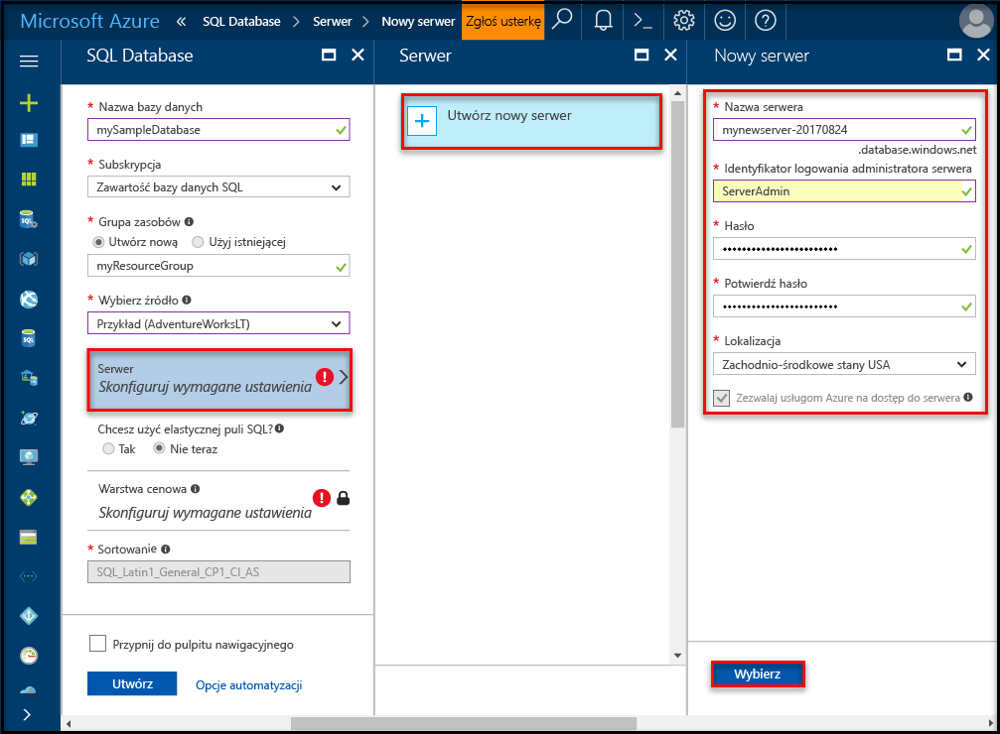
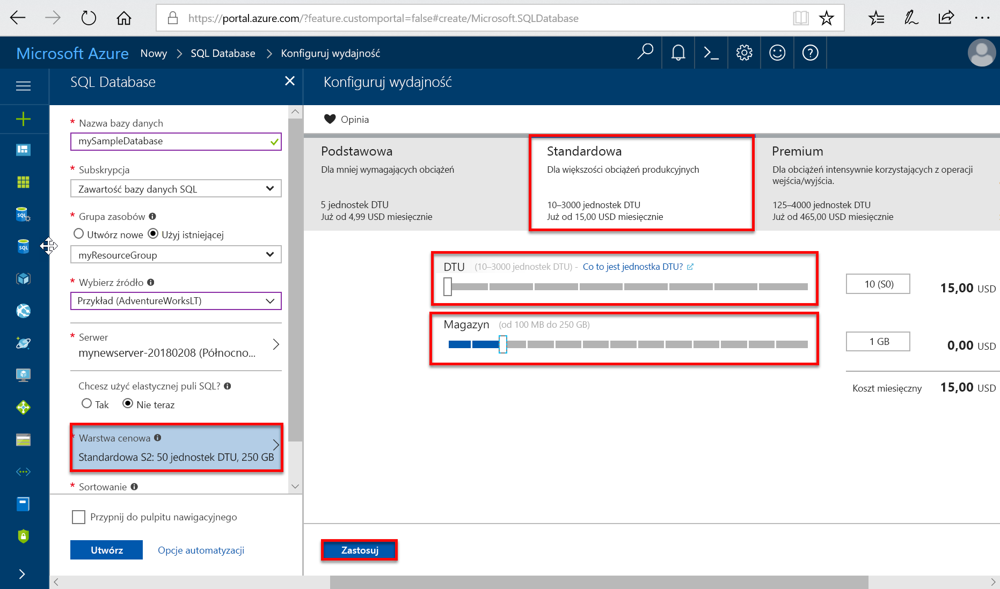
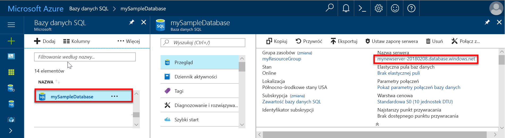
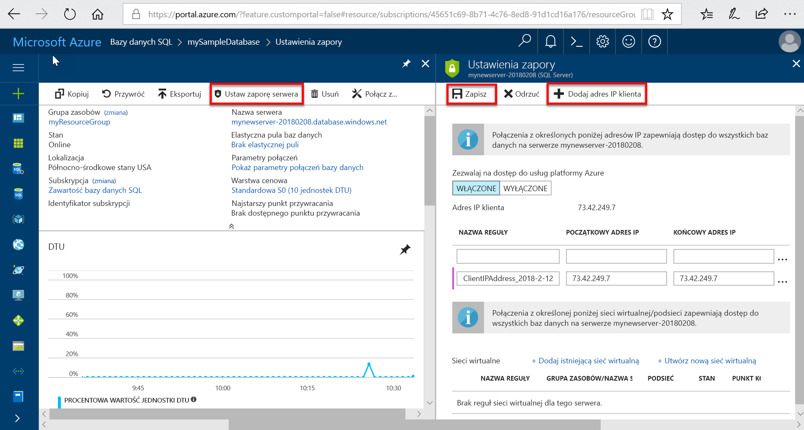
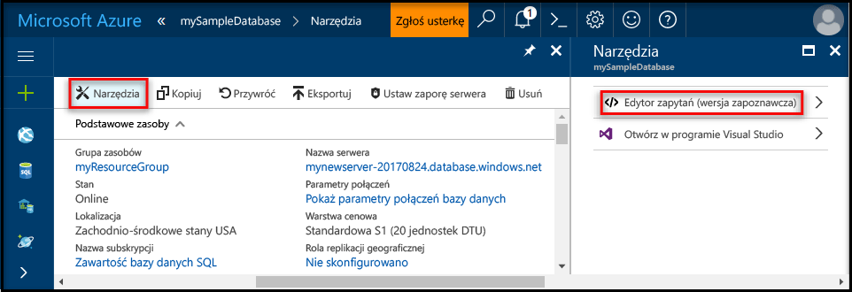
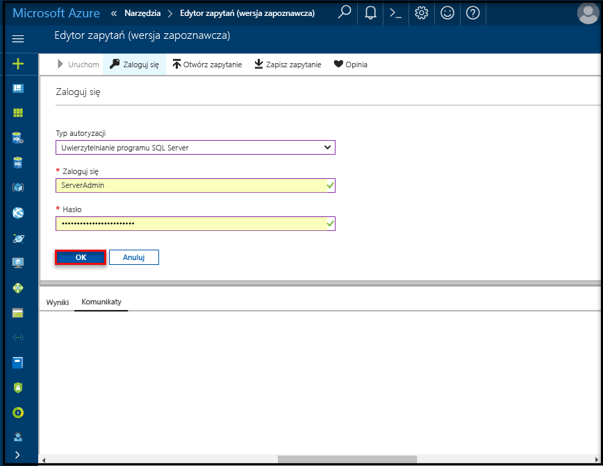
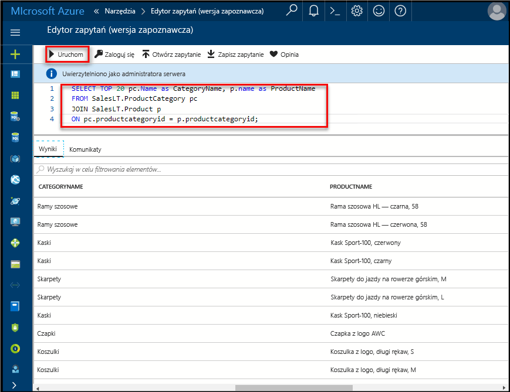

# <a name="create-an-azure-sql-database-in-the-azure-portal"></a>Tworzenia bazy danych SQL platformy Azure w witrynie Azure Portal

Ten samouczek Szybki start zawiera szczegółowe instrukcje dotyczące tworzenia bazy danych SQL na platformie Azure. Usługa Azure SQL Database to oferta typu „baza danych jako usługa”, która pozwala na uruchamianie i skalowanie baz danych SQL Server o wysokiej dostępności w chmurze. Ten przewodnik Szybki start pokazuje, jak rozpocząć pracę od utworzenia bazy danych SQL za pomocą witryny Azure Portal.

Jeśli nie masz subskrypcji platformy Azure, przed rozpoczęciem utwórz [bezpłatne](https://azure.microsoft.com/free/) konto.

## <a name="log-in-to-the-azure-portal"></a>Logowanie do witryny Azure Portal

Zaloguj się do witryny [Azure Portal](https://portal.azure.com/).

## <a name="create-a-sql-database"></a>Tworzenie bazy danych SQL

Baza danych Azure SQL jest tworzona ze zdefiniowanym zestawem [zasobów obliczeniowych i przechowywania](sql-database-service-tiers.md). Baza danych jest tworzona w [grupie zasobów platformy Azure](../azure-resource-manager/resource-group-overview.md) oraz na [serwerze logicznym bazy danych Azure SQL Database](sql-database-features.md). 

Wykonaj te kroki, aby utworzyć bazę danych SQL zawierającą przykładowe dane firmy Adventure Works LT. 

1. Kliknij przycisk **Nowy** znajdujący się w lewym górnym rogu witryny Azure Portal.

2. Na stronie **Nowy** wybierz pozycję **Bazy danych**, a następnie na stronie **Nowy** w obszarze **SQL Database** wybierz pozycję **Utwórz**.

   

3. Wypełnij formularz Baza danych SQL w sposób pokazany na wcześniejszej ilustracji, używając następujących informacji:   

   | Ustawienie       | Sugerowana wartość | Opis | 
   | ------------ | ------------------ | ------------------------------------------------- | 
   | **Nazwa bazy danych** | mySampleDatabase | Prawidłowe nazwy baz danych opisano w artykule [Database Identifiers](https://docs.microsoft.com/en-us/sql/relational-databases/databases/database-identifiers) (Identyfikatory baz danych). | 
   | **Subskrypcja** | Twoja subskrypcja  | Aby uzyskać szczegółowe informacje o subskrypcjach, zobacz [Subskrypcje](https://account.windowsazure.com/Subscriptions). |
   | **Grupa zasobów**  | myResourceGroup | Prawidłowe nazwy grup zasobów opisano w artykule [Naming rules and restrictions](https://docs.microsoft.com/azure/architecture/best-practices/naming-conventions) (Reguły i ograniczenia nazewnictwa). |
   | **Źródło źródła** | Próbka (AdventureWorksLT) | Ładuje schemat AdventureWorksLT i dane do nowej bazy danych |

   > [!IMPORTANT]
   > Musisz wybrać przykładową bazę danych w tym formularzu, ponieważ jest ona używana w pozostałej części tego przewodnika Szybki start.
   > 

4. W pozycji **Serwer** kliknij opcję **Skonfiguruj wymagane ustawienia** i wypełnij formularz serwera SQL (serwera logicznego) w sposób pokazany na wcześniejszej ilustracji, używając następujących informacji:   

   | Ustawienie       | Sugerowana wartość | Opis | 
   | ------------ | ------------------ | ------------------------------------------------- | 
   | **Nazwa serwera** | Dowolna nazwa unikatowa w skali globalnej | Prawidłowe nazwy serwera opisano w artykule [Naming rules and restrictions](https://docs.microsoft.com/azure/architecture/best-practices/naming-conventions) (Reguły i ograniczenia nazewnictwa). | 
   | **Identyfikator logowania administratora serwera** | Dowolna prawidłowa nazwa | Prawidłowe nazwy identyfikatorów logowania opisano w artykule [Database Identifiers](https://docs.microsoft.com/en-us/sql/relational-databases/databases/database-identifiers) (Identyfikatory baz danych). |
   | **Hasło** | Dowolne prawidłowe hasło | Hasło musi mieć co najmniej 8 znaków i musi zawierać znaki z trzech z następujących kategorii: wielkie litery, małe litery, cyfry i znaki inne niż alfanumeryczne. |
   | **Subskrypcja** | Twoja subskrypcja | Aby uzyskać szczegółowe informacje o subskrypcjach, zobacz [Subskrypcje](https://account.windowsazure.com/Subscriptions). |
   | **Grupa zasobów** | myResourceGroup | Prawidłowe nazwy grup zasobów opisano w artykule [Naming rules and restrictions](https://docs.microsoft.com/azure/architecture/best-practices/naming-conventions) (Reguły i ograniczenia nazewnictwa). |
   | **Lokalizacja** | Dowolna prawidłowa lokalizacja | Aby uzyskać informacje na temat regionów, zobacz temat [Regiony systemu Azure](https://azure.microsoft.com/regions/). |

   > [!IMPORTANT]
   > Login i hasło administratora serwera określone w tym miejscu będą wymagane do logowania do serwera i jego baz danych w późniejszej części tego przewodnika Szybki start. Zapamiętaj lub zapisz te informacje do wykorzystania w przyszłości. 
   >  

   

5. Po wypełnieniu formularza kliknij pozycję **Wybierz**.

6. Kliknij pozycję **Warstwa cenowa**, aby określić warstwę usługi, liczbę jednostek DTU i ilość miejsca do magazynowania. Przejrzyj opcje liczby jednostek DTU i miejsca do magazynowania dostępne dla poszczególnych warstw usługi. 

   > [!IMPORTANT]
   > \* Magazyn o rozmiarze większym niż ilość miejsca do magazynowania są dostępne w wersji zapoznawczej dodatkowych kosztów za dodatkową opłatą. Szczegóły można znaleźć w [cenniku usługi SQL Database](https://azure.microsoft.com/pricing/details/sql-database/). 
   >
   >\* W warstwie Premium magazyn o rozmiarze ponad 1 TB jest obecnie dostępny w następujących regionach: Wschodnie stany USA 2, Zachodnie stany USA, Administracja USA — Wirginia, Europa Zachodnia, Niemcy Środkowe, Azja Południowo-Wschodnia, Japonia Wschodnia, Australia Wschodnia, Kanada Środkowa i Kanada Wschodnia. Więcej informacji można znaleźć na stronie [bieżących ograniczeń poziomów P11–P15](sql-database-resource-limits.md#single-database-limitations-of-p11-and-p15-when-the-maximum-size-greater-than-1-tb).  
   > 

7. Na potrzeby tego samouczka Szybki start wybierz warstwę usługi **Standardowa**, a następnie wybierz za pomocą suwaka **100 jednostek DTU (S3)** i **400** GB miejsca do magazynowania.

   

8. Zaakceptuj warunki wersji zapoznawczej, aby użyć opcji **dodatkowego magazynu**. 

   > [!IMPORTANT]
   > \* Magazyn o rozmiarze większym niż ilość miejsca do magazynowania są dostępne w wersji zapoznawczej dodatkowych kosztów za dodatkową opłatą. Szczegóły można znaleźć w [cenniku usługi SQL Database](https://azure.microsoft.com/pricing/details/sql-database/). 
   >
   >\* W warstwie Premium magazyn o rozmiarze ponad 1 TB jest obecnie dostępny w następujących regionach: Wschodnie stany USA 2, Zachodnie stany USA, Administracja USA — Wirginia, Europa Zachodnia, Niemcy Środkowe, Azja Południowo-Wschodnia, Japonia Wschodnia, Australia Wschodnia, Kanada Środkowa i Kanada Wschodnia. Więcej informacji można znaleźć na stronie [bieżących ograniczeń poziomów P11–P15](sql-database-resource-limits.md#single-database-limitations-of-p11-and-p15-when-the-maximum-size-greater-than-1-tb).  
   > 

9. Po wybraniu warstwy serwera, liczby jednostek DTU i ilości miejsca do magazynowania kliknij przycisk **Zastosuj**.  

10. Teraz po uzupełnieniu formularza SQL Database kliknij przycisk **Utwórz**, aby aprowizować bazę danych. Aprowizacja zajmuje kilka minut. 

11. Na pasku narzędzi kliknij pozycję **Powiadomienia**, aby monitorować proces wdrażania.
    
     

## <a name="create-a-server-level-firewall-rule"></a>Tworzenie reguły zapory na poziomie serwera

Usługa SQL Database tworzy zaporę na poziomie serwera, która uniemożliwia zewnętrznym aplikacjom i narzędziom łączenie się z serwerem i wszelkimi bazami danych na tym serwerze, chyba że zostanie utworzona reguła zapory otwierająca zaporę dla konkretnych adresów IP. Wykonaj następujące kroki, aby utworzyć [regułę zapory na poziomie serwera usługi SQL Database](sql-database-firewall-configure.md) dla podanego adresu IP klienta i włączyć zewnętrzną łączność przez zaporę usługi SQL Database wyłącznie dla konkretnego adresu IP. 

> [!NOTE]
> Usługa SQL Database nawiązuje komunikację na porcie 1433. Jeśli próbujesz nawiązać połączenie z sieci firmowej, ruch wychodzący na porcie 1433 może być zablokowany przez firmową zaporę. Jeśli nastąpi taka sytuacja, nie będzie można nawiązać połączenia z serwerem usługi Azure SQL Database, chyba że dział IT otworzy port 1433.
>

1. Po ukończeniu wdrażania kliknij pozycję **Bazy danych SQL** w menu po lewej stronie i kliknij bazę danych **mySampleDatabase** na stronie **Bazy danych SQL**. Zostanie otwarta strona przeglądu bazy danych zawierająca w pełni kwalifikowaną nazwę serwera (na przykład **mynewserver-20170824.database.windows.net**) i opcje dalszej konfiguracji. 

2. Skopiuj tę w pełni kwalifikowaną nazwę serwera w celu nawiązania połączenia z serwerem i jego bazami danych w kolejnych przewodnikach Szybki start. 

    

3. Kliknij pozycję **Ustaw zaporę serwera** na pasku narzędzi, tak jak pokazano to na wcześniejszej ilustracji. Zostanie otwarta strona **Ustawienia zapory** dla serwera SQL Database. 

    

4. Kliknij pozycję **Dodaj adres IP klienta** na pasku narzędzi, aby dodać bieżący adres IP do nowej reguły zapory. Reguła zapory może otworzyć port 1433 dla pojedynczego adresu IP lub zakresu adresów IP.

5. Kliknij pozycję **Zapisz**. Dla bieżącego adresu IP zostanie utworzona reguła zapory na poziomie serwera otwierająca port 1433 na serwerze logicznym.

6. Kliknij przycisk **OK**, a następnie zamknij stronę **Ustawienia zapory**.

Teraz można połączyć się z serwerem usługi SQL Database i jego bazami danych przy użyciu programu SQL Server Management Studio lub innego wybranego narzędzia z tego adresu IP przy użyciu poprzednio utworzonego konta administratora serwera.

> [!IMPORTANT]
> Domyślnie dostęp za pośrednictwem zapory usługi SQL Database jest włączony dla wszystkich usług platformy Azure. Kliknij przycisk **WYŁ.** na tej stronie, aby wyłączyć tę opcję dla wszystkich usług platformy Azure.
>

## <a name="query-the-sql-database"></a>Wykonywanie zapytań względem bazy danych SQL

Teraz, po utworzeniu przykładowej bazy danych na platformie Azure, użyjemy wbudowanego narzędzia do obsługi zapytań w witrynie Azure Portal, aby potwierdzić, że możesz nawiązać połączenie z bazą danych i wysłać zapytanie dotyczące danych. 

1. Na stronie SQL Database dla konkretnej bazy danych kliknij pozycję **Narzędzia** na pasku narzędzi, a następnie kliknij pozycję **Edytor zapytań (wersja zapoznawcza)**.

    

2. Kliknij pole wyboru **Warunki dotyczące wersji zapoznawczej**, a następnie kliknij przycisk **OK**. Zostanie otwarta strona Edytor zapytań.

3. Kliknij pozycję **Zaloguj**, przejrzyj informacje logowania, a następnie kliknij przycisk **OK**, aby zalogować się przy użyciu funkcji uwierzytelniania programu SQL Server, korzystając z utworzonych wcześniej nazwy logowania i hasła administratora serwera.

    

4. Kliknij przycisk **OK**, aby się zalogować.

5. Po uwierzytelnieniu się jako **administrator systemu** w okienku edytora zapytań wpisz poniższe zapytanie.

   ```sql
   SELECT TOP 20 pc.Name as CategoryName, p.name as ProductName
   FROM SalesLT.ProductCategory pc
   JOIN SalesLT.Product p
   ON pc.productcategoryid = p.productcategoryid;
   ```

6. Kliknij pozycję **Uruchom**, a następnie przejrzyj wyniki zapytania w okienku **Wyniki**.

   

7. Zamknij stronę **Edytor zapytań**, kliknij przycisk **OK**, aby odrzucić niezapisane zmiany, a następnie zamknij stronę **Narzędzia**.

## <a name="clean-up-resources"></a>Oczyszczanie zasobów

Zapisz te zasoby, jeśli chcesz przejść do sekcji [Następne kroki](#next-steps) i dowiedzieć się, jak połączyć bazę danych i wykonywać w niej zapytania przy użyciu różnych metod. Jeśli jednak chcesz usunąć zasoby utworzone w tym przewodniku Szybki start, wykonaj poniższe czynności. 


1. W menu znajdującym się po lewej stronie w witrynie Azure Portal kliknij pozycję **Grupy zasobów**, a następnie kliknij pozycję **myResourceGroup**. 
2. Na stronie grupy zasobów kliknij pozycję **Usuń**, wpisz w polu tekstowym nazwę **myResourceGroup**, a następnie kliknij pozycję **Usuń**.

## <a name="next-steps"></a>Następne kroki

Teraz, gdy już masz bazę danych, możesz nawiązać z nią połączenie i uruchamiać zapytania za pomocą ulubionych narzędzi. Dowiedz się więcej, wybierając narzędzie poniżej:

- [SQL Server Management Studio](sql-database-connect-query-ssms.md)
- [Visual Studio Code](sql-database-connect-query-vscode.md)
- [.NET](sql-database-connect-query-dotnet.md)
- [PHP](sql-database-connect-query-php.md)
- [Node.js](sql-database-connect-query-nodejs.md)
- [Java](sql-database-connect-query-java.md)
- [Python](sql-database-connect-query-python.md)
- [Ruby](sql-database-connect-query-ruby.md)
