# Samouczek usługi SQL Database: tworzenie bazy danych SQL w ciągu kilku minut za pomocą witryny Azure Portal
> [!div class="op_single_selector"]
> * [Azure portal](sql-database-get-started.md)
> * [C#](sql-database-get-started-csharp.md)
> * [PowerShell](sql-database-get-started-powershell.md)
> 
> 

Z tego samouczka nauczysz się używać witryny Azure Portal do wykonywania następujących czynności:

* Tworzenie bazy danych SQL z przykładowymi danymi na platformie Azure.
* Tworzenie reguły zapory na poziomie serwera dla pojedynczego adresu IP lub zakresu adresów IP.

Te same czynności można wykonać, używając języka [C#](sql-database-get-started-csharp.md) lub interpretera [PowerShell](sql-database-get-started-powershell.md).

[!INCLUDE [Login](../../includes/azure-getting-started-portal-login.md)]

## Tworzenie pierwszej bazy danych SQL na platformie Azure
1. Połącz się z [witryną Azure Portal](http://portal.azure.com), jeśli połączenie nie zostało nawiązane już wcześniej.
2. Kliknij **Nowy**, kliknij **Dane i magazyn**, a następnie znajdź opcję **Baza danych SQL**.
   
    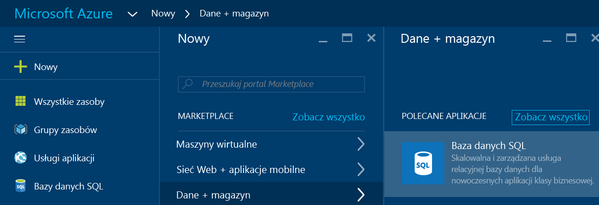
3. Kliknij przycisk **Baza danych SQL**, aby otworzyć blok bazy danych SQL. Zawartość tego bloku różni się w zależności od liczby subskrypcji i istniejących obiektów (takich jak serwery).
   
    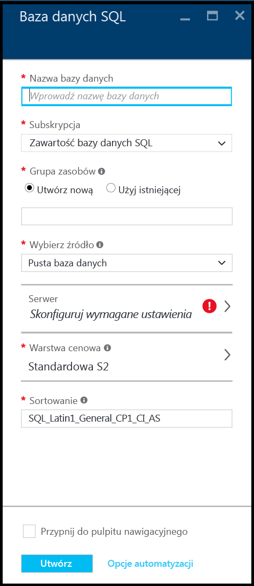
4. W polu tekstowym **Nazwa bazy danych** podaj nazwę pierwszej bazy danych, na przykład „moja_baza_danych”. Zielony znacznik wyboru wskazuje, czy podana nazwa jest poprawna.
   
    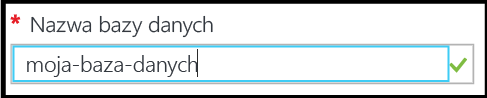
5. Jeśli masz kilka subskrypcji, wybierz jedną z nich.
6. W obszarze **Grupa zasobów** kliknij przycisk **Utwórz nowy** i podaj nazwę pierwszej grupy zasobów — np. „moja_grupa_zasobów”. Zielony znacznik wyboru wskazuje, czy podana nazwa jest poprawna.
   
    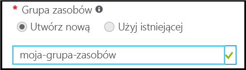
7. W obszarze **Wybierz źródło** kliknij przycisk **Próbka**, a następnie w obszarze **Wybierz próbkę** kliknij **AdventureWorksLT [V12]**.
   
    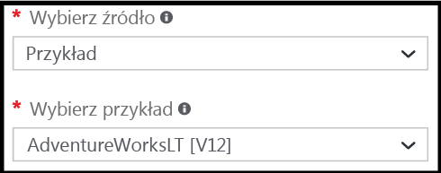
8. W obszarze **Serwer** kliknij przycisk **Skonfiguruj wymagane ustawienia**.
   
    
9. W bloku Serwer kliknij **Utwórz nowy serwer**. Baza danych SQL na platformie Azure jest tworzona w ramach obiektu serwera, który może być serwerem nowym lub istniejącym.
   
    
10. Przejrzyj blok **Nowy serwer**, aby poznać informacje potrzebne do konfiguracji nowego serwera.
    
    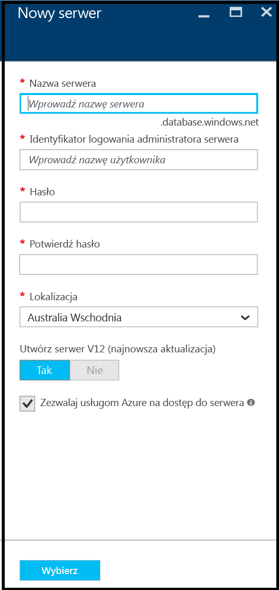
11. W polu tekstowym **Nazwa serwera** podaj nazwę pierwszego serwera — np. „mój_nowy_obiekt_serwera”. Zielony znacznik wyboru wskazuje, czy podana nazwa jest poprawna.
    
    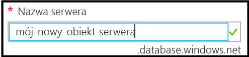
12. W obszarze **Logowanie administratora serwera** podaj nazwę użytkownika w celu logowania się jako administrator — np. „moje_konto_administratora”. Ta nazwa logowania jest nazywana główną nazwą logowania serwera. Zielony znacznik wyboru wskazuje, czy podana nazwa jest poprawna.
    
    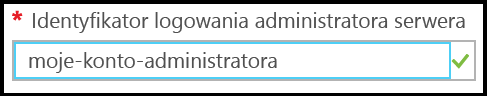
13. W obszarze **Hasło** i **Potwierdź hasło** podaj hasło do głównego konta logowania serwera, na przykład "p@ssw0rd1". Zielony znacznik wyboru wskazuje, czy podane hasło jest poprawne.
    
    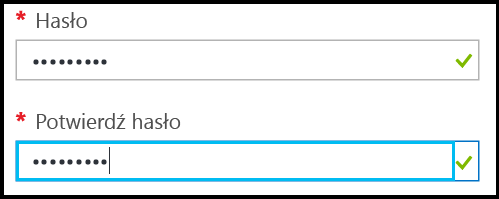
14. W obszarze **Lokalizacja** wybierz centrum danych odpowiednie dla danej lokalizacji — np. „Australia Wschodnia”.
    
    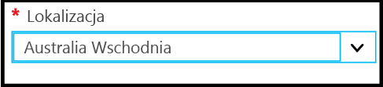
15. W obszarze *Utwórz serwer V12 (najnowsza aktualizacja)* zwróć uwagę, że możliwe jest utworzenie tylko bieżącej wersji serwera Azure SQL.
    
    
16. Należy zauważyć, że domyślnie pole wyboru obok pozycji **Zezwalaj usługom Azure na dostęp do serwera** jest zaznaczone i nie można go zmienić w tym miejscu. Jest to opcja zaawansowana. Chociaż dla większości scenariuszy nie jest to konieczne, można zmienić to ustawienie w ustawieniach zapory serwera dla tego obiektu serwera.
    
    
17. W bloku Nowy serwer przejrzyj wybrane opcje, a następnie kliknij przycisk **Wybierz**, aby wybrać ten nowy serwer dla nowej bazy danych.
    
    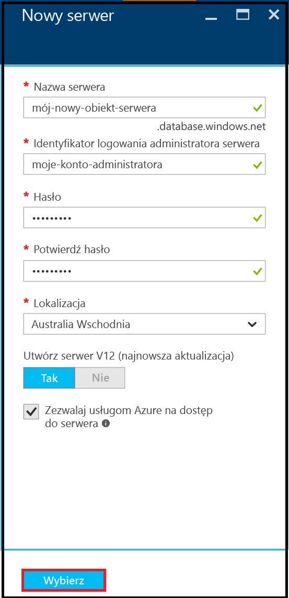
18. W bloku bazy danych SQL w obszarze **Poziom cenowy** kliknij przycisk **S2 standardowa** a następnie kliknij przycisk **Podstawowe**, aby wybrać najniższy poziom cenowy dla swojej pierwszej bazy danych. Poziom cenowy można zawsze zmienić później.
    
    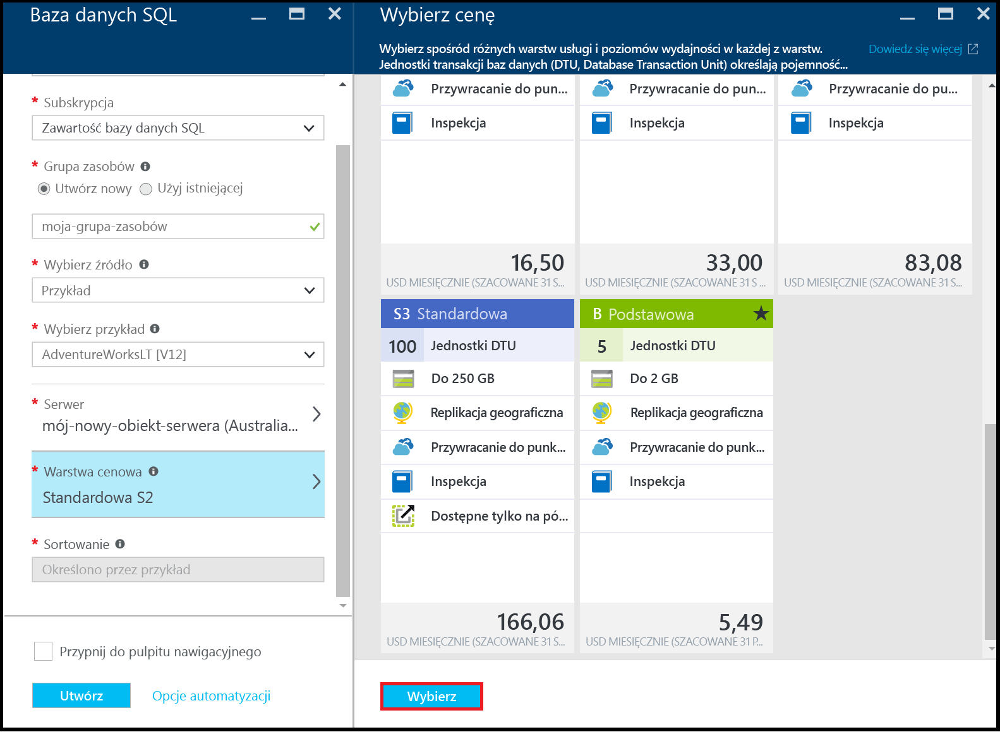
19. W bloku Baza danych SQL przejrzyj wybrane opcje, a następnie kliknij przycisk **Utwórz**, aby utworzyć pierwszy serwer i bazę danych. Zostanie sprawdzona poprawność podanych wartości i rozpocznie się wdrożenie.
    
    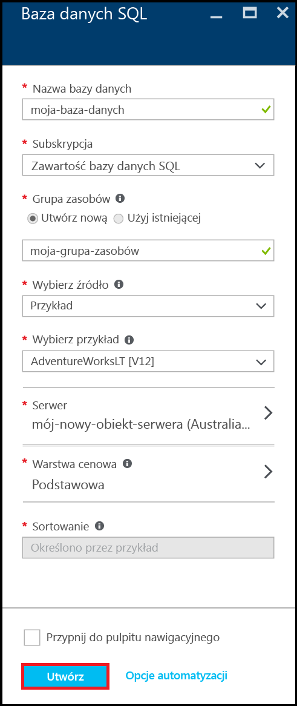
20. Na pasku narzędzi portalu kliknij ikonę **Powiadomienia**, aby sprawdzić stan wdrożenia.
    
    

> [!IMPORTANT]
> Po zakończeniu wdrożenia na platformie Azure zostanie utworzony serwer Azure SQL i baza danych. Połączenie z nowym serwerem ani bazą danych przy użyciu narzędzi programu SQL Server nie będzie możliwe do momentu utworzenia reguły zapory serwera w celu otwarcia zapory usługi SQL Database na połączenia spoza platformy Azure.
> 
> 

[!INCLUDE [Create server firewall rule](../../includes/sql-database-create-new-server-firewall-portal.md)]

## Następne kroki
Po ukończeniu tego samouczka usługi SQL Database i utworzeniu bazy danych z przykładowymi danymi możesz przystąpić do jej eksplorowania przy użyciu ulubionych narzędzi.

* Jeśli znasz język Transact-SQL i program SQL Server Management Studio (SSMS), dowiedz się, jak [nawiązać połączenie z bazą danych SQL i odpytywać ją w programie SSMS](sql-database-connect-query-ssms.md).
* Jeśli posługujesz się programem Excel, naucz się [nawiązywać połączenie z bazą danych SQL w programie Excel](sql-database-connect-excel.md).
* Jeśli chcesz zacząć programować, wybierz język programowania w obszarze [Biblioteki połączeń dla usługi SQL Database i programu SQL Server](sql-database-libraries.md).
* Jeśli chcesz przenieść lokalne bazy danych programu SQL Server na platformę Azure, zobacz artykuł [Migrating a database to Azure SQL Database](sql-database-cloud-migrate.md) (Migracja bazy danych do usługi Azure SQL Database), aby dowiedzieć się więcej.
* Jeśli chcesz załadować dane z pliku CSV do nowej tabeli przy użyciu narzędzia wiersza polecenia BCP, zobacz artykuł [Loading data into SQL Database from a CSV file using BCP](sql-database-load-from-csv-with-bcp.md) (Ładowanie danych do usługi SQL Database z pliku CSV przy użyciu narzędzia BCP).
* Jeśli chcesz rozpocząć eksplorowanie zabezpieczeń usługi Azure SQL Database, zobacz artykuł [Getting started with security](sql-database-get-started-security.md) (Wprowadzenie do zabezpieczeń)

## Dodatkowe zasoby
[Co to jest SQL Database?](sql-database-technical-overview.md)

<!--HONumber=Nov16_HO2-->

