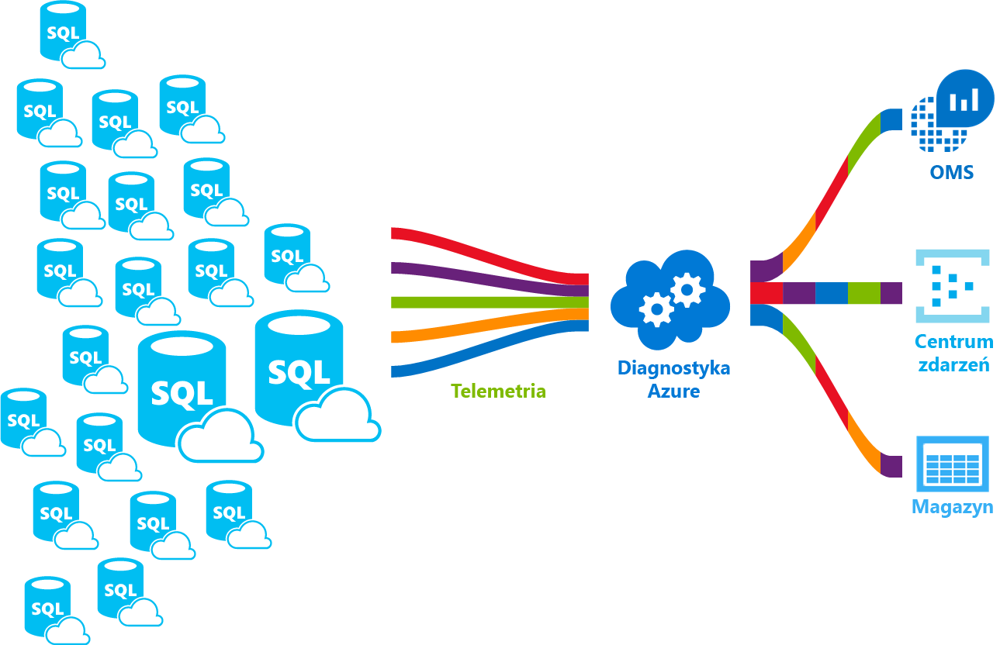

# Co to jest usługa Azure SQL Database? 

Usługa SQL Database jest usługą relacyjnej bazy danych ogólnego przeznaczenia w systemie Microsoft Azure, obsługującą struktury takie, jak dane relacyjne, JSON, dane przestrzenne i XML. Zapewnia [dynamicznie skalowalną wydajność](sql-database-service-tiers.md) i udostępnia opcje, takie jak [indeksy magazynu kolumn](https://docs.microsoft.com/sql/relational-databases/indexes/columnstore-indexes-overview), używane w skomplikowanych analizach i raportowaniu, oraz [przetwarzanie OLTP danych w pamięci](sql-database-in-memory.md) na potrzeby ekstremalnego przetwarzania transakcyjnego. Firma Microsoft bezproblemowo obsługuje wprowadzanie poprawek i aktualizowanie bazy kodu SQL i ukrywa procesy zarządzania podstawową infrastrukturą. 

Usługa SQL Database współdzieli swój kod podstawowy z [aparatem bazy danych programu Microsoft SQL Server](https://docs.microsoft.com/sql/sql-server/sql-server-technical-documentation). Zgodnie ze strategią firmy Microsoft skupiającej się na chmurze najnowsze funkcjonalności programu SQL Server są wydawane najpierw w usłudze SQL Database, a dopiero później w samym programie SQL Server. Podejście to umożliwia użytkownikom dostęp do najnowszych możliwości programu SQL Server bez potrzeby wdrażania poprawek lub wykonywania uaktualnień — a na dodatek funkcje te są już przetestowane w milionach baz danych. Aby uzyskać informacje dotyczące nowych możliwości w miarę ich publikowania, zobacz:

- **[Harmonogram działania platformy Azure dla usługi SQL Database](https://azure.microsoft.com/roadmap/?category=databases)**: miejsce, w którym można zobaczyć, co pojawiło się nowego i co jest planowane. 
- **[Blog usługi Azure SQL Database](https://azure.microsoft.com/blog/topics/database)**: miejsce, w którym członkowie zespołu produktowego programu SQL Server zamieszczają informacje o nowościach i funkcjach usługi SQL Database. 

Usługa SQL Database oferuje przewidywalną wydajność na różnych poziomach usługi, która zapewnia dynamiczną skalowalność bez przestojów, wbudowany mechanizm inteligentnej optymalizacji, globalną skalowalność i dostępność oraz zaawansowane opcje zabezpieczeń — wszystko przy bliskich zeru nakładach administracyjnych. Te możliwości pozwalają Ci skoncentrować się na szybkim tworzeniu aplikacji i skracaniu czasu wejścia na rynek, a nie na poświęcaniu cennego czasu i cennych zasobów na zarządzanie maszynami wirtualnymi i infrastrukturą. Usługa SQL Database jest obecnie dostępna w 38 centrach danych na całym świecie z coraz większą liczbą centrów danych regularnie dołączanych, dzięki czemu możesz uruchomić swoją bazę danych w centrum danych położonym w pobliżu.

> [!NOTE]
> Aby uzyskać informacje o zabezpieczeniach platformy Azure, zobacz [Centrum zaufania Azure](https://azure.microsoft.com/support/trust-center/security/).
>

## Skalowalna wydajność i pule

W usłudze SQL Database każda baza danych jest odizolowana od innych i przenośna, z własną [warstwą usług](sql-database-service-tiers.md) i z gwarantowanym poziomem wydajności. Usługa SQL Database zapewnia różne poziomy wydajności dla różnych potrzeb oraz umożliwia włączanie baz danych do puli w celu maksymalnego wykorzystania zasobów i uzyskania oszczędności finansowych.

### Dostosowanie wydajności i skalowanie bez przestojów

Usługa SQL Database oferuje cztery warstwy usług zapewniające obsługę różnych obciążeń bazy danych (od niewielkich do bardzo dużych): Podstawowa, Standardowa, Premium i Premium RS. Ponosząc niewielki miesięczny koszt, możesz utworzyć pierwszą aplikację na małej, pojedynczej bazie danych, a następnie w dowolnym momencie ręcznie lub programowo zmienić jej warstwę usług, aby spełnić wymagania rozwiązania. Wydajność można dostosować bez przestoju aplikacji i przerwy w świadczeniu usługi klientom. Dynamiczna skalowalność umożliwia bazie danych przezroczyste odpowiadanie na gwałtownie zmieniające się wymagania dotyczące zasobów oraz płacenie tylko za potrzebne zasoby i tylko gdy są używane.

   

### Pule elastyczne umożliwiające zmaksymalizowanie wykorzystania zasobów

W przypadku wielu firm i aplikacji możliwość tworzenia pojedynczych baz danych i dostosowywania wydajności na żądanie jest wystarczająca, zwłaszcza gdy wzorce użycia są względnie przewidywalne. Jednak w przypadku nieprzewidywalnych wzorców zarządzanie kosztami i modelem biznesowym może być trudne. [Pule elastyczne](sql-database-elastic-pool.md) zostały zaprojektowane, aby rozwiązać ten problem. Koncepcja jest prosta. Przydzielasz zasoby wydajności do puli, a nie do pojedynczej bazy danych, i płacisz za zbiorczą wydajność puli, a nie za wydajność pojedynczej bazy danych. 

   

Pule elastyczne nie wymagają koncentrowania się na skalowaniu wydajności bazy danych w górę i w dół w miarę zmian zapotrzebowania na zasoby. Bazy danych w puli używają zasobów wydajności puli elastycznej w miarę potrzeb. Bazy danych w puli zużywają zasoby, ale nie przekraczają limitów puli, więc koszt pozostaje przewidywalny nawet wtedy, gdy nie można przewidzieć użycia poszczególnych baz danych. Ponadto możliwe jest [dodawanie i usuwanie baz danych w puli](sql-database-elastic-pool-manage-portal.md) i skalowanie aplikacji od kilku do tysięcy baz danych — wszystko w ramach kontrolowanego budżetu. Możesz również kontrolować minimum i maksimum zasobów dostępnych dla baz danych w puli w celu zapewnienia, że żadna baza danych w puli nie używa wszystkich zasobów i jednocześnie każda baza danych w puli ma gwarantowaną minimalną ilość zasobów. Aby dowiedzieć się więcej na temat wzorców projektowych dla aplikacji SaaS wykorzystujących pule elastyczne, zobacz artykuł [Design Patterns for Multi-tenant SaaS Applications with Azure SQL Database](sql-database-design-patterns-multi-tenancy-saas-applications.md) (Wzorce projektowe dla wielodostępnych aplikacji SaaS korzystających z usługi Azure SQL Database).

### Mieszaj pojedyncze bazy danych z bazami danych w puli

W obu przypadkach — pojedyncza baza danych i pule elastyczne — nie ma ograniczenia do jednego rozwiązania. Możesz w łatwy i szybki sposób łączyć pojedyncze bazy danych z pulami elastycznymi i zmieniać warstwy usług pojedynczych baz danych oraz pul elastycznych, aby dostosować je do swojej sytuacji. Korzystając z siły i zasięgu platformy Azure, możesz łączyć inne usługi Azure z usługą SQL Database i dopasowywać je do niej, aby zaspokoić potrzeby unikatowego projektu aplikacji, zwiększyć efektywność kosztową i poprawić wykorzystanie zasobów oraz otworzyć się na nowe możliwości biznesowe.

### Możliwości rozbudowanego monitorowania i zgłaszania alertów

Jednak jak porównać względną wydajność pojedynczych baz danych i pul elastycznych? Skąd wiadomo, kiedy kliknąć, aby zatrzymać regulowanie w górę i w dół we właściwym miejscu? Możesz użyć [wbudowanej funkcji monitorowania wydajności](sql-database-performance.md) i narzędzi do [zgłaszania alertów](sql-database-insights-alerts-portal.md) w połączeniu z ocenami wydajności opartymi na [jednostkach DTU (Database Transaction Units) dla pojedynczych baz danych i jednostkach eDTU (elastic DTU) dla pul elastycznych](sql-database-what-is-a-dtu.md). Za pomocą tych narzędzi możesz szybko ocenić wpływ skalowania w górę lub w dół na podstawie bieżących lub przewidywanych wymagań dotyczących wydajności. Zobacz artykuł [Opcje i wydajność usługi SQL Database: poznaj, co jest dostępne w poszczególnych warstwach usług](sql-database-service-tiers.md), aby uzyskać szczegółowe informacje.

Ponadto usługa SQL Database może [tworzyć metryki i dzienniki diagnostyczne](sql-database-metrics-diag-logging.md), które ułatwiają monitorowanie. Usługę SQL Database można skonfigurować do przechowywania danych dotyczących użycia zasobów, pracowników i sesji oraz połączeń z jednym z następujących zasobów platformy Azure:

- **Usługa Azure Storage**: w celu archiwizowania ogromnych ilości danych telemetrycznych za niewielką cenę
- **Centrum zdarzeń Azure**: w celu integracji danych telemetrycznych usługi SQL Database z niestandardowym rozwiązaniem monitorowania lub potokami danych
- **Usługa Azure Log Analytics**: w celu użycia wbudowanego rozwiązania monitorowania obejmującego funkcje raportowania, zgłaszania alertów i zmniejszenia ryzyka

    

## Możliwości dostępności

Umowa dotycząca poziomu usług [(SLA)](http://azure.microsoft.com/support/legal/sla/) o czołowej w branży dostępności 99,99% dla platformy Azure, która jest obsługiwana przez globalną sieć centrów danych zarządzanych przez firmę Microsoft, pomaga zapewnić działanie aplikacji przez 24 godziny na dobę, 7 dni w tygodniu. Ponadto usługa SQL Database oferuje wbudowane funkcje [zapewnienia ciągłości działalności biznesowej i globalnej skalowalności](sql-database-business-continuity.md), takie jak:

- **[Automatyczne kopie zapasowe](sql-database-automated-backups.md)**: usługa SQL Database automatycznie wykonuje pełne i różnicowe kopie zapasowe oraz kopie zapasowe dziennika transakcji.
- **[Przywracanie do punktu w czasie](sql-database-recovery-using-backups.md)**: usługa SQL Database obsługuje odzyskiwanie do dowolnego punktu w czasie w ramach okresu przechowywania automatycznych kopii zapasowych.
- **[Aktywna replikacja geograficzna](sql-database-geo-replication-overview.md)**: usługa SQL Database pozwala na skonfigurowanie maksymalnie czterech udostępnionych do odczytu pomocniczych baz danych w tym samym centrum danych lub w globalnie rozproszonych centrach danych platformy Azure.  Na przykład, jeśli masz aplikację SaaS z bazą danych katalogu charakteryzującą się dużą liczbą równoczesnych transakcji tylko do odczytu, włącz aktywną replikację geograficzną, aby umożliwić globalne skalowanie odczytu i pozbyć się wąskich gardeł w podstawowej bazie danych, spowodowanych obciążeniami odczytu. 
- **[Grupy trybu failover](sql-database-geo-replication-overview.md)**: usługa SQL Database pozwala włączyć wysoką dostępność i równoważenie obciążeń w skali globalnej, w tym przezroczystą replikację geograficzną i tryb failover dla dużych zestawów baz danych i pul elastycznych. Grupy trybu failover i aktywna replikacja geograficzna umożliwiają tworzenie globalnie rozproszonych aplikacji SaaS przy minimalnym narzucie prac administracyjnych, pozostawiając po stronie usługi SQL Database całość złożonego monitorowania, routing i organizację trybu failover.

## Wbudowane narzędzie analizy

Usługa SQL Database udostępnia wbudowane narzędzie analizy, które pomaga znacznie zmniejszyć koszty działania baz danych i zarządzania nimi oraz zmaksymalizować wydajność i zabezpieczenia aplikacji. Nieprzerwanie obsługując miliony obciążeń klientów, usługa SQL Database zbiera i przetwarza ogromne ilości danych telemetrycznych, w pełni przestrzegając przy tym zasad ochrony prywatności klientów. Rozmaite algorytmy stale analizują dane telemetryczne, dzięki czemu usługa może zdobywać wiedzę i dostosować się do Twojej aplikacji. Dzięki tej analizie usługa funkcjonuje ze zwiększoną wydajnością wynikającą z uwzględnienia zaleceń dostosowanych do określonego obciążenia. 

### Automatyczne monitorowanie i dostosowywanie wydajności

Usługa SQL Database udostępnia szczegółowy wgląd w zapytania, których monitorowanie jest wymagane. Usługa SQL Database uzyskuje informacje o wzorcach Twoich baz danych i umożliwia dostosowanie schematu bazy danych do obciążenia. Usługa SQL Database udostępnia [zalecenia dotyczące dostrajania wydajności](sql-database-advisor.md) pozwalające na przeglądanie i stosowanie akcji dostrajających. 

Jednak nieprzerwane monitorowanie bazy danych jest trudnym i żmudnym zadaniem, szczególnie w przypadku pracy z wieloma bazami danych. Funkcja [Intelligent Insights](sql-database-intelligent-insights.md) zapewnia to przez automatyczne monitorowanie wydajności bazy danych SQL w odpowiedniej skali oraz informowanie o problemach ze spadkiem wydajności. Identyfikuje główną przyczynę problemu i oferuje zalecenia dotyczące podnoszenia wydajności, jeśli to możliwe.

Wydajne zarządzanie olbrzymią liczbą baz danych może być niemożliwe, nawet przy zastosowaniu wszystkich dostępnych narzędzi i raportów udostępnianych przez usługę SQL Database i witrynę Azure Portal. Zamiast ręcznego monitorowania i dostrajania bazy danych można rozważyć delegowanie niektórych działań monitorowania i dostrajania do usługi SQL Database przy użyciu funkcji [automatycznego dostrajania](sql-database-automatic-tuning.md). Usługa SQL Database automatycznie stosuje zalecenia, testy i sprawdza każdą z akcji dostrajania, upewniając się, że następuje poprawa wydajności. W ten sposób usługa SQL Database automatycznie dostosowuje się do obciążenia w kontrolowany i bezpieczny sposób. Automatyczne dostrajanie oznacza, że wydajność bazy danych jest dokładnie monitorowana i porównywana przed i po wykonaniu każdej akcji dostrajania. W przypadku, gdy wydajność nie uległa poprawie, akcja dostrajania zostanie wycofana.

Dzisiaj wielu naszych partnerów uruchamiających [wielodostępne aplikacje SaaS](sql-database-design-patterns-multi-tenancy-saas-applications.md) korzystające z usługi SQL Database korzysta z automatycznego dostrajania wydajności, mając pewność, że ich aplikacje zawsze działają ze stabilną i przewidywalną wydajnością. Z ich punktu widzenia ta funkcja znacznie zmniejsza ryzyko wystąpienia w środku nocy zdarzenia związanego z wydajnością. Ponadto ponieważ niektórzy ich klienci używają także programu SQL Server, stosują oni te same zalecenia indeksowania podane przez usługę SQL Database w odniesieniu do klientów korzystających z programu SQL Server.

W usłudze [SQL Database dostępne są](sql-database-automatic-tuning.md) dwa aspekty automatycznego dostrajania:

- **Automatyczne zarządzanie indeksami**: identyfikuje indeksy, które powinny zostać dodane w bazie danych, i indeksy, które powinny zostać z niej usunięte.
- **Automatyczna korekta planu**: identyfikuje plany, które mogą sprawiać problemy, i rozwiązuje problemy z wydajnością planów SQL (dostępne już wkrótce w programie SQL Server 2017).

### Adaptacyjne przetwarzanie zapytań

Do usługi SQL Database dodajemy również rodzinę [funkcji adaptacyjnego przetwarzania zapytań](/sql/relational-databases/performance/adaptive-query-processing), takich jak przeplatane wykonywanie funkcji o wielu instrukcjach zwracających tabelę, informacja zwrotna przydziału pamięci w trybie wsadowym i adaptacyjne sprzężenia w trybie wsadowym. Każda z tych adaptacyjnych funkcji przetwarzania zapytań stosuje podobne techniki „poznaj i dostosuj” ułatwiające dalsze rozwiązywanie problemów dotyczących wydajności związanych z historycznie trudnymi do rozwiązania problemami z optymalizacją zapytań.

### Inteligentne wykrywanie zagrożeń

 [Wykrywanie zagrożeń SQL](sql-database-threat-detection.md) wykorzystuje funkcję [inspekcji bazy danych SQL](sql-database-auditing.md) do ciągłego monitorowania baz danych SQL na platformie Azure pod kątem potencjalnie szkodliwych prób dostępu do poufnych danych. Funkcja wykrywania zagrożeń SQL stanowi nową warstwę zabezpieczeń, która umożliwia klientom wykrywanie potencjalnych zagrożeń i reagowanie na nie na bieżąco, zapewniając alerty zabezpieczeń w przypadku wystąpienia nietypowych działań. Użytkownicy otrzymują alerty o podejrzanych działaniach w bazie danych, potencjalnych lukach w zabezpieczeniach, atakach polegających na wstrzyknięciu kodu SQL i anomaliach we wzorcach dostępu do bazy danych. Alerty wykrywania zagrożeń SQL zawierają szczegółowe informacje o podejrzanych działaniach i zalecane czynności dotyczące sposobu badania i ograniczenia zagrożenia. Użytkownicy mogą eksplorować podejrzane zdarzenia, aby określić, czy zdarzenie jest skutkiem próby uzyskania dostępu, naruszenia zabezpieczeń lub wykorzystania danych w bazie danych. Wykrywanie zagrożeń upraszcza reagowanie na potencjalne zagrożenia bazy danych bez konieczności dysponowania wiedzą na poziomie eksperta zabezpieczeń lub zarządzania zaawansowanymi systemami monitorowania bezpieczeństwa.

## Zaawansowane zabezpieczenia i zgodność

Usługa SQL Database oferuje szeroką gamę [wbudowanych funkcji zabezpieczeń i zgodności](sql-database-security-overview.md), co ułatwia spełnienie przez aplikację różnych wymagań dotyczących zabezpieczeń i zgodności. 

### Inspekcja zgodności i zabezpieczeń

[Inspekcja bazy danych SQL](sql-database-auditing.md) śledzi zdarzenia bazy danych i zapisuje je w dzienniku inspekcji na koncie magazynu Azure. Inspekcja pomaga zachować zgodność z przepisami, analizować aktywność bazy danych oraz uzyskać wgląd w odchylenia i anomalie, które mogą oznaczać problemy biznesowe lub podejrzane naruszenia zabezpieczeń.

### Szyfrowanie danych w spoczynku

Funkcja [Transparent Data Encryption](/sql/relational-databases/security/encryption/transparent-data-encryption-azure-sql) usługi SQL Database pomaga chronić przed zagrożeniem powodowanym przez złośliwe działania, wykonując w czasie rzeczywistym szyfrowanie i odszyfrowywanie bazy danych, skojarzonych kopii zapasowych i plików dziennika transakcji w stanie spoczynku bez konieczności wprowadzania zmian w aplikacji. Począwszy od maja 2017 roku wszystkie nowo utworzone bazy danych SQL na platformie Azure są automatycznie chronione za pomocą funkcji przezroczystego szyfrowania danych (TDE, Transparent Data Encryption). Funkcja TDE jest sprawdzoną w SQL technologią szyfrowania danych w spoczynku, która przez wiele standardów zgodności jest wymagana do ochrony przed kradzieżą nośników magazynowania. Klienci mogą w bezpieczny i spełniający kryteria zgodności sposób zarządzać kluczami szyfrowania funkcji TDE i innymi wpisami tajnymi za pomocą usługi Azure Key Vault.

### Szyfrowanie danych w ruchu

Usługa SQL Database to jedyny system bazy danych, który oferuje ochronę danych poufnych w locie, podczas przechowywania i podczas przetwarzania zapytań przy użyciu funkcji [Always Encrypted](https://docs.microsoft.com/sql/relational-databases/security/encryption/always-encrypted-database-engine). Funkcja Always Encrypted to pierwsze w branży rozwiązanie, które oferuje bezkonkurencyjne zabezpieczenie danych przed naruszeniami, w tym przed kradzieżą danych o kluczowym znaczeniu. Na przykład w ramach funkcji Always Encrypted numery kart kredytowych klientów są przechowywane w bazie danych zawsze w postaci zaszyfrowanej, nawet podczas przetwarzania zapytania, z możliwością odszyfrowania w punkcie użycia przez autoryzowany personel lub przez aplikacje wymagające przetwarzania tych danych.

### Dynamiczne maskowanie danych

Funkcja [dynamicznego maskowania danych w bazie danych SQL](sql-database-dynamic-data-masking-get-started.md) ogranicza ujawnianie poufnych danych przez ich maskowanie dla nieuprzywilejowanych użytkowników. Dynamiczne maskowanie danych pomaga zapobiec nieautoryzowanemu dostępowi do danych poufnych, umożliwiając klientom wyznaczenie, jaka część danych poufnych może zostać odsłonięta, przy minimalnym wpływie na warstwę aplikacji. Jest to funkcja zabezpieczeń oparta na zasadach, która ukrywa dane poufne w zestawie wyników zapytania w wyznaczonych polach bazy danych, przy czym dane w bazie danych pozostają bez zmian.

### Zabezpieczenia na poziomie wiersza

[Zabezpieczenia na poziomie wiersza](https://docs.microsoft.com/sql/relational-databases/security/row-level-security) umożliwiają klientom kontrolowanie dostępu do wierszy w tabeli bazy danych na podstawie właściwości użytkownika wykonującego zapytanie (np. członkostwa w grupie lub kontekstu wykonania). Zabezpieczenia na poziomie wiersza (RLS, Row-Level Security) upraszczają projektowanie i kodowanie zabezpieczeń w aplikacji. Zabezpieczenia na poziomie wiersza umożliwiają zaimplementowanie ograniczeń w dostępie do wiersza danych. Możliwe jest na przykład zapewnienie, że pracownicy mają dostęp tylko do tych wierszy danych, które są odpowiednie do ich działu, lub ograniczenie dostępu do danych klienta tylko do danych odpowiednich dla firmy.

### Integracja usługi Azure Active Directory z uwierzytelnianiem wieloskładnikowym

Usługa SQL Database umożliwia centralne zarządzanie tożsamościami użytkowników bazy danych i innych usług firmy Microsoft dzięki funkcji [integracji usługi Azure Active Directory](sql-database-aad-authentication.md). Ta funkcja upraszcza zarządzanie uprawnieniami i zwiększa bezpieczeństwo. Usługa Azure Active Directory obsługuje [uwierzytelnianie wieloskładnikowe](sql-database-ssms-mfa-authentication.md) (MFA, Multi-Factor Authentication) w celu zwiększenia bezpieczeństwa danych i aplikacji, korzystając z procesu jednokrotnego logowania.

### Certyfikacja zgodności

Usługa SQL Database jest poddawana regularnym inspekcjom i ma certyfikat kilku standardów zgodności. Aby uzyskać więcej informacji, zobacz witrynę [Centrum zaufania Microsoft Azure](https://azure.microsoft.com/support/trust-center/), w której można znaleźć aktualną listę [certyfikatów zgodności usługi SQL Database](https://azure.microsoft.com/support/trust-center/services/).

## Łatwe w użyciu narzędzia

Dzięki usłudze SQL Database tworzenie i konserwowanie aplikacji jest łatwiejsze i bardziej produktywne. Usługa SQL Database pozwala Ci skoncentrować się na tym, co robisz najlepiej: tworzeniu wspaniałych aplikacji. W usłudze SQL Database możesz zarządzać i projektować, korzystając z narzędzi i umiejętności, które już masz.

- **[Azure Portal](https://portal.azure.com/)**: aplikacja sieci Web do zarządzania wszystkimi usługami platformy Azure 
- **[SQL Server Management Studio](https://docs.microsoft.com/sql/ssms/download-sql-server-management-studio-ssms)**: bezpłatna, udostępniona do pobrania aplikacja kliencka do zarządzania dowolną infrastrukturą SQL — od programu SQL Server po usługę SQL Database
- **[SQL Server Data Tools w programie Visual Studio](https://docs.microsoft.com/sql/ssdt/download-sql-server-data-tools-ssdt)**: bezpłatna, udostępniona do pobrania aplikacja kliencka do projektowania relacyjnych baz danych programu SQL Server, baz danych SQL platformy Azure, pakietów usługi Integration Services, modeli danych usługi Analysis Services i raportów usługi Reporting Services.
- **[Visual Studio Code](https://code.visualstudio.com/docs)**: bezpłatny, udostępniony do pobrania, otwarty edytor kodu dla systemów Windows, macOS i Linux obsługujący rozszerzenia, w tym [rozszerzenie mssql](https://aka.ms/mssql-marketplace), używany do wysyłania zapytań do programu Microsoft SQL Server oraz usług Azure SQL Database i SQL Data Warehouse.

Usługa SQL Database obsługuje tworzenie aplikacji za pomocą narzędzi Python, Java, Node.js, PHP, Ruby i .NET w systemach MacOS, Linux i Windows. Usługa SQL Database obsługuje te same [biblioteki połączeń](sql-database-libraries.md) co program SQL Server.

## Kontakt z zespołem inżynierów programu SQL Server

- [DBA Stack Exchange](https://dba.stackexchange.com/questions/tagged/sql-server): zadawaj pytania dotyczące administrowania bazami danych
- [Stack Overflow](http://stackoverflow.com/questions/tagged/sql-server): zadawaj pytania dotyczące opracowywania zawartości
- [Fora MSDN](https://social.msdn.microsoft.com/Forums/en-US/home?category=sqlserver): zadawaj pytania techniczne
- [Microsoft Connect](https://connect.microsoft.com/SQLServer/Feedback): zgłaszaj usterki i wysyłaj prośby dotyczące funkcji
- [Reddit](https://www.reddit.com/r/SQLServer/): omówienie programu SQL Server

## Następne kroki

- Zapoznać się z [cennikiem](https://azure.microsoft.com/pricing/details/sql-database/) zawierającym porównania i kalkulatory kosztów dla pojedynczej bazy danych i pul elastycznych.

- Zobacz te przewodniki Szybki start, aby rozpocząć pracę:

  - [Tworzenia bazy danych SQL w witrynie Azure Portal](sql-database-get-started-portal.md)  
  - [Tworzenia bazy danych SQL za pomocą interfejsu wiersza polecenia platformy Azure](sql-database-get-started-cli.md)
  - [Tworzenie bazy danych SQL za pomocą programu PowerShell](sql-database-get-started-powershell.md)

- Aby uzyskać zestaw przykładów interfejsu wiersza polecenia platformy Azure i programu PowerShell, zobacz:
  - [Przykłady interfejsu wiersza polecenia platformy Azure dla usługi SQL Database](sql-database-cli-samples.md)
  - [Przykłady programu Azure PowerShell dla usługi SQL Database](sql-database-powershell-samples.md)
