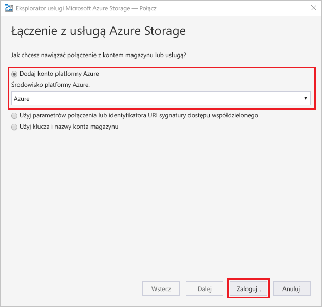
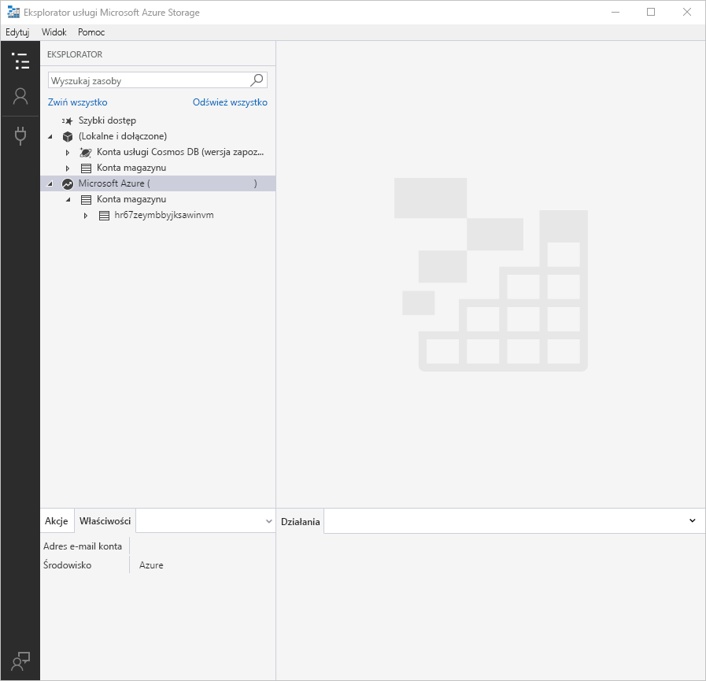
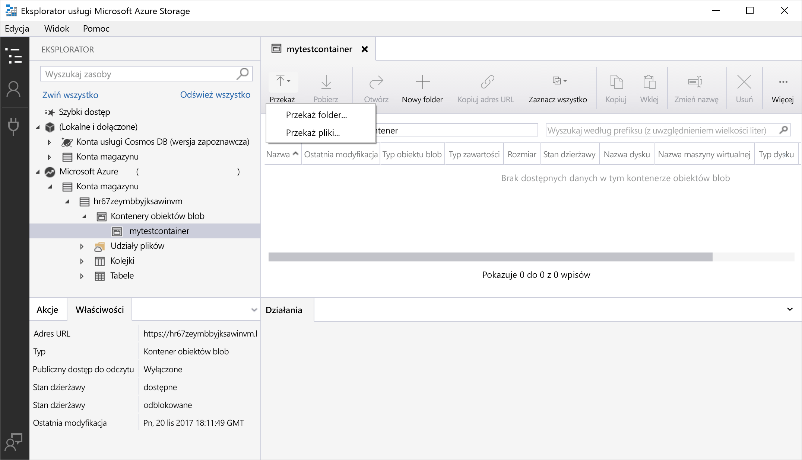
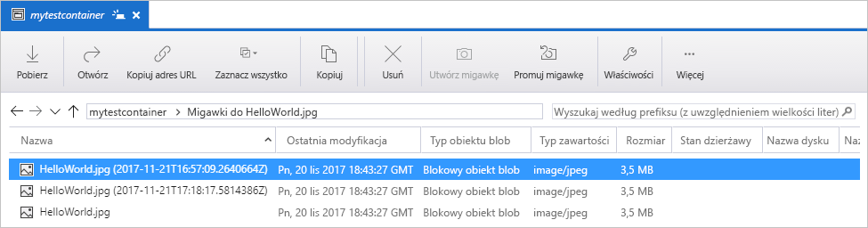
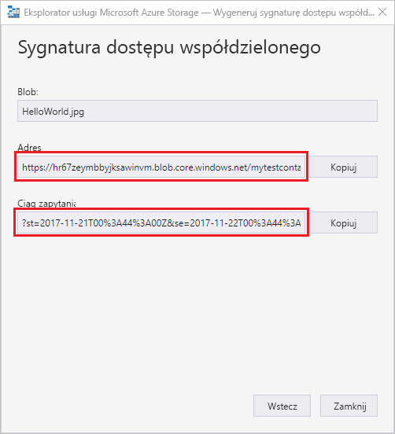

# Transferowanie obiektów do usługi Azure Blob Storage i z niej za pomocą Eksploratora usługi Azure Storage

[Eksplorator usługi Azure Storage](https://azure.microsoft.com/features/storage-explorer/) to wieloplatformowy interfejs użytkownika służący do zarządzania zawartością kont magazynu. Ten przewodnik zawiera informacje na temat używania Eksploratora usługi Azure Storage do transferowania plików między dyskiem lokalnym i usługą Azure Blob Storage.

Jeśli nie masz subskrypcji platformy Azure, przed rozpoczęciem utwórz [bezpłatne konto](https://azure.microsoft.com/free/?WT.mc_id=A261C142F).

Dla tego przewodnika Szybki start wymagane jest, aby Eksplorator usługi Azure Storage był zainstalowany. Jeśli nie jest, odwiedź stronę [Eksploratora usługi Azure Storage](https://azure.microsoft.com/features/storage-explorer/), aby pobrać go dla systemu Windows, Macintosh lub Linux.

[!INCLUDE [storage-quickstart-tutorial-create-account-portal](../../../includes/storage-quickstart-tutorial-create-account-portal.md)]

## Logowanie się w Eksploratorze usługi Storage

Podczas pierwszego uruchomienia wyświetlane jest okno **Eksplorator usługi Microsoft Azure Storage — nawiązywanie połączenia**. Eksplorator usługi Storage oferuje kilka sposobów nawiązywania połączenia z kontami magazynu. W poniższej tabeli przedstawiono różne sposoby nawiązywania połączenia:

|Zadanie|Przeznaczenie|
|---|---|
|Dodawanie konta platformy Azure | Przekierowuje Cię do strony logowania organizacji w celu uwierzytelniania na platformie Azure. |
|Używanie parametrów połączenia lub identyfikatora URI sygnatury dostępu współdzielonego | Umożliwia bezpośredni dostęp do kontenera lub konta magazynu za pomocą tokenu sygnatury dostępu współdzielonego lub udostępnionych parametrów połączenia. |
|Używanie nazwy i klucza konta magazynu| Użyj nazwy i klucza konta magazynu do nawiązania połączenia z magazynem Azure Storage.|

Wybierz pozycję **Dodaj konto platformy Azure**, a następnie kliknij pozycję **Zaloguj się...**. Postępuj zgodnie z monitami wyświetlanymi na ekranie, aby zalogować się do konta platformy Azure.

Po nawiązaniu połączenia Eksplorator usługi Azure Storage zostanie załadowany z wyświetloną kartą **Eksplorator**. Ten widok udostępnia szczegółowe informacje dotyczące wszystkich kont usługi Azure Storage, a także magazynu lokalnego skonfigurowanego za pomocą kont [emulatora magazynu Azure](../common/storage-use-emulator.md?toc=%2fazure%2fstorage%2fblobs%2ftoc.json) lub bazy danych [Cosmos DB](../../cosmos-db/storage-explorer.md?toc=%2fazure%2fstorage%2fblobs%2ftoc.json) bądź środowisk usługi [Azure Stack](../../azure-stack/user/azure-stack-storage-connect-se.md?toc=%2fazure%2fstorage%2fblobs%2ftoc.json).

## Tworzenie kontenera

Obiekty blob są zawsze przesyłane do kontenera. Umożliwia to organizowanie grup obiektów blob w sposób podobny do organizowania plików w folderach na komputerze.

Aby utworzyć kontener, rozwiń konto magazynu utworzone w poprzednim kroku. Wybierz pozycję **Kontenery obiektów blob**, rozwiń ją, a następnie wybierz pozycję **Utwórz kontener obiektów blob**. Wprowadź nazwę kontenera obiektów blob. Lista reguł i ograniczeń dotyczących nazewnictwa kontenerów obiektów blob znajduje się w sekcji [reguł nazewnictwa kontenerów](storage-dotnet-how-to-use-blobs.md#create-a-container). Po zakończeniu naciśnij klawisz **Enter**, aby utworzyć kontener obiektów blob. Po pomyślnym utworzeniu kontener obiektów blob zostanie wyświetlony w folderze **Kontenery obiektów blob** dla wybranego konta magazynu.

## Przekazywanie obiektów blob do kontenera

Usługa Blob Storage obsługuje blokowe, uzupełnialne i stronicowe obiekty blob. Pliki VHD używane do tworzenia kopii maszyn wirtualnych IaaS są stronicowymi obiektami blob. Uzupełnialne obiekty blob są używane do rejestrowania, na przykład w sytuacji, w której konieczny jest zapis do pliku, a następnie dodawanie kolejnych informacji. Większość plików przechowywanych w usłudze Blob Storage to blokowe obiekty blob.

Na wstążce kontenera wybierz pozycję **Przekaż**. Ta operacja udostępnia opcję przekazania folderu lub pliku.

Wybierz pliki lub folder do przekazania. Wybierz **typ obiektu blob**. Dopuszczalne wartości to **uzupełniany**, **stronicowy** lub **blokowy** obiekt blob.

W przypadku przekazywania pliku VHD lub VHDX wybierz pozycję **Przekazuj pliki VHD lub VHDX jako stronicowe obiekty blob (zalecane)**.

W polu **Przekaż do folderu (opcjonalnie)** wprowadź nazwę folderu do przechowywania plików lub folderów w folderze w ramach kontenera. Jeśli nie zostanie wybrany żaden folder, pliki zostaną przekazane bezpośrednio w ramach kontenera.

Po wybraniu przycisku **OK** zaznaczone pliki zostaną umieszczone w kolejce do przekazania, a następnie przekazane. Po zakończeniu przekazywania wyniki zostaną wyświetlone w oknie **Działania**.

## Wyświetlanie obiektów blob w kontenerze

W **Eksploratorze usługi Azure Storage** wybierz kontener w ramach konta magazynu. W okienku głównym wyświetlana jest lista obiektów blob w wybranym kontenerze.

## Pobieranie obiektów blob

Aby pobrać obiekty blob przy użyciu **Eksploratora usługi Azure Storage**, zaznacz obiekt blob, a następnie wybierz pozycję **Pobierz** ze wstążki. Zostanie wyświetlone okno dialogowe, w którym możliwe jest wprowadzenie nazwy pliku. Wybierz pozycję **Zapisz**, aby rozpocząć pobieranie obiektu blob do lokalizacji lokalnej.

## Zarządzanie migawkami

Eksplorator usługi Azure Storage umożliwia tworzenie [migawek](storage-blob-snapshots.md) obiektów blob i zarządzanie nimi. Aby utworzyć migawkę obiektu blob, kliknij go prawym przyciskiem myszy, a następnie wybierz pozycję **Utwórz migawkę**. Aby wyświetlić migawkę obiektu blob, kliknij go prawym przyciskiem myszy, a następnie wybierz pozycję **Zarządzaj migawkami**. Lista migawek dla danego obiektu blob jest wyświetlana w bieżącej karcie.

## Zarządzanie zasadami dostępu

Eksplorator usługi Storage umożliwia zarządzanie zasadami dostępu dla kontenerów w ramach ich interfejsu użytkownika. Istnieją dwa typy zasad bezpiecznego dostępu (sygnatury dostępu współdzielonego): na poziomie usługi i na poziomie konta. Sygnatury dostępu współdzielonego na poziomie konta dotyczą konta magazynu i mogą zostać zastosowane względem wielu usług i zasobów. Sygnatury dostępu współdzielonego na poziomie usługi są definiowane dla zasobu w ramach określonej usługi. Aby wygenerować sygnaturę dostępu współdzielonego na poziomie usługi, kliknij dowolny kontener prawym przyciskiem myszy, a następnie wybierz pozycję **Zarządzaj zasadami dostępu...**. Aby wygenerować sygnaturę dostępu współdzielonego na poziomie konta, kliknij konto magazynu prawym przyciskiem myszy.

Wybierz pozycję **Dodaj**, aby dodać nowe zasady dostępu oraz zdefiniować uprawnienia dla tych zasad. Po zakończeniu wybierz pozycję **Zapisz**, aby zapisać zasady dostępu. Te zasady są teraz dostępne do użycia podczas konfigurowania sygnatury dostępu współdzielonego.

## Praca z sygnaturami dostępu współdzielonego

Sygnatury dostępu współdzielonego można pobierać za pomocą Eksploratora usługi Storage. Kliknij prawym przyciskiem myszy konto magazynu, kontener lub obiekt blob, a następnie wybierz pozycję **Uzyskaj sygnaturę dostępu współdzielonego...**. Wybierz czas rozpoczęcia i czas wygaśnięcia oraz uprawnienia dla adresu URL sygnatury dostępu współdzielonego, a następnie wybierz pozycję **Utwórz**. Zostanie udostępniony pełny adres URL z ciągiem zapytania oraz sam ciąg zapytania — możliwe jest skopiowanie tych elementów z następnego ekranu.

## Następne kroki

W tym przewodniku Szybki start przedstawiono metodę transferowania plików między dyskiem lokalnym i usługą Azure Blob Storage przy użyciu **Eksploratora usługi Azure Storage**. Aby dowiedzieć się więcej na temat pracy z usługą Blob Storage, przejdź do instrukcji dotyczących magazynu obiektów blob.

> [!div class="nextstepaction"]
> [Instrukcje: Operacje wykonywane w usłudze Blob Storage](storage-how-to-use-blobs-powershell.md)
