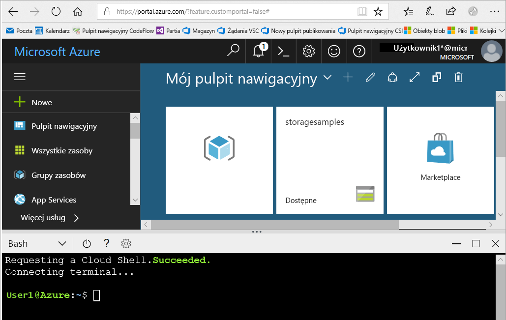
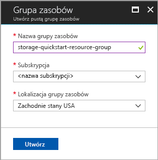
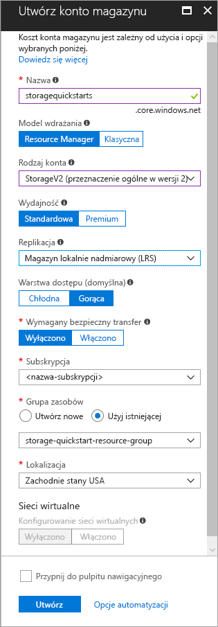

# <a name="create-a-storage-account"></a>Tworzenie konta magazynu

Konto usługi Azure Storage zapewnia unikatową przestrzeń nazw w chmurze do przechowywania i umożliwiania dostępu do obiektów w usłudze Azure Storage. Konto magazynu zawiera wszystkie obiekty blob, pliki, kolejki, tabele i dyski tworzone w ramach tego konta. 

Aby rozpocząć pracę z usługą Azure Storage, należy najpierw utworzyć konto magazynu. Możesz utworzyć konto usługi Azure Storage przy użyciu [witryny Azure Portal](https://portal.azure.com/), [programu Azure PowerShell](https://docs.microsoft.com/powershell/azure/overview) lub [interfejsu wiersza polecenia platformy Azure](https://docs.microsoft.com/cli/azure/overview?view=azure-cli-latest). W tym przewodniku Szybki start przedstawiano sposób użycia każdej z tych opcji do utworzenia nowego konta magazynu. 


## <a name="prerequisites"></a>Wymagania wstępne

Jeśli nie masz subskrypcji platformy Azure, przed rozpoczęciem utwórz [bezpłatne konto](https://azure.microsoft.com/free/).

# <a name="portaltabportal"></a>[Portal](#tab/portal)

Brak.

# <a name="powershelltabpowershell"></a>[Program PowerShell](#tab/powershell)

Dla tego przewodnika Szybki start jest wymagany moduł Azure PowerShell w wersji 3.6 lub nowszej. Uruchom polecenie `Get-Module -ListAvailable AzureRM`, aby określić bieżącą wersję. Jeśli konieczna będzie instalacja lub uaktualnienie, zobacz [Instalowanie modułu Azure PowerShell](/powershell/azure/install-azurerm-ps).

# <a name="azure-clitabazure-cli"></a>[Interfejs wiersza polecenia platformy Azure](#tab/azure-cli)

Możesz zalogować się do platformy Azure i uruchomić polecenia interfejsu wiersza polecenia platformy Azure w jeden z dwóch sposobów:

- Polecenia interfejsu wiersza polecenia platformy Azure możesz uruchamiać z poziomu witryny Azure Portal w usłudze Azure Cloud Shell 
- Możesz zainstalować interfejs wiersza polecenia i uruchamiać jego komendy lokalnie  

### <a name="use-azure-cloud-shell"></a>Używanie usługi Azure Cloud Shell

Usługa Azure Cloud Shell jest bezpłatną powłoką Bash, którą można uruchamiać bezpośrednio w witrynie Azure Portal. Ma ona wstępnie zainstalowany interfejs wiersza polecenia platformy Azure skonfigurowany do użycia z Twoim kontem. Kliknij przycisk **Cloud Shell** w menu w prawym górnym rogu witryny Azure Portal:

[](https://portal.azure.com)

Ten przycisk służy do uruchamiania interaktywnej powłoki, której możesz używać do wykonywania kroków opisanych w tym przewodniku Szybki start:

[](https://portal.azure.com)

### <a name="install-the-cli-locally"></a>Instalowanie interfejsu wiersza polecenia lokalnie

Interfejs wiersza polecenia platformy Azure możesz również zainstalować i używać lokalnie. Ten przewodnik Szybki start wymaga interfejsu wiersza polecenia platformy Azure w wersji 2.0.4 lub nowszej. Uruchom polecenie `az --version`, aby dowiedzieć się, jaka wersja jest używana. Jeśli konieczna będzie instalacja lub uaktualnienie, zobacz [Instalowanie interfejsu wiersza polecenia platformy Azure 2.0](/cli/azure/install-azure-cli). 

---

## <a name="log-in-to-azure"></a>Zaloguj się do platformy Azure.

# <a name="portaltabportal"></a>[Portal](#tab/portal)

Zaloguj się do witryny [Azure Portal](https://portal.azure.com).

# <a name="powershelltabpowershell"></a>[Program PowerShell](#tab/powershell)

Zaloguj się do subskrypcji platformy Azure za pomocą polecenia `Login-AzureRmAccount`, a następnie postępuj zgodnie z instrukcjami wyświetlanymi na ekranie w celu uwierzytelnienia.

```powershell
Login-AzureRmAccount
```

# <a name="azure-clitabazure-cli"></a>[Interfejs wiersza polecenia platformy Azure](#tab/azure-cli)

Aby uruchomić usługę Azure Cloud Shell, zaloguj się do witryny [Azure Portal](https://portal.azure.com).

Aby zalogować się do lokalnej instalacji interfejsu wiersza polecenia, uruchom polecenie logowania:

```cli
az login
```

---

## <a name="create-a-resource-group"></a>Tworzenie grupy zasobów

Grupa zasobów platformy Azure to logiczny kontener przeznaczony do wdrażania zasobów platformy Azure i zarządzania nimi. Więcej informacji na temat grup zasobów znajduje się w temacie [Omówienie usługi Azure Resource Manager](../../azure-resource-manager/resource-group-overview.md).

# <a name="portaltabportal"></a>[Portal](#tab/portal)

Aby utworzyć grupę zasobów w witrynie Azure Portal, wykonaj następujące kroki:

1. W witrynie Azure Portal rozwiń menu po lewej stronie, aby otworzyć menu usług, a następnie wybierz pozycję **Grupy zasobów**.
2. Kliknij przycisk **Dodaj**, aby dodać nową grupę zasobów.
3. Wprowadź nazwę nowej grupy zasobów.
4. Wybierz subskrypcję, w ramach której chcesz utworzyć nową grupę zasobów.
5. Wybierz lokalizację grupy zasobów.
6. Kliknij przycisk **Utwórz**.  



# <a name="powershelltabpowershell"></a>[Program PowerShell](#tab/powershell)

Aby utworzyć nową grupę zasobów za pomocą programu PowerShell, użyj polecenia [New-AzureRmResourceGroup](/powershell/module/azurerm.resources/new-azurermresourcegroup): 

```powershell
# put resource group in a variable so you can use the same group name going forward,
# without hardcoding it repeatedly
$resourceGroup = "storage-quickstart-resource-group"
New-AzureRmResourceGroup -Name $resourceGroup -Location $location 
```

Jeśli nie masz pewności, który region należy określić dla parametru `-Location`, za pomocą polecenia [Get-AzureRmLocation](/powershell/module/azurerm.resources/get-azurermlocation) możesz pobrać listę obsługiwanych regionów dla swojej subskrypcji:

```powershell
Get-AzureRmLocation | select Location 
$location = "westus"
```

# <a name="azure-clitabazure-cli"></a>[Interfejs wiersza polecenia platformy Azure](#tab/azure-cli)

Aby utworzyć nową grupę zasobów za pomocą interfejsu wiersza polecenia platformy Azure, użyj polecenia [az group create](/cli/azure/group#az_group_create). 

```azurecli-interactive
az group create \
    --name storage-quickstart-resource-group \
    --location westus
```

Jeśli nie masz pewności, który region należy określić dla parametru `--location`, za pomocą polecenia [az account list-locations](/cli/azure/account#az_account_list) możesz pobrać listę obsługiwanych regionów dla swojej subskrypcji.

```azurecli-interactive
az account list-locations \
    --query "[].{Region:name}" \
    --out table
```

---

## <a name="create-a-general-purpose-storage-account"></a>Tworzenie konta magazynu ogólnego przeznaczenia

Konto magazynu ogólnego przeznaczenia zapewnia dostęp do wszystkich usług magazynu Azure Storage: obiektów blob, plików, kolejek i tabel. Konto magazynu ogólnego przeznaczenia można utworzyć w warstwie Standardowa lub Premium. W przykładach w tym artykule pokazano sposób tworzenia konta magazynu ogólnego przeznaczenia w warstwie Standardowa (wartość domyślna).

Usługa Azure Storage oferuje dwa typy kont magazynu ogólnego przeznaczenia:

- Konta ogólnego przeznaczenia, wersja 2 
- Konta ogólnego przeznaczenia, wersja 1 

> [!NOTE]
> Zalecane jest tworzenie nowych kont magazynu jako **kont ogólnego przeznaczenia, wersja 2**, aby móc korzystać z nowszych funkcji dostępnych w przypadku tych kont.  

Aby uzyskać więcej informacji dotyczących typów kont magazynu, zobacz temat [Opcje konta usługi Azure Storage](storage-account-options.md).

Podczas określania nazwy konta magazynu należy pamiętać o następujących regułach:

- Nazwy kont usługi Magazyn muszą mieć długość od 3 do 24 znaków i mogą zawierać tylko cyfry i małe litery.
- Nazwa konta magazynu musi być unikatowa w obrębie platformy Azure. Każde konto magazynu musi mieć inną nazwę.

# <a name="portaltabportal"></a>[Portal](#tab/portal)

Aby utworzyć konto magazynu ogólnego przeznaczenia w wersji 2 w witrynie Azure Portal, wykonaj następujące kroki:

1. W witrynie Azure Portal rozwiń menu po lewej stronie, aby otworzyć menu usług, a następnie wybierz pozycję **Więcej usług**. Następnie przewiń w dół do pozycji **Magazyn** i wybierz pozycję **Konta magazynu**. W oknie **Konta magazynu**, które zostanie wyświetlone, wybierz pozycję **Dodaj**.
2. Wprowadź nazwę konta magazynu.
3. Ustaw pole **Rodzaj konta** na wartość **StorageV2 (ogólnego przeznaczenia, wersja 2)**.
4. Pozostaw pole **Replikacja** ustawione na wartość **Magazyn lokalnie nadmiarowy (LRS)**. Możesz również wybrać pozycję **Magazyn strefowo nadmiarowy (wersja zapoznawcza magazynu ZRS)**, **Magazyn geograficznie nadmiarowy (GRS)** lub **Magazyn geograficznie nadmiarowy dostępny do odczytu (RA-GRS)**.
5. Pozostaw następujące pola ustawione na ich wartości domyślne: **Model wdrażania**, **Wydajność** i **Wymagany bezpieczny transfer**.
6. Wybierz subskrypcję, w ramach której chcesz utworzyć konto magazynu.
7. Z listy rozwijanej **Grupa zasobów** wybierz pozycję **Użyj istniejącej**, a następnie wybierz grupę zasobów utworzoną w poprzedniej sekcji.
8. Wybierz lokalizację nowego konta magazynu.
9. Kliknij pozycję **Utwórz**, aby utworzyć konto magazynu.      



# <a name="powershelltabpowershell"></a>[Program PowerShell](#tab/powershell)

Aby utworzyć konto magazynu ogólnego przeznaczenia w wersji 2 z poziomu programu PowerShell przy użyciu magazynu lokalnie nadmiarowego (LRS), użyj polecenia [New-AzureRmStorageAccount](/powershell/module/azurerm.storage/New-AzureRmStorageAccount): 

```powershell
New-AzureRmStorageAccount -ResourceGroupName $resourceGroup `
  -Name "storagequickstart" `
  -Location $location `
  -SkuName Standard_LRS `
  -Kind StorageV2 
```

Aby utworzyć konto magazynu ogólnego przeznaczenia w wersji 2 przy użyciu magazynu strefowo nadmiarowego (wersja zapoznawcza magazynu ZRS), magazynu geograficznie nadmiarowego (GRS) lub magazynu geograficznie nadmiarowego dostępnego do odczytu (RA-GRS), zastąp żądaną wartość w poniższej tabeli dla parametru **SkuName**. 

|Opcja replikacji  |Parametr SkuName  |
|---------|---------|
|Magazyn lokalnie nadmiarowy (LRS)     |Standard_LRS         |
|Magazyn strefowo nadmiarowy (ZRS)     |Standard_ZRS         |
|Magazyn geograficznie nadmiarowy (GRS)     |Standard_GRS         |
|Magazyn geograficznie nadmiarowy dostępny do odczytu (GRS)     |Standard_RAGRS         |

# <a name="azure-clitabazure-cli"></a>[Interfejs wiersza polecenia platformy Azure](#tab/azure-cli)

Aby utworzyć konto magazynu ogólnego przeznaczenia w wersji 2 z poziomu interfejsu wiersza polecenia platformy Azure przy użyciu magazynu lokalnie nadmiarowego, użyj polecenia [az storage account create](/cli/azure/storage/account#az_storage_account_create).

```azurecli-interactive
az storage account create \
    --name storagequickstart \
    --resource-group storage-quickstart-resource-group \
    --location westus \
    --sku Standard_LRS \
    --kind StorageV2
```

Aby utworzyć konto magazynu ogólnego przeznaczenia w wersji 2 z magazynu strefowo nadmiarowego (wersja zapoznawcza magazynu ZRS), magazynu geograficznie nadmiarowego (GRS) lub magazynu geograficznie nadmiarowego dostępnego do odczytu (RA-GRS), zastąp żądaną wartość w poniższej tabeli dla parametru **sku**. 

|Opcja replikacji  |parametr sku  |
|---------|---------|
|Magazyn lokalnie nadmiarowy (LRS)     |Standard_LRS         |
|Magazyn strefowo nadmiarowy (ZRS)     |Standard_ZRS         |
|Magazyn geograficznie nadmiarowy (GRS)     |Standard_GRS         |
|Magazyn geograficznie nadmiarowy dostępny do odczytu (GRS)     |Standard_RAGRS         |

---

> [!NOTE]
> [Magazyn strefowo nadmiarowy](https://azure.microsoft.com/blog/announcing-public-preview-of-azure-zone-redundant-storage/preview/) jest obecnie w wersji zapoznawczej i jest dostępny tylko w następujących lokalizacjach:
>    - Wschodnie stany USA 2
>    - Środkowe stany USA
>    - Francja Środkowa (ten region jest obecnie w wersji zapoznawczej. Zobacz [Microsoft Azure preview with Azure Availability Zones now open in France (Platforma Microsoft Azure w wersji zapoznawczej ze strefami dostępności platformy Azure jest obecnie otwarta we Francji)](https://azure.microsoft.com/blog/microsoft-azure-preview-with-azure-availability-zones-now-open-in-france), aby zażądać dostępu).
    
Aby uzyskać więcej informacji o różnych dostępnych typach replikacji, zobacz [Opcje replikacji magazynu](storage-redundancy.md).

## <a name="clean-up-resources"></a>Oczyszczanie zasobów

Jeśli chcesz oczyścić zasoby utworzone w tym przewodniku Szybki start, możesz po prostu usunąć grupę zasobów. Usunięcie grupy zasobów powoduje również usunięcie skojarzonego konta magazynu i wszystkich innych zasobów skojarzonych z tą grupą zasobów.

# <a name="portaltabportal"></a>[Portal](#tab/portal)

Aby usunąć grupę zasobów za pomocą witryny Azure Portal:

1. W witrynie Azure Portal rozwiń menu po lewej stronie, aby otworzyć menu usług, a następnie wybierz pozycję **Grupy zasobów**, aby wyświetlić listę grup zasobów.
2. Znajdź grupę zasobów do usunięcia, a następnie kliknij prawym przyciskiem myszy przycisk **Więcej** (**...** ) po prawej stronie listy.
3. Wybierz pozycję **Usuń grupę zasobów** i potwierdź.

# <a name="powershelltabpowershell"></a>[Program PowerShell](#tab/powershell)

Aby usunąć grupę zasobów i skojarzone z nią zasoby, w tym nowe konto magazynu, użyj polecenia [Remove-AzureRmResourceGroup](/powershell/module/azurerm.resources/remove-azurermresourcegroup): 

```powershell
Remove-AzureRmResourceGroup -Name $resourceGroup
```

# <a name="azure-clitabazure-cli"></a>[Interfejs wiersza polecenia platformy Azure](#tab/azure-cli)

Aby usunąć grupę zasobów i skojarzone z nią zasoby, w tym nowe konto magazynu, użyj polecenia [az group delete](/cli/azure/group#az_group_delete).

```azurecli-interactive
az group delete --name myResourceGroup
```

---

## <a name="next-steps"></a>Następne kroki

W tym przewodniku Szybki start zostało utworzone standardowe konto magazynu ogólnego przeznaczenia. Aby dowiedzieć się, jak przekazywać i pobierać obiekty blob z konta magazynu i do niego, przejdź do przewodnika Szybki start dotyczącego magazynu obiektów blob.

# <a name="portaltabportal"></a>[Portal](#tab/portal)

> [!div class="nextstepaction"]
> [Transferowanie obiektów do usługi Azure Blob Storage i z niej za pomocą witryny Azure Portal](../blobs/storage-quickstart-blobs-portal.md)

# <a name="powershelltabpowershell"></a>[Program PowerShell](#tab/powershell)

> [!div class="nextstepaction"]
> [Transferowanie obiektów do usługi Azure Blob Storage i z niej za pomocą programu PowerShell](../blobs/storage-quickstart-blobs-powershell.md)

# <a name="azure-clitabazure-cli"></a>[Interfejs wiersza polecenia platformy Azure](#tab/azure-cli)

> [!div class="nextstepaction"]
> [Transferowanie obiektów do usługi Azure Blob Storage i z niej za pomocą interfejsu wiersza polecenia platformy Azure](../blobs/storage-quickstart-blobs-cli.md)

---
