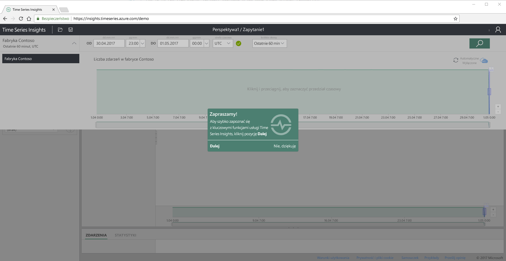
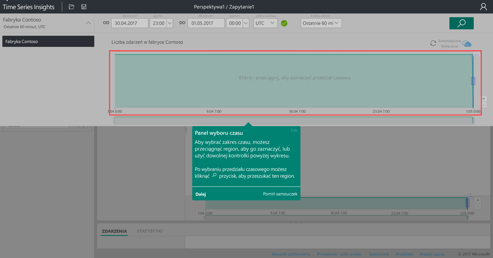
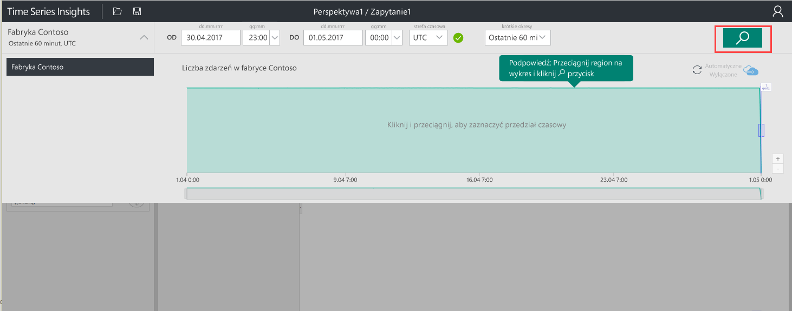
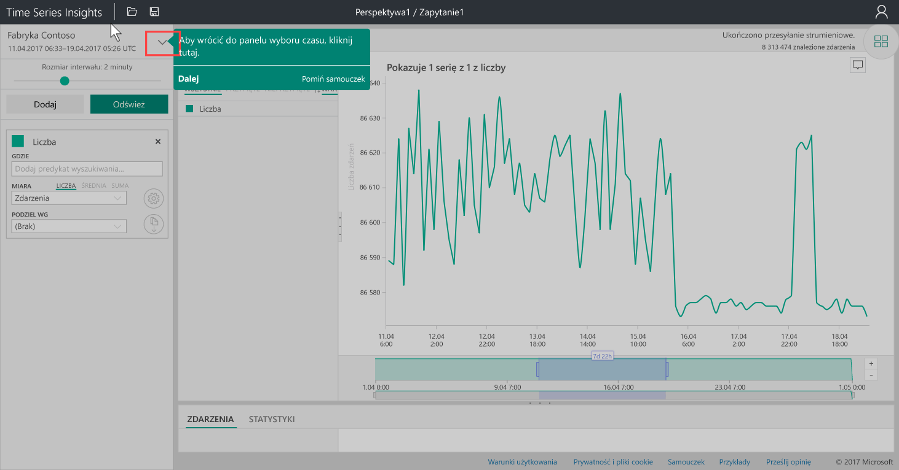
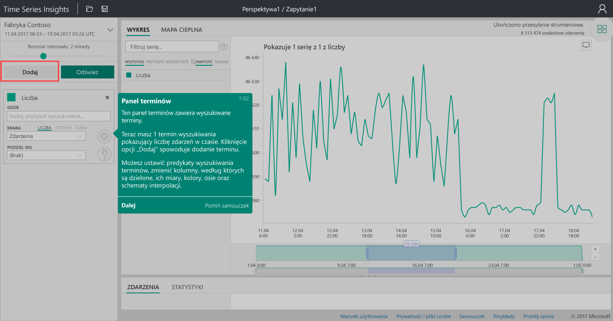
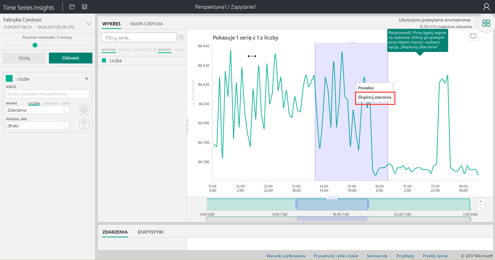
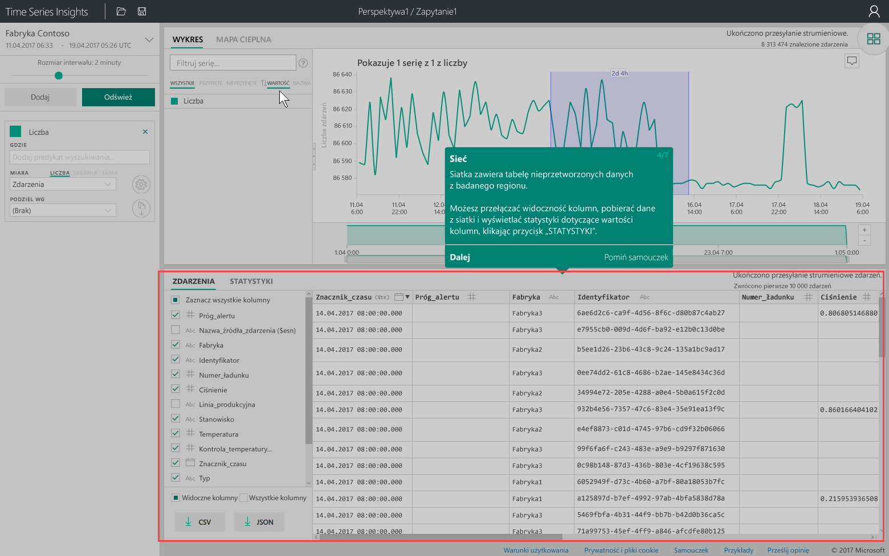
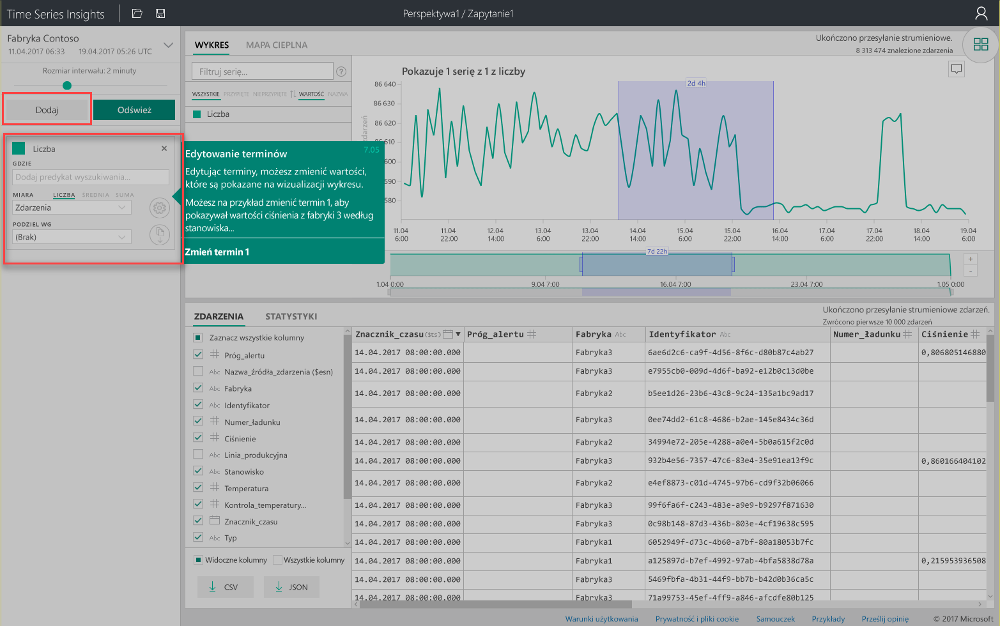
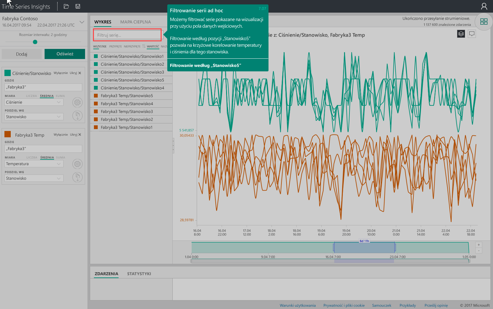

# Szybki start: poznawanie usługi Azure Time Series Insights
W tym przewodniku Szybki start pokazano, jak rozpocząć pracę z eksploratorem usługi Azure Time Series Insights w bezpłatnym środowisku pokazowym. Dowiesz się, jak przy użyciu przeglądarki internetowej wizualizować duże ilości danych IoT, i poznasz najważniejsze funkcje eksploratora usługi Time Series Insights. 

Azure Time Series Insights to w pełni zarządzana usługa związana z analizą, przechowywaniem i wizualizacją, dzięki której z łatwością można badać i analizować miliardy zdarzeń IoT jednocześnie. Usługa ta zapewnia globalny wgląd w dane i umożliwia szybkie weryfikowanie rozwiązań IoT. Ponadto zapobiega kosztownym przestojom w pracy urządzeń o krytycznym znaczeniu, pomagając w odkrywaniu ukrytych trendów, wykrywaniu anomalii i przeprowadzaniu analiz głównych przyczyn w czasie zbliżonym do rzeczywistego.  Jeśli tworzysz aplikację, która wymaga przechowywania danych szeregów czasowych lub wykonywania na nich zapytań, możesz programować przy użyciu interfejsów API REST usługi Time Series Insights.

Jeśli nie masz subskrypcji platformy Azure, przed rozpoczęciem utwórz [bezpłatne konto platformy Azure](https://azure.microsoft.com/free/?ref=microsoft.com&utm_source=microsoft.com&utm_medium=docs&utm_campaign=visualstudio).

## Poznawanie eksploratora usługi Time Series Insights w środowisku pokazowym

1. W przeglądarce przejdź do witryny [https://insights.timeseries.azure.com/demo](https://insights.timeseries.azure.com/demo). 

2. Jeśli zostanie wyświetlony monit, zaloguj się do eksploratora usługi Time Series Insights przy użyciu poświadczeń konta platformy Azure. 
 
3. Zostanie wyświetlona strona szybkiego przewodnika po usłudze Time Series Insights. Kliknij przycisk **Dalej**, aby zacząć szybki przewodnik.

   

4. Zostanie wyświetlony **panel wyboru czasu**. Użyj tego panelu, aby wybrać przedział czasu do wizualizacji.

   

5. Kliknij i przeciągnij w wybranym regionie, a następnie kliknij przycisk **Wyszukaj**.
 
    

   Usługa Time Series Insights wyświetli wizualizację wykresu dla określonego przedziału czasu. W ramach wykresu liniowego możesz wykonywać różne czynności, takie jak filtrowanie, przypinanie, sortowania i nakładanie. 

   Aby powrócić do **panelu wyboru czasu**, kliknij strzałkę w dół, jak pokazano na ilustracji:

   

6. Kliknij przycisk **Dodaj** na **panelu terminów**, aby dodać nowy termin wyszukiwania.

   

7. Na wykresie możesz wybrać region, kliknąć prawym przyciskiem myszy ten region i wybrać polecenie **Eksploruj zdarzenia**.
 
   

   Zostanie wyświetlona siatka danych pierwotnych z badanego regionu:

   

8. Edytuj terminy, aby zmienić wartości na wykresie, oraz dodaj kolejny termin w celu krzyżowej korelacji różnych typów wartości:

   

9. Wprowadź termin filtrowania w polu **Filtruj szeregi...**, aby wykonać filtrowanie szeregów ad hoc. Na potrzeby tego przewodnika Szybki start wprowadź termin **Station5** (Stacja5), aby skorelować temperaturę i ciśnienie dla tej stacji.
 
   

Po zakończeniu przewodnika Szybki start możesz poeksperymentować z zestawem danych przykładowych, aby tworzyć różne wizualizacje. 

### Następne kroki
Teraz możesz utworzyć własne środowisko usługi Time Series Insights:
> [!div class="nextstepaction"]
> [Planowanie środowiska usługi Time Series Insights](time-series-insights-environment-planning.md)
