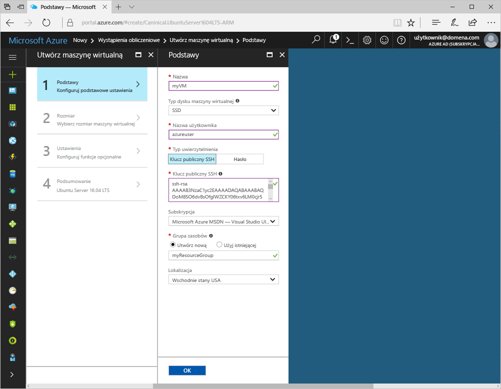
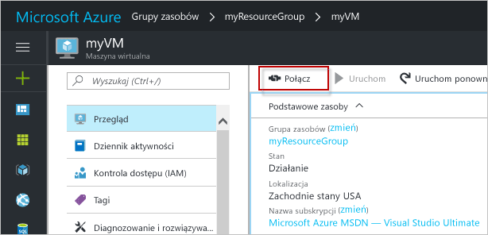

# <a name="create-a-linux-virtual-machine-with-the-azure-portal"></a>Tworzenie maszyny wirtualnej z systemem Linux za pomocą witryny Azure Portal

Maszyny wirtualne platformy Azure można utworzyć za pomocą witryny Azure Portal. Ta metoda bazuje na opartym na przeglądarce interfejsie użytkownika umożliwiającym tworzenie i konfigurowanie maszyn wirtualnych oraz wszystkich pokrewnych zasobów. Ten przewodnik Szybki start opisuje proces tworzenia maszyny wirtualnej i instalowania serwera internetowego na tej maszynie wirtualnej.

Jeśli nie masz subskrypcji platformy Azure, przed rozpoczęciem utwórz [bezpłatne konto](https://azure.microsoft.com/free/?WT.mc_id=A261C142F).

## <a name="create-ssh-key-pair"></a>Tworzenie pary kluczy SSH

Do wykonania kroków tego przewodnika Szybki start konieczne jest posiadanie pary kluczy SSH. Jeśli masz już parę kluczy SSH, możesz pominąć ten krok.

Korzystając z powłoki Bash, uruchom to polecenie i wykonaj instrukcje wyświetlane na ekranie. Dane wyjściowe polecenia zawierają nazwę pliku klucza publicznego. Skopiuj zawartość pliku klucza publicznego do schowka.

```bash
ssh-keygen -t rsa -b 2048
```

## <a name="log-in-to-azure"></a>Zaloguj się do platformy Azure. 

Zaloguj się w witrynie Azure Portal pod adresem http://portal.azure.com.

## <a name="create-virtual-machine"></a>Tworzenie maszyny wirtualnej

1. Kliknij przycisk **Nowy** znajdujący się w lewym górnym rogu witryny Azure Portal.

2. Wybierz pozycję **Wystąpienia obliczeniowe**, a następnie wybierz pozycję **Ubuntu Server 16.04 LTS**. 

3. Wprowadź informacje o maszynie wirtualnej. W obszarze **Typ uwierzytelniania** wybierz pozycję **Klucz publiczny SSH**. Podczas wklejania klucza publicznego SSH pamiętaj, aby usunąć wszystkie wiodące i końcowe białe znaki. Po zakończeniu kliknij przycisk **OK**.

    

4. Wybierz rozmiar maszyny wirtualnej. Aby wyświetlić więcej rozmiarów, wybierz pozycje **Wyświetl wszystkie** lub zmień filtr **Obsługiwany typ dysku**. 

      

5. W obszarze **Ustawienia** zachowaj wartości domyślne i kliknij przycisk **OK**.

6. Na stronie podsumowania kliknij przycisk **OK**, aby rozpocząć wdrażanie maszyny wirtualnej.

7. Maszyna wirtualna zostanie przypięta do pulpitu nawigacyjnego witryny Azure Portal. Po zakończeniu wdrażania zostanie automatycznie otwarte podsumowanie maszyny wirtualnej.


## <a name="connect-to-virtual-machine"></a>Nawiązywanie połączenia z maszyną wirtualną

Utwórz połączenie SSH z maszyną wirtualną.

1. Kliknij przycisk **Połącz** we właściwościach maszyny wirtualnej. Na przycisku połączenia są wyświetlane parametry połączenia SSH, których można użyć do nawiązania połączenia z maszyną wirtualną.

     

2. Uruchom następujące polecenie, aby utworzyć sesję SSH. Zastąp parametry połączenia wartościami skopiowanymi z witryny Azure Portal.

```bash 
ssh azureuser@40.112.21.50
```

## <a name="install-nginx"></a>Instalowanie serwera NGINX

Użyj poniższego skryptu powłoki systemowej w celu zaktualizowania źródeł pakietów i zainstalowania najnowszego pakietu NGINX. 

```bash 
#!/bin/bash

# update package source
sudo apt-get -y update

# install NGINX
sudo apt-get -y install nginx
```

Po zakończeniu zamknij sesję SSH i wróć do właściwości maszyny wirtualnej w witrynie Azure Portal.


## <a name="open-port-80-for-web-traffic"></a>Otwieranie portu 80 na potrzeby ruchu w sieci Web 

Sieciowa grupa zabezpieczeń zabezpiecza ruch przychodzący i wychodzący. Po utworzeniu maszyny wirtualnej z poziomu witryny Azure Portal na porcie 22 jest tworzona reguła ruchu przychodzącego dla połączeń SSH. Ponieważ maszyna wirtualna hostuje serwer sieci Web, należy utworzyć regułę sieciowej grupy zabezpieczeń dla portu 80.

1. Na maszynie wirtualnej kliknij nazwę **grupy zasobów**.
2. Wybierz **sieciową grupę zabezpieczeń**. Sieciową grupę zabezpieczeń można zidentyfikować za pomocą kolumny **Typ**. 
3. W menu po lewej stronie, w obszarze ustawień, kliknij pozycję **Reguły zabezpieczeń dla ruchu przychodzącego**.
4. Kliknij pozycję **Dodaj**.
5. W polu **Nazwa** wpisz wartość **http**. Upewnij się, że w polu **Zakres portów** ustawiono wartość 80, a w polu **Akcja** — wartość **Zezwalaj**. 
6. Kliknij przycisk **OK**.


## <a name="view-the-nginx-welcome-page"></a>Wyświetlanie strony powitalnej serwera NGINX

Po zainstalowaniu serwera NGINX i otwarciu portu 80 dla maszyny wirtualnej można uzyskać dostęp do serwera sieci Web z Internetu. Otwórz przeglądarkę internetową i wpisz publiczny adres IP maszyny wirtualnej. Publiczny adres IP można znaleźć we właściwościach maszyny wirtualnej w witrynie Azure Portal.

 

## <a name="clean-up-resources"></a>Oczyszczanie zasobów

Gdy grupa zasobów, maszyna wirtualna i wszystkie pokrewne zasoby nie będą już potrzebne, można je usunąć. W tym celu wybierz grupę zasobów dla maszyny wirtualnej, a następnie kliknij przycisk **Usuń**.

## <a name="next-steps"></a>Następne kroki

W tym przewodniku Szybki start została wdrożona prosta maszyna wirtualna i reguła sieciowej grupy zabezpieczeń oraz zainstalowano serwer sieci Web. Aby dowiedzieć się więcej o maszynach wirtualnych platformy Azure, przejdź do samouczka dla maszyn wirtualnych z systemem Linux.

> [!div class="nextstepaction"]
> [Samouczki dla maszyny wirtualnej platformy Azure z systemem Linux](./tutorial-manage-vm.md)
