# Tworzenie pierwszej maszyny wirtualnej z systemem Windows w witrynie Azure Portal
Ten samouczek pokazuje, jak łatwo można w ciągu kilku minut utworzyć maszynę wirtualną z systemem Windows przy użyciu witryny Azure Portal.  

Jeśli nie masz subskrypcji platformy Azure, przed rozpoczęciem utwórz [bezpłatne konto](https://azure.microsoft.com/free/).

## Wybieranie obrazu maszyny wirtualnej z portalu Marketplace
Jako przykładu używamy obrazu systemu Windows Server 2012 R2 Datacenter, ale jest to tylko jeden z wielu obrazów oferowanych na platformie Azure. Obrazy dostępne do wyboru zależą od subskrypcji. Na przykład niektóre obrazy komputerowe są dostępne dla [subskrybentów MSDN](https://azure.microsoft.com/pricing/member-offers/msdn-benefits-details/?WT.mc_id=A261C142F).

1. Zaloguj się w witrynie [Azure Portal](https://portal.azure.com).
2. W menu Centrum kliknij kolejno pozycje **Nowy** > **Obliczanie** > **Windows Server 2012 R2 Datacenter**.
   
    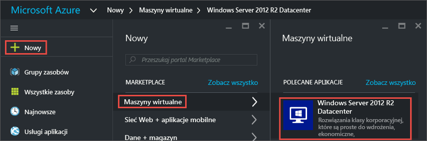
3. W bloku **Windows Server 2012 R2 Datacenter** w sekcji **Wybierz model wdrożenia** sprawdź, czy wybrano pozycję **Menedżer zasobów**. Kliknij przycisk **Utwórz**.
   
    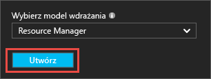

## Tworzenie maszyny wirtualnej z systemem Windows
Po wybraniu obrazu możesz użyć ustawień domyślnych i szybko utworzyć maszynę wirtualną.

1. W bloku **Podstawowe** wprowadź nazwę maszyny wirtualnej w polu **Nazwa**. Nazwa musi składać się z 1–15 znaków i nie może zawierać znaków specjalnych.
2. Podaj nazwę użytkownika w polu **Nazwa użytkownika** i silne hasło w polu **Hasło**. Zostaną one użyte do utworzenia konta lokalnego na maszynie wirtualnej. Konto lokalne jest używane do logowania się do maszyny wirtualnej i zarządzania nią. 
   
    Hasło musi mieć długość od 8 do 123 znaków i spełniać trzy z czterech następujących wymagań dotyczących złożoności: mała litera, wielka litera, cyfra i znak specjalny. Więcej informacji na temat [wymagań dotyczących nazwy użytkownika i hasła](virtual-machines-windows-faq.md#what-are-the-username-requirements-when-creating-a-vm).
3. Wybierz istniejącą [grupę zasobów](../azure-resource-manager/resource-group-overview.md#resource-groups) lub wprowadź nazwę nowej grupy zasobów. W polu **Lokalizacja** wprowadź lokalizację centrum danych Azure, np. **Zachodnie stany USA**. 
4. Gdy skończysz, kliknij przycisk **OK**, aby przejść do następnej sekcji. 
   
    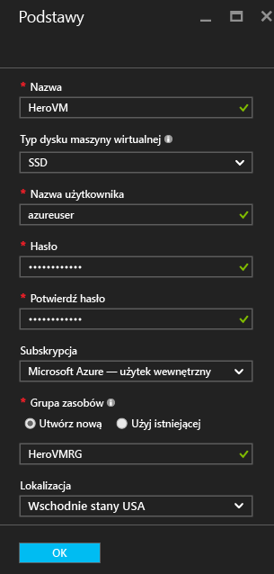
5. Wybierz [rozmiar](virtual-machines-windows-sizes.md?toc=%2fazure%2fvirtual-machines%2fwindows%2ftoc.json) maszyny wirtualnej, a następnie kliknij przycisk **Wybierz**, aby kontynuować. 
   
    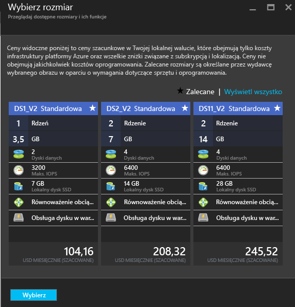
6. W bloku **Ustawienia** możesz zmienić opcje magazynu i sieci. Dla celów tego samouczka zaakceptuj ustawienia domyślne. Jeśli wybrano rozmiar maszyny wirtualnej, który obsługuję tę funkcję, możesz wypróbować usługę Premium Storage, wybierając opcję **Premium (SSD)** w obszarze **Typ dysku**. Po zakończeniu wprowadzania zmian kliknij przycisk **OK**.
   
    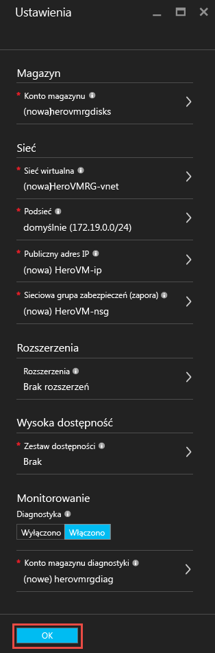
7. Kliknij pozycję **Podsumowanie**, aby przejrzeć wybrane opcje. Po wyświetleniu komunikatu **Sprawdzanie poprawności zakończone powodzeniem** kliknij przycisk **OK**.
   
    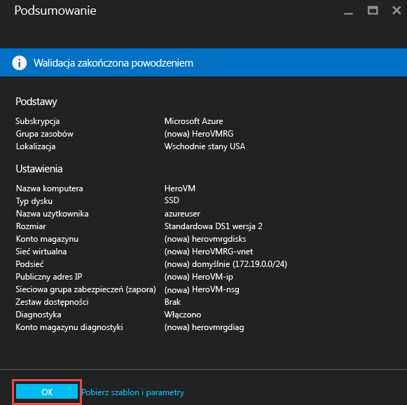
8. Podczas tworzenia maszyny wirtualnej przez platformę Azure możesz śledzić postęp w obszarze **Maszyny wirtualne** w menu Centrum. 

## Nawiązywanie połączenia z maszyną wirtualną i logowanie
1. W menu Centrum kliknij pozycję **Maszyny wirtualne**.
2. Wybierz maszynę wirtualną z listy.
3. W bloku maszyny wirtualnej kliknij pozycję **Połącz**. Operacja spowoduje utworzenie i pobranie pliku Remote Desktop Protocol (rdp), który jest swego rodzaju skrótem do nawiązywania połączenia z maszyną wirtualną. Możesz zapisać plik na pulpicie, aby zapewnić sobie łatwy dostęp. **Otwórz** ten plik, aby nawiązać połączenie z maszyną wirtualną.
   
    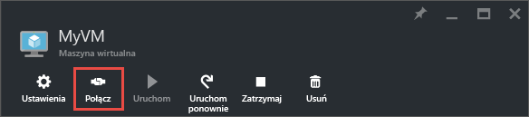
4. Zostanie wyświetlone ostrzeżenie, że plik rdp pochodzi od nieznanego wydawcy. Jest to normalne. W oknie pulpitu zdalnego kliknij przycisk **Połącz**, aby kontynuować.
   
    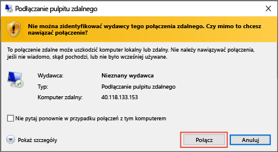
5. W oknie Zabezpieczenia systemu Windows wpisz nazwę użytkownika i hasło konta lokalnego, które zostało utworzone podczas tworzenia maszyny wirtualnej. Wprowadź nazwę użytkownika w formacie *nazwa_maszyny_wirtualnej*&#92;*nazwa_użytkownika*, a następnie kliknij przycisk **OK**.
   
    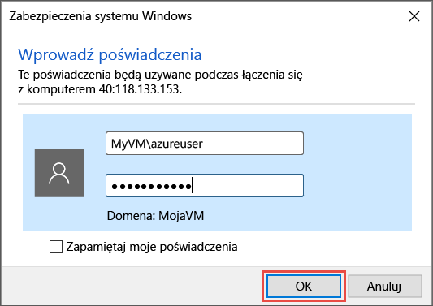
6. Zostanie wyświetlone ostrzeżenie, że nie można zweryfikować certyfikatu. Jest to normalne. Kliknij przycisk **Tak**, aby potwierdzić tożsamość maszyny wirtualnej i zakończyć logowanie.
   
   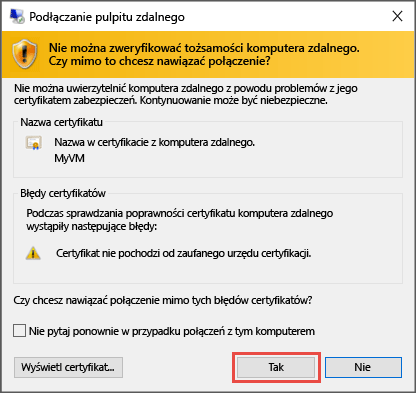

Jeśli podczas próby połączenia wystąpiły problemy, zobacz [Troubleshoot Remote Desktop connections to a Windows-based Azure Virtual Machine](virtual-machines-windows-troubleshoot-rdp-connection.md?toc=%2fazure%2fvirtual-machines%2fwindows%2ftoc.json) (Rozwiązywanie problemów z połączeniami pulpitu zdalnego z maszyną wirtualną Azure z systemem Windows).

Teraz możesz pracować z maszyną wirtualną tak samo jak z każdym innym serwerem.

## Opcja: zatrzymanie maszyny wirtualnej
Dobrym rozwiązaniem jest zatrzymanie maszyny wirtualnej w celu uniknięcia opłat, gdy maszyna nie jest używana. Kliknij pozycję **Zatrzymaj**, a następnie kliknij przycisk **Tak**.

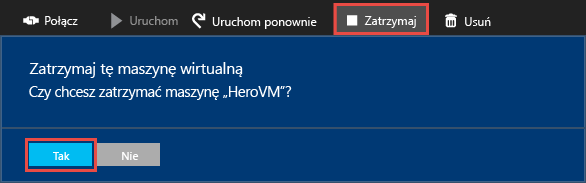

Kliknij przycisk **Uruchom**, aby ponownie uruchomić maszynę wirtualną, gdy wszystko będzie gotowe do jej ponownego użycia.

## Następne kroki
* Z nową maszyną wirtualną można poeksperymentować, [instalując program IIS](virtual-machines-windows-hero-role.md?toc=%2fazure%2fvirtual-machines%2fwindows%2ftoc.json). W tym samouczku pokazano także, jak otworzyć port 80 na przychodzący ruch sieciowy przy użyciu sieciowej grupy zabezpieczeń (NSG, network security group). 
* Można także [utworzyć maszynę wirtualną z systemem Windows przy użyciu programu PowerShell](virtual-machines-windows-ps-create.md?toc=%2fazure%2fvirtual-machines%2fwindows%2ftoc.json) lub [utworzyć maszynę wirtualną z systemem Linux](virtual-machines-linux-quick-create-cli.md?toc=%2fazure%2fvirtual-machines%2flinux%2ftoc.json) przy użyciu interfejsu wiersza polecenia platformy Azure.
* Jeśli interesuje Cię automatyzacja wdrożeń, zobacz temat [Create a Windows virtual machine by using a Resource Manager template](virtual-machines-windows-ps-template.md?toc=%2fazure%2fvirtual-machines%2fwindows%2ftoc.json) (Tworzenie maszyny wirtualnej z systemem Windows przy użyciu szablonu menedżera zasobów).

<!--HONumber=Nov16_HO3-->

