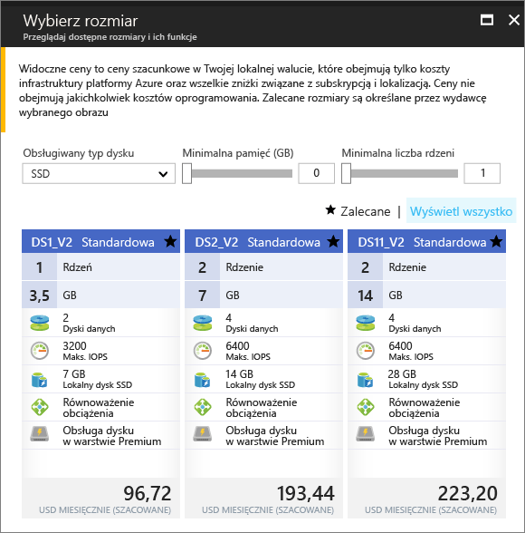

# <a name="create-a-windows-virtual-machine-in-an-availability-zone-with-the-azure-portal"></a>Utwórz maszynę wirtualną systemu Windows w strefie dostępności przy użyciu portalu Azure

Ta procedura artykułu przy użyciu portalu Azure, aby utworzyć maszynę wirtualną w strefie dostępności Azure. [Strefa dostępności](../../availability-zones/az-overview.md) to fizycznie oddzielona strefa w regionie świadczenia usługi Azure. Strefy dostępności chronią aplikacje i dane, zmniejszając prawdopodobieństwo wystąpienia awarii lub utraty całego centrum danych.

[!INCLUDE [availability-zones-preview-statement.md](../../../includes/availability-zones-preview-statement.md)]


## <a name="log-in-to-azure"></a>Zaloguj się do platformy Azure. 

Zaloguj się do portalu Azure pod adresem https://portal.azure.com.

## <a name="create-virtual-machine"></a>Tworzenie maszyny wirtualnej

1. Kliknij przycisk **Nowy** znajdujący się w lewym górnym rogu witryny Azure Portal.

2. Wybierz pozycję **Wystąpienia obliczeniowe**, a następnie wybierz pozycję **Windows Server 2016 Datacenter**. 

3. Wprowadź informacje o maszynie wirtualnej. Nazwa użytkownika i hasło wprowadzone w tym miejscu są używane na potrzeby logowania się do maszyny wirtualnej. Po zakończeniu kliknij przycisk **OK**.

    

4. Wybierz rozmiar maszyny wirtualnej. Aby wyświetlić więcej rozmiarów, wybierz pozycje **Wyświetl wszystkie** lub zmień filtr **Obsługiwany typ dysku**. Należy wybrać jedną z rozmiary obsługiwane w wersji zapoznawczej stref dostępności, takich jak *DS1_v2 standardowe*. 

      

5. W obszarze **ustawienia** > **wysokiej dostępności**, wybierz jedną z numerem stref z **strefy dostępności** listy rozwijanej, Zachowaj pozostałe wartości domyślne, i Kliknij przycisk **OK**.

    

6. Na stronie Podsumowanie kliknij **zakupu** rozpocząć wdrażanie maszyny wirtualnej.

7. Maszyna wirtualna zostanie przypięta do pulpitu nawigacyjnego witryny Azure Portal. Po zakończeniu wdrażania zostanie automatycznie otwarte podsumowanie maszyny wirtualnej.


## <a name="zone-for-ip-address-and-managed-disk"></a>Strefa adresu IP i dysku zarządzanego

Po wdrożeniu maszyny Wirtualnej w strefie dostępności adresu IP i dysków zarządzanych zasobów są wdrażane w tej samej strefie dostępności. Można potwierdzić ustawienia strefy przy użyciu programu Azure PowerShell. Jeśli konieczna będzie instalacja lub uaktualnienie, zobacz [Instalowanie modułu Azure PowerShell](/powershell/azure/install-azurerm-ps).

Poniższe przykłady uzyskać informacje dotyczące zasobów w grupie zasobów o nazwie *myResourceGroup*. Zastąp nazwę grupy zasobów, który został użyty do utworzenia maszyny Wirtualnej.

Znajdź strefy publiczny adres IP z [Get-AzureRmPublicIpAddress](/en-us/powershell/module/azurerm.network/get-azurermpublicipaddress):

```powershell
Get-AzureRmPublicIpAddress -ResourceGroupName myResourceGroup
```
`Zones` Ustawienie w danych wyjściowych pokazuje, że publicznego adresu IP w tej samej strefie dostępności jako maszyny Wirtualnej:

```powershell
Name                     : myVM-ip
ResourceGroupName        : myResourceGroup
Location                 : eastus2
Id                       : /subscriptions/e44f251c-c67e-4760-9ed6-bf99a306ecff/resourceGroups/danlep0911/providers/Micr
                           osoft.Network/publicIPAddresses/myVM-ip
Etag                     : W/"b67e14c0-7e8a-4d12-91c5-da2a5dfad132"
ResourceGuid             : 314bf57d-9b25-4474-9282-db3561d536aa
ProvisioningState        : Succeeded
Tags                     :
PublicIpAllocationMethod : Dynamic
IpAddress                : 13.68.16.25
PublicIpAddressVersion   : IPv4
IdleTimeoutInMinutes     : 4
IpConfiguration          : {
                             "Id": "/subscriptions/e44f251c-c67e-4760-9ed6-bf99a306ecff/resourceGroups/myResourceGroup/providers/Microsoft.Network/networkInterfaces/myVM11842/ipConfigurations/ipconfig1"
                           }
DnsSettings              : null
Zones                    : {2}
```


Zasób dysku zarządzanego maszyny wirtualnej również został utworzony w tej strefie. Można to sprawdzić za pomocą polecenia [Get-AzureRmDisk](/powershell/module/azurerm.compute/get-azurermdisk):

```powershell
Get-AzureRmDisk -ResourceGroupName myResourceGroup
```

Dane wyjściowe pokazują, że dysk zarządzany znajduje się w tej samej strefie dostępności co maszyna wirtualna:

```powershell
ResourceGroupName  : myResourceGroup
AccountType        : PremiumLRS
OwnerId            : /subscriptions/d5b9d4b7-6fc1-0000-0000-000000000000/resourceGroups/myResourceGroup/providers/Microsoft.
                     Compute/virtualMachines/myVM
ManagedBy          : /subscriptions/d5b9d4b7-6fc1-0000-0000-000000000000/resourceGroups/myResourceGroup/providers/Microsoft.
                     Compute/virtualMachines/myVM
Sku                : Microsoft.Azure.Management.Compute.Models.DiskSku
Zones              : {2}
TimeCreated        : 9/7/2017 6:57:26 PM
OsType             : Windows
CreationData       : Microsoft.Azure.Management.Compute.Models.CreationData
DiskSizeGB         : 127
EncryptionSettings :
ProvisioningState  : Succeeded
Id                 : /subscriptions/d5b9d4b7-6fc1-0000-0000-000000000000/resourceGroups/myResourceGroup/providers/Microsoft.
                     Compute/disks/myVM_OsDisk_1_bd921920bb0a4650becfc2d830000000
Name               : myVM_OsDisk_1_bd921920bb0a4650becfc2d830000000
Type               : Microsoft.Compute/disks
Location           : eastus2
Tags               : {}
```

## <a name="next-steps"></a>Następne kroki

W tym artykule przedstawiono sposób tworzenia maszyny wirtualnej w strefie dostępności. Dowiedz się więcej o [regionach i dostępności](regions-and-availability.md) maszyn wirtualnych platformy Azure.
