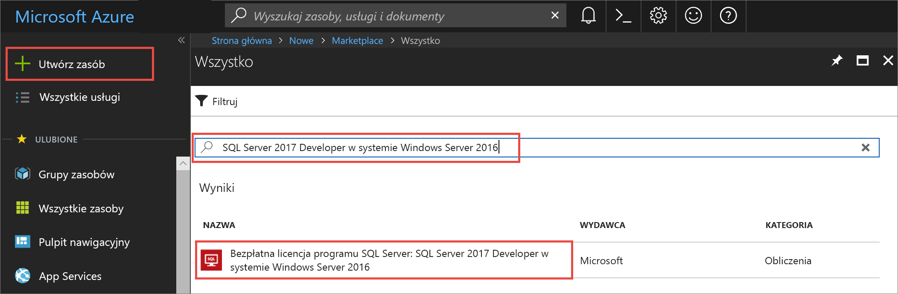
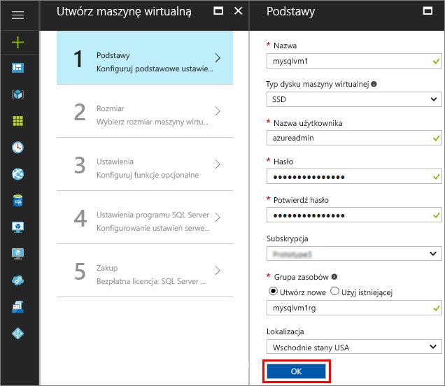
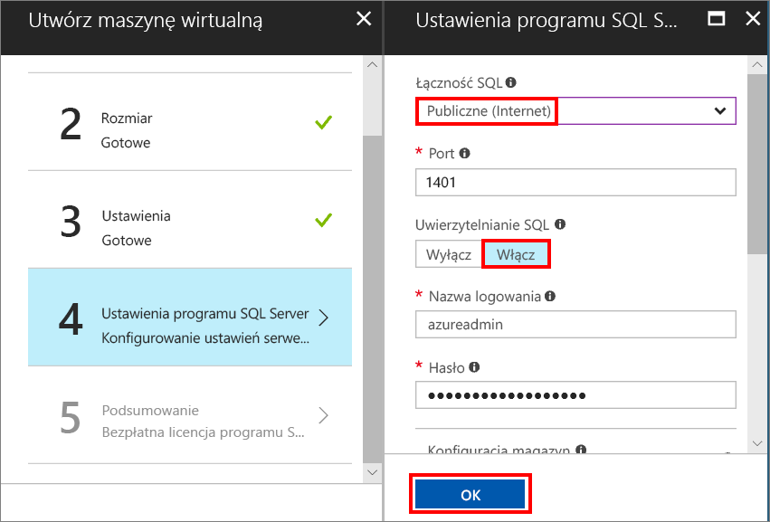
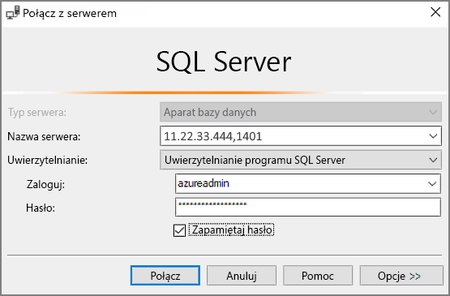

# Tworzenie maszyny wirtualnej systemu Windows z programem SQL Server 2017 w witrynie Azure Portal

> [!div class="op_single_selector"]
> * [Windows](quickstart-sql-vm-create-portal.md)
> * [Linux](../../linux/sql/provision-sql-server-linux-virtual-machine.md)

Ten przewodnik Szybki start przeprowadza użytkownika przez proces tworzenia maszyny wirtualnej z programem SQL Server w witrynie Azure Portal.

Jeśli nie masz subskrypcji platformy Azure, przed rozpoczęciem utwórz [bezpłatne konto](https://azure.microsoft.com/free/?WT.mc_id=A261C142F).

##  Wybieranie obrazu maszyny wirtualnej z programem SQL Server

1. Zaloguj się w witrynie [Azure Portal](https://portal.azure.com) przy użyciu swojego konta.

1. W witrynie Azure Portal kliknij pozycję **Nowe**. Portal otworzy okno **Nowe**.

1. W polu wyszukiwania wpisz ciąg **SQL Server 2017 Developer w systemie Windows Server 2016**, a następnie naciśnij klawisz Enter.

1. Wybierz obraz **Free SQL Server License: SQL Server 2017 Developer on Windows Server 2016**  (Bezpłatna licencja programu SQL Server: SQL Server 2017 Developer w systemie Windows Server 2016).

   

   > [!TIP]
   > W tym samouczku jest używana wersja Developer — w pełni funkcjonalna wersja programu SQL Server, bezpłatna w przypadku zastosowań obejmujących tworzenie i testowanie. Opłaty dotyczą tylko kosztów obsługi maszyny wirtualnej. Aby uzyskać więcej informacji na temat cen, zobacz [Pricing guidance for SQL Server Azure VMs](virtual-machines-windows-sql-server-pricing-guidance.md) (Wskazówki dotyczące cen maszyn wirtualnych platformy Azure z programem SQL Server).

1. Kliknij przycisk **Utwórz**.

##  Podawanie podstawowych informacji

W oknie **Podstawowe** podaj następujące informacje:

1. W polu **Nazwa** wprowadź unikatową nazwę maszyny wirtualnej. 

1. W polu **Nazwa użytkownika** wprowadź nazwę dla konta administratora lokalnego na maszynie wirtualnej.

1. Podaj silne hasło w polu **Hasło**.

1. Wprowadź nową nazwę **grupy zasobów**. Ta grupa ułatwia zarządzanie wszystkimi zasobami skojarzonymi z maszyną wirtualną.

1. Zweryfikuj inne ustawienia domyślne, a następnie kliknij przycisk **OK**, aby kontynuować.

   

## Wybieranie rozmiaru maszyny wirtualnej

W kroku **Rozmiar** wybierz rozmiar maszyny wirtualnej w oknie **Wybierz rozmiar**. W tym oknie początkowo wyświetlane są rozmiary maszyn zalecane zgodnie z wybranym obrazem. 

1. Kliknij pozycję **Wyświetl wszystko**, aby wyświetlić wszystkie dostępne rozmiary maszyn.

1. W ramach tego przewodnika Szybki start wybierz pozycję **D2S_V3**. W portalu wyświetlany jest szacowany miesięczny koszt maszyny w przypadku ciągłego użycia (bez uwzględnienia kosztów licencjonowania programu SQL Server). Należy pamiętać, że z wersją Developer Edition nie są związane żadne dodatkowe koszty licencjonowania dla programu SQL Server. Aby uzyskać bardziej szczegółowe informacje dotyczące cen, odwiedź [stronę cennika](https://azure.microsoft.com/pricing/details/virtual-machines/windows/).

   > [!TIP]
   > Maszyna o rozmiarze **D2S_V3** pozwala zaoszczędzić koszty związane z testowaniem. Jednak w przypadku obciążeń produkcyjnych zobacz zalecane rozmiary i konfiguracje maszyn w artykule [Najlepsze rozwiązania w zakresie wydajności dla programu SQL Server w usłudze Azure Virtual Machines](virtual-machines-windows-sql-performance.md).

1. Kliknij pozycję **Wybierz**, aby kontynuować.

## Konfigurowanie funkcji opcjonalnych

W oknie **Ustawienia** kliknij przycisk **OK** w celu wybrania ustawień domyślnych.

## Ustawienia programu SQL Server

W oknie **Ustawienia programu SQL Server** skonfiguruj następujące opcje.

1. Z listy rozwijanej **Łączność z serwerem SQL** wybierz pozycję **Publiczna (Internet)**. Umożliwi to połączenia programu SQL Server za pośrednictwem Internetu.

1. Zmień numer **portu** na **1401** w celu uniknięcia używania dobrze znanego numeru portu w scenariuszu publicznym.

1. W obszarze **Uwierzytelnianie SQL** kliknij pozycję **Włącz**. Identyfikator logowania SQL jest ustawiony na tą samą nazwę użytkownika i hasło, które zostały skonfigurowane na potrzeby maszyny wirtualnej.

1. W razie potrzeby zmień dowolne inne ustawienia, a następnie kliknij przycisk **OK**, aby ukończyć konfigurację maszyny wirtualnej z programem SQL Server.

   

## Tworzenie maszyny wirtualnej z programem SQL Server

W oknie **Podsumowanie** przejrzyj podsumowanie i kliknij pozycję **Zakup**, aby utworzyć wystąpienie programu SQL Server, grupę zasobów i zasoby określone dla tej maszyny wirtualnej.

Możesz monitorować wdrożenie z poziomu witryny Azure Portal. Przycisk **Powiadomienia** w górnej części ekranu służy do wyświetlania podstawowych informacji dotyczących stanu wdrożenia.

> [!TIP]
> Wdrażanie maszyny wirtualnej systemu Windows z programem SQL Server może potrwać kilka minut.

## Ustanawianie połączenia z programem SQL Server

1. W portalu znajdź **publiczny adres IP** maszyny wirtualnej w sekcji **Omówienie** właściwości maszyny wirtualnej.

1. Na innym komputerze podłączonym do Internetu otwórz program SQL Server Management Studio (SSMS).

   > [!TIP]
   > Jeśli nie masz programu SQL Server Management Studio, możesz pobrać go [tutaj](https://docs.microsoft.com/sql/ssms/download-sql-server-management-studio-ssms).

1. W oknie dialogowym **Connect to Server** (Łączenie z serwerem) lub **Connect to Database Engine** (Łączenie z aparatem bazy danych) edytuj wartość **Server name** (Nazwa serwera). Wprowadź publiczny adres IP maszyny wirtualnej. Następnie dodaj przecinek i port niestandardowy, **1401**, określony podczas konfigurowania nowej maszyny wirtualnej. Na przykład `11.22.33.444,1401`.

1. W polu **Authentication** (Uwierzytelnianie) wybierz opcję **SQL Server Authentication** (Uwierzytelnianie programu SQL Server).

1. W polu **Login** (Logowanie) wpisz nazwę prawidłowego identyfikatora logowania SQL.

1. W polu **Password** (Hasło) wpisz hasło logowania.

1. Kliknij przycisk **Connect** (Połącz).

    

##  Zdalne logowanie się do maszyny wirtualnej

Wykonaj następujące kroki, aby ustanowić połączenie z maszyną wirtualną programu SQL Server przy użyciu pulpitu zdalnego:

[!INCLUDE [Connect to SQL Server VM with remote desktop](../../../../includes/virtual-machines-sql-server-remote-desktop-connect.md)]

Po ustanowieniu połączenia z maszyną wirtualną programu SQL Server możesz uruchomić narzędzie SQL Server Management Studio i ustanowić połączenie przy użyciu uwierzytelniania systemu Windows i poświadczeń administratora lokalnego. Jeśli opcja Uwierzytelnianie programu SQL Server została włączona, możesz też ustanowić połączenie przy użyciu uwierzytelniania SQL oraz identyfikatora logowania i hasła skonfigurowanego podczas aprowizowania.

Korzystając z dostępu do maszyny, możesz bezpośrednio zmienić ustawienia maszyny i programu SQL Server, w zależności od wymagań. Na przykład możesz skonfigurować ustawienia zapory lub zmienić ustawienia konfiguracji programu SQL Server.

## Oczyszczanie zasobów

Jeśli maszyna wirtualna SQL ma działać w sposób ciągły, możesz uniknąć niepotrzebnych opłat, zatrzymując ją, gdy jest nieużywana. Możesz również trwale usunąć wszystkie zasoby skojarzone z maszyną wirtualną, usuwając skojarzone z nią grupy zasobów z poziomu portalu. Spowoduje to również trwałe usunięcie maszyny wirtualnej, dlatego tego polecenia należy używać z rozwagą. Aby uzyskać więcej informacji, zobacz [Zarządzanie zasobami platformy Azure za pośrednictwem portalu](../../../azure-resource-manager/resource-group-portal.md).

## Następne kroki

W tym samouczku Szybki start utworzono maszynę wirtualną z programem SQL Server 2017 w witrynie Azure Portal. Aby dowiedzieć się więcej o sposobie przeprowadzania migracji danych do nowego serwera SQL Server, zobacz następujący artykuł.

> [!div class="nextstepaction"]
> [Migrowanie bazy danych do maszyny wirtualnej SQL](virtual-machines-windows-migrate-sql.md)
