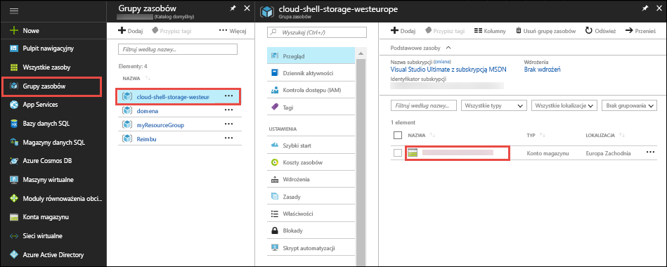
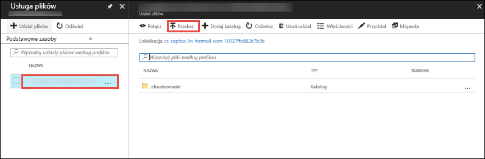

W [portalu Azure](https://portal.azure.com), kliknij przycisk **grup zasobów** > **chmurze-powłoki-magazynu -\<your_region >**  >   **\<storage_account_name >**.



W **omówienie** strony konta magazynu, wybierz opcję **pliki**.

Wybierz udział plików automatycznie generowanych i wybierz **przekazać**. Ten udział plików jest zainstalowany w chmurze powłoki jako `clouddrive`.



Kliknij selektor plików i wybierz plik ZIP, a następnie kliknij przycisk **przekazać**. 

W powłoce chmury za pomocą `ls` Aby sprawdzić, czy widzą przekazanego pliku ZIP w domyślnym `clouddrive` udziału.

```azurecli-interactive
ls clouddrive
```
