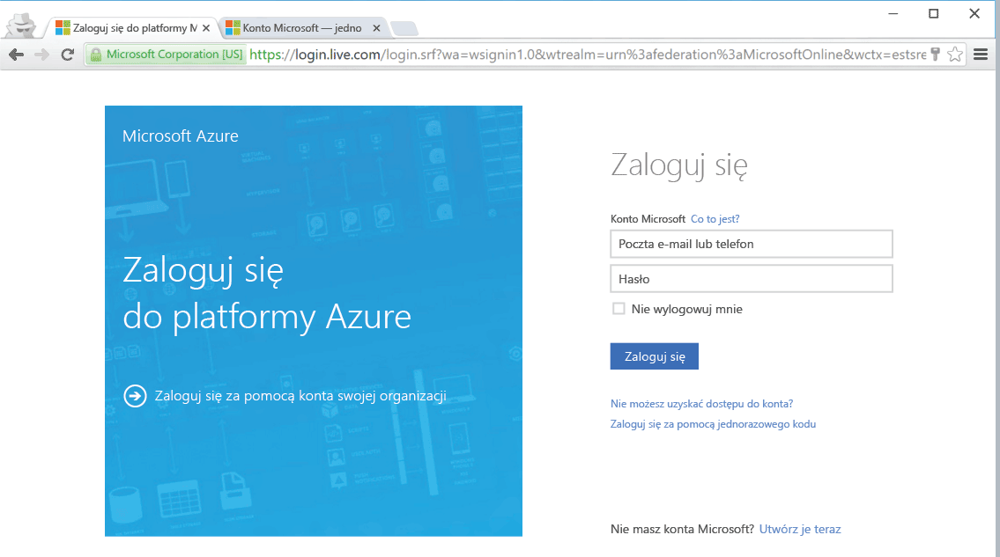

<!--
includes/azure-include-getting-started-v12portal-gettings-an-account.md

Latest Freshness check:  2016-04-11 , carlrab.

As of circa 2016-04-11, the following topics might include this include:
articles/sql-database/sql-database-get-started-tutorial.md

-->
## Łączenie z witryną Azure Portal w przypadku posiadania subskrypcji

Aby połączyć się z witryną Azure Portal, trzeba mieć subskrypcję.

### Zakładanie nowego konta

Jeśli nie masz jeszcze konta Azure, skorzystaj z jednej z poniższych opcji, by je założyć:

- Załóż [bezpłatne konto](https://azure.microsoft.com/get-started/).
- Użyj [subskrypcji MSDN](https://azure.microsoft.com/pricing/member-offers/msdn-benefits/).

### Logowanie przy użyciu istniejącego konta

Za pomocą [istniejącej subskrypcji]( https://account.windowsazure.com/Home/Index) wykonaj poniższe kroki, aby połączyć się z witryną Azure Portal.

1. Otwórz wybraną przeglądarkę i połącz się z witryną [Azure Portal](https://portal.azure.com/).

1. Zaloguj się w witrynie [Azure Portal](https://portal.azure.com/).

1. Kiedy zostanie wyświetlona strona **logowania**, podaj poświadczenia subskrypcji.

   

<!--HONumber=Sep16_HO3-->

