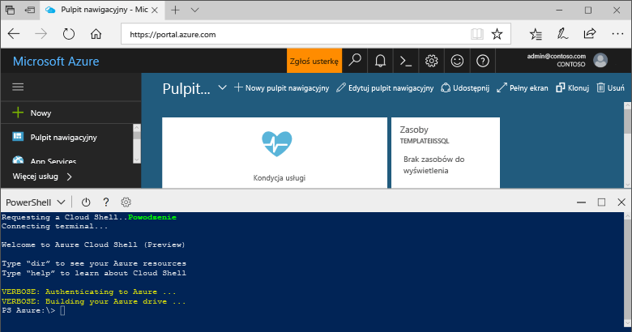

## Uruchamianie usługi Azure Cloud Shell

Usługa Azure Cloud Shell jest bezpłatną powłoką, którą można uruchamiać bezpośrednio w witrynie Azure Portal. Udostępnia ona wstępnie zainstalowane i najczęściej używane narzędzia platformy Azure, które są skonfigurowane do użycia na koncie. Kliknij przycisk **Cloud Shell** w menu w prawym górnym rogu witryny [Azure Portal](https://portal.azure.com).

Przycisk uruchamia interaktywną powłokę, której można używać do uruchamiania wszystkich kroków opisanych w tym temacie:

