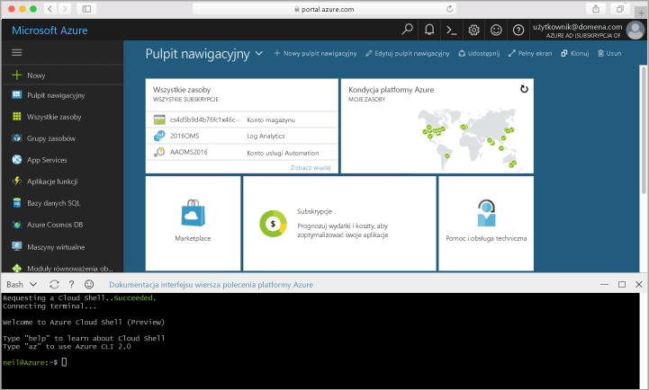

## Uruchamianie usługi Azure Cloud Shell

Usługa Azure Cloud Shell jest bezpłatną powłoką Bash, którą można uruchamiać bezpośrednio w witrynie Azure Portal. Ma ona wstępnie zainstalowany interfejs wiersza polecenia platformy Azure skonfigurowany do użycia z Twoim kontem. Kliknij przycisk **Cloud Shell** w menu w prawym górnym rogu witryny [Azure Portal](https://portal.azure.com).

Ten przycisk uruchamia interaktywną powłokę, której można używać do wykonywania kroków opisanych w tym temacie:

