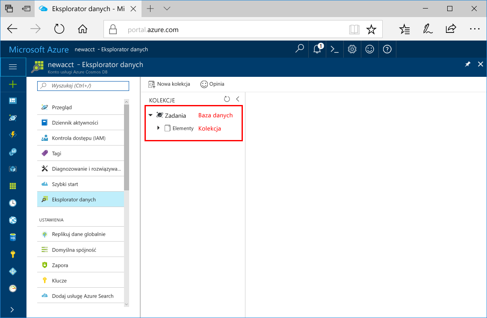

Teraz możesz użyć narzędzia Eksplorator danych w witrynie Azure Portal, aby utworzyć bazę danych i kolekcję. 

1. Kliknij przycisk **Eksploratora danych** > **nowej kolekcji**. 
    
    **Dodaj kolekcji** obszar jest wyświetlany po prawej, konieczne może być przewiń w prawo, aby go wyświetlić.

    

2. W **dodać kolekcji** wprowadź ustawienia dla nowej kolekcji.

    Ustawienie|Sugerowana wartość|Opis
    ---|---|---
    Identyfikator bazy danych|Zadania|Wprowadź *zadania* jako nazwę nowej bazy danych. Nazwy baz danych muszą zawierać od 1 do 255 znaków i nie mogą zawierać znaków /, \\, #, ? ani mieć spacji na końcu.
    Identyfikator kolekcji|Items|Wprowadź *elementów* jako nazwę nowej kolekcji. Kolekcja identyfikatorów mają te same wymagania znak nazwy bazy danych.
    Pojemność magazynu| Stała (10 GB)|Zmień wartość na **stałe (10 GB)**. Ta wartość to pojemność magazynu bazy danych.
    Przepływność|400 RU|Zmień przepływność 400 jednostek żądań na sekundę (RU/s). Jeśli chcesz zmniejszyć opóźnienie, możesz później przeskalować przepływność w górę.
    Klucz partycji|/category|Klucz partycji służący do równomiernego dystrybuowania danych do każdej partycji. Wybór odpowiedniego klucza partycji jest ważny w celu utworzenia wydajnej kolekcji. Więcej informacji zawiera temat [Designing for partitioning](../articles/cosmos-db/partition-data.md#designing-for-partitioning) (Projektowanie pod kątem partycjonowania).

    Kliknij przycisk **OK**.

    Eksplorator danych wyświetla nową bazę danych i kolekcji.

    