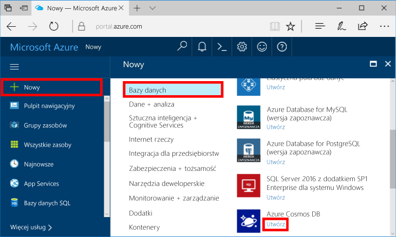
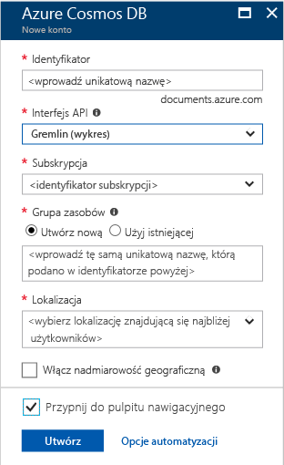

1. W nowym oknie zaloguj się do witryny [Azure Portal](https://portal.azure.com/).
2. W okienku po lewej stronie kliknij pozycję **Nowy**, kliknij pozycję **Bazy danych**, a następnie kliknij pozycję **Azure Cosmos DB**.
   
   

3. W bloku **Nowe konto** określ odpowiednią konfigurację konta usługi Azure Cosmos DB. 

    Usługa Azure Cosmos DB umożliwia wybór jednego z czterech modeli programowania: Gremlin (graf), MongoDB, SQL (DocumentDB) oraz Tabela (klucz-wartość).  
       
    W tym artykule Szybki start będziemy programować przy użyciu interfejsu API programu Graph, dlatego podczas wypełniania formularza wybierz pozycję **Gremlin (graf)**. Jeśli masz dane dokumentów z aplikacji wykazu, dane typu klucz/wartość (tabela) lub dane zmigrowane z aplikacji MongoDB, weź pod uwagę, że usługa Azure Cosmos DB może zapewnić globalnie rozproszoną platformę usługi bazy danych o wysokiej dostępności dla wszystkich Twoich aplikacji o znaczeniu krytycznym.

    W bloku **Nowe konto** wypełnij pola, używając informacji przedstawionych na poniższym zrzucie ekranu jako wskazówki. Ponieważ Twoje wartości nie będą odpowiadać tym na zrzucie ekranu, pamiętaj, aby podczas konfigurowania konta wybierać unikatowe wartości. 
 
    

    Ustawienie|Sugerowana wartość|Opis
    ---|---|---
    ID|*Unikatowa wartość*|Wybrana unikatowa wartość służąca do identyfikacji konta usługi Azure Cosmos DB. Ponieważ adres *documents.azure.com* jest dołączany do podanego identyfikatora w celu utworzenia identyfikatora URI, użyty identyfikator powinien być unikatowy, ale rozpoznawalny. Identyfikator może zawierać tylko małe litery, cyfry i znaki łącznika (-) oraz musi zawierać od 3 do 50 znaków.
    Interfejs API|Gremlin (graf)|W dalszej części będziemy programować przy użyciu [interfejsu API programu Graph](../articles/cosmos-db/graph-introduction.md).|
    Subskrypcja|*Twoja subskrypcja*|Subskrypcja platformy Azure, która ma być używana dla usługi Azure Cosmos DB. 
    Grupa zasobów|*Taka sama wartość jak identyfikator*|Nazwa nowej grupy zasobów dla Twojego konta. Dla uproszczenia można użyć takiej samej nazwy jak identyfikator. 
    Lokalizacja|*Region najbliżej Twoich użytkowników*|Lokalizacja geograficzna, w której będzie hostowane Twoje konto usługi Azure Cosmos DB. Wybierz lokalizację znajdującą się najbliżej Twoich użytkowników, aby zapewnić im najszybszy dostęp do danych.

4. Kliknij przycisk **Utwórz**, aby utworzyć konto.
5. Na pasku narzędzi kliknij pozycję **Powiadomienia**, aby monitorować proces wdrażania.

    

6.  Po zakończeniu wdrażania otwórz nowe konto przy użyciu kafelka **Wszystkie zasoby**. 

    