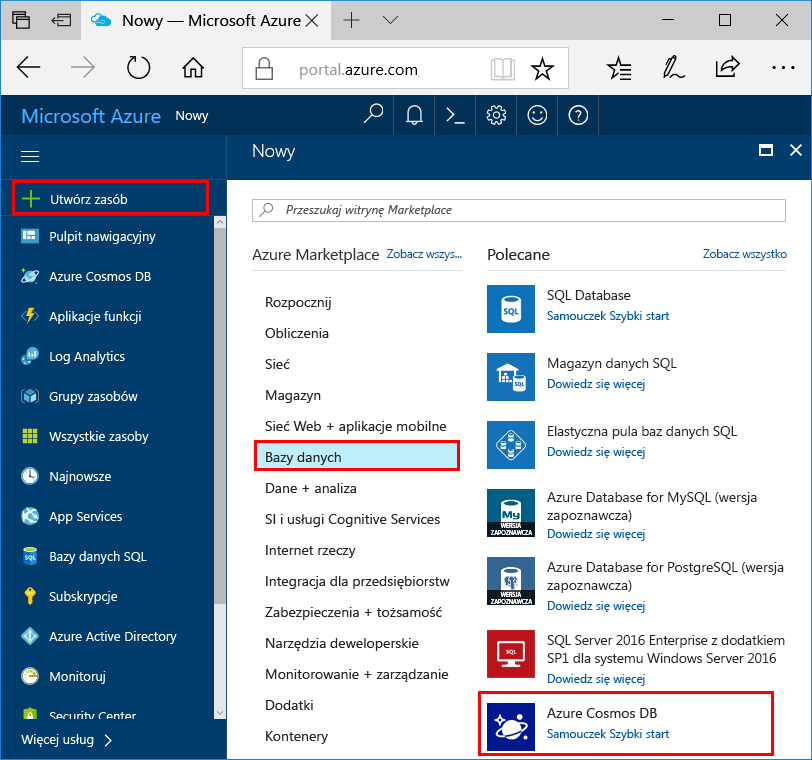
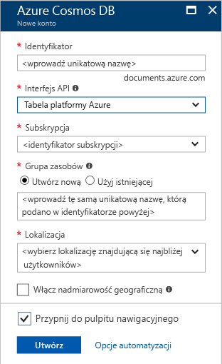

1. W nowym oknie przeglądarki, zaloguj się do [portalu Azure](https://portal.azure.com/).
2. W menu po lewej stronie kliknij pozycję **Nowy**, kliknij pozycję **Bazy danych**, a następnie w obszarze **Azure Cosmos DB** kliknij pozycję **Utwórz**. 
   
   

3. W **nowe konto** wprowadź ustawienia dla nowego konta bazy danych Azure rozwiązania Cosmos. 
 
    Ustawienie|Sugerowana wartość|Opis
    ---|---|---
    ID|*Wprowadź unikatową nazwę*|Wprowadź unikatową nazwę pozwalającą zidentyfikować to konto bazy danych Azure rozwiązania Cosmos. Ponieważ adres *documents.azure.com* jest dołączany do podanego identyfikatora w celu utworzenia identyfikatora URI, użyty identyfikator powinien być unikatowy, ale rozpoznawalny.  Identyfikator może zawierać tylko małe litery, cyfry i znaki łącznika (-) oraz musi zawierać od 3 do 50 znaków.
    Interfejs API|Tabela platformy Azure|Interfejs API Określa typ konta, aby utworzyć. Azure DB rozwiązania Cosmos zawiera pięć interfejsy API w celu odpowiada potrzebom aplikacji: SQL (baza danych dokumentu), Gremlin (wykres bazy danych) bazy danych MongoDB (baza danych dokumentu), tabel Azure i Cassandra, każdy wymagających obecnie oddzielne konto.  Wybierz **tabel Azure** ponieważ w tym szybkiego startu tworzysz tabelę, która współdziała z interfejsu API tabeli.  [Dowiedz się więcej o interfejsie API tabeli](../articles/cosmos-db/table-introduction.md) |
    Subskrypcja|*Wprowadzić taką samą nazwę unikatową, co zostało opisane powyżej w identyfikatorze*|Wybierz subskrypcję Azure, która ma być używany dla tego konta bazy danych Azure rozwiązania Cosmos. 
    Grupa zasobów|*Taka sama wartość jak identyfikator*|Wprowadź nazwę nowej grupy zasobów dla Twojego konta. Dla uproszczenia można użyć takiej samej nazwy jak identyfikator. 
    Lokalizacja|*Wybierz region najbliższy użytkowników*|Wybierz lokalizację geograficzną, w której będzie hostowane konto bazy danych Azure rozwiązania Cosmos. Użyj lokalizacji, która jest najbardziej zbliżony do użytkowników, aby uzyskać instrukcje na temat najszybszy dostęp do danych.
    Włącz nadmiarowość geograficzna| Pozostaw puste | Spowoduje to utworzenie replikowanych wersji bazy danych w drugim regionie (sparowany). To pole pozostanie puste.  
    Przypnij do pulpitu nawigacyjnego | Wybierz pozycję | Zaznacz to pole, dzięki czemu nowe konto bazy danych zostanie dodane do pulpitu nawigacyjnego portalu, by mieć łatwy dostęp.

    Następnie kliknij pozycję **Utwórz**.  

    

4. Tworzenie konta zajmuje kilka minut. Podczas tworzenie konta portalu Wyświetla **wdrażania rozwiązania Cosmos bazy danych Azure** kafelka.

    

    Po utworzeniu konta **Gratulacje! Utworzono konto bazy danych Azure rozwiązania Cosmos** zostanie wyświetlona strona.
