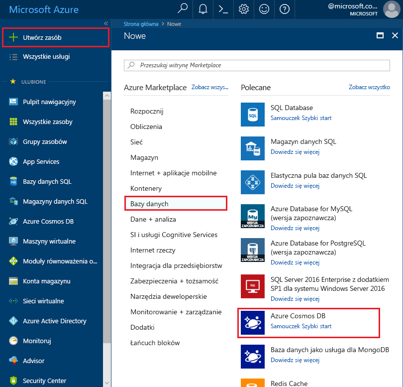
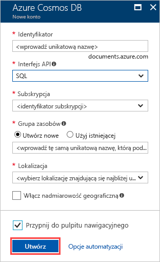

1. W nowym oknie zaloguj się do witryny [Azure Portal](https://portal.azure.com/).
2. W okienku po lewej stronie kliknij pozycję **Nowy**, kliknij pozycję **Bazy danych**, a następnie kliknij pozycję **Azure Cosmos DB**.
   
   

3. W bloku **Nowe konto** określ żądaną konfigurację tego konta usługi Azure Cosmos DB. 

    Usługa Azure Cosmos DB umożliwia wybranie jednego z czterech modeli programowania: Gremlin (graf), MongoDB, SQL (DocumentDB) oraz Tabela (klucz-wartość). Każdy z tych modeli wymaga obecnie osobnego konta.
    
    W tym artykule Szybki start będziemy programować przy użyciu interfejsu API usługi DocumentDB, dlatego podczas wypełniania formularza wybierz pozycję **SQL (DocumentDB)**. Jeśli masz dane grafu dla aplikacji mediów społecznościowych, dane typu klucz/wartość (tabela) lub dane zmigrowane z aplikacji MongoDB, weź pod uwagę, że usługa Azure Cosmos DB może zapewnić globalnie rozproszoną platformę usługi bazy danych o wysokiej dostępności dla wszystkich Twoich aplikacji o znaczeniu krytycznym.

    Wypełnij pola w bloku **Nowe konto**, używając informacji przedstawionych na poniższym zrzucie ekranu jako wskazówki — Twoje wartości mogą różnić się od wartości na zrzucie ekranu.
 
    

    Ustawienie|Sugerowana wartość|Opis
    ---|---|---
    ID|*Unikatowa wartość*|Unikatowa nazwa do identyfikacji tego konta usługi Azure Cosmos DB. Ponieważ adres *documents.azure.com* jest dołączany do podanego identyfikatora w celu utworzenia identyfikatora URI, użyty identyfikator powinien być unikatowy, ale rozpoznawalny. Identyfikator może zawierać tylko małe litery, cyfry i znaki łącznika (-) oraz musi zawierać od 3 do 50 znaków.
    Interfejs API|SQL (DocumentDB)|W dalszej części artykułu będziemy programować przy użyciu [interfejsu API usługi DocumentDB](../articles/documentdb/documentdb-introduction.md).|
    Subskrypcja|*Twoja subskrypcja*|Subskrypcja platformy Azure, która ma być używana dla tego konta usługi Azure Cosmos DB. 
    Grupa zasobów|*Taka sama wartość jak identyfikator*|Nazwa nowej grupy zasobów dla Twojego konta. Dla uproszczenia można użyć takiej samej nazwy jak identyfikator. 
    Lokalizacja|*Region najbliżej Twoich użytkowników*|Lokalizacja geograficzna, w której będzie hostowane Twoje konto usługi Azure Cosmos DB. Wybierz lokalizację znajdującą się najbliżej Twoich użytkowników, aby zapewnić im najszybszy dostęp do danych.
4. Kliknij przycisk **Utwórz**, aby utworzyć konto.
5. Na górnym pasku narzędzi kliknij ikonę **Powiadomienia** , aby monitorować proces wdrażania.

    

6.  Gdy w oknie Powiadomienia zostanie wyświetlona informacja o pomyślnym wdrożeniu, zamknij okno powiadomień i otwórz nowe konto z poziomu kafelka **Wszystkie zasoby** na pulpicie nawigacyjnym. 

    
 
