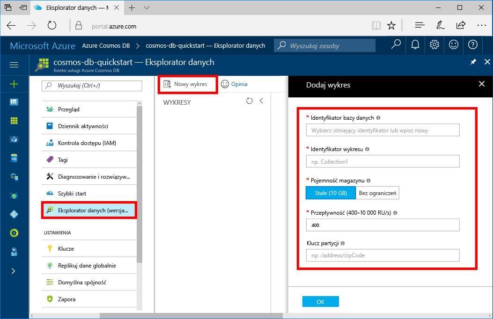

Teraz możesz użyć narzędzia Eksplorator danych w witrynie Azure Portal, aby utworzyć bazę danych grafów. 

1. W portalu Azure, w menu po lewej stronie, wybierz **Eksploratora danych (wersja zapoznawcza)**.

2. W obszarze **Eksploratora danych (wersja zapoznawcza)**, wybierz pozycję **nowy wykres**. Następnie wypełnij strony, korzystając z następujących informacji:

    

    Ustawienie|Sugerowana wartość|Opis
    ---|---|---
    Identyfikator bazy danych|sample-database|Wprowadź *sample-database* jako nazwę nowej bazy danych. Nazwy bazy danych musi należeć do zakresu od 1 do 255 znaków i nie może zawierać `/ \ # ?` lub spacji.
    Identyfikator grafu|sample-graph|Wprowadź *sample-graph* jako nazwę nowej kolekcji. W przypadku nazw grafów obowiązują takie same wymagania dotyczące znaków jak dla identyfikatorów baz danych.
    Pojemność magazynu| 10 GB|Pozostaw wartość domyślną. To jest pojemność magazynu bazy danych.
    Przepływność|400 jednostek żądania|Pozostaw wartość domyślną. Później możesz skalować przepływność, aby zmniejszyć opóźnienie.

3. Po wypełnić formularza wybierz **OK**.
