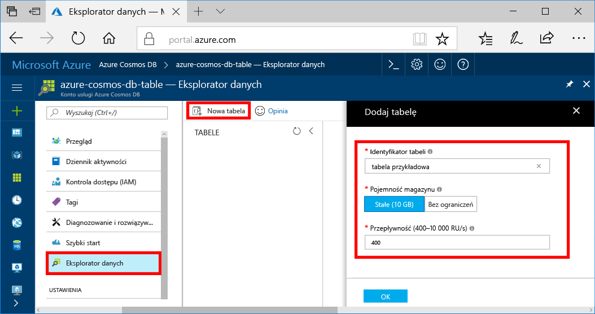
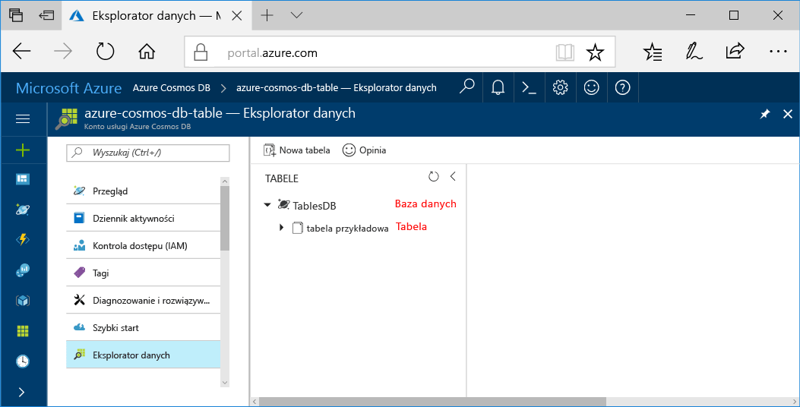

Można teraz używać narzędzia Eksplorator danych w portalu Azure, można utworzyć bazy danych i tabeli. 

1. Kliknij przycisk **Eksploratora danych** > **nową tabelę**. 
    
    **Dodaj tabelę** obszar jest wyświetlany po prawej, konieczne może być przewiń w prawo, aby go wyświetlić.

    

2. W **Dodaj tabelę** wprowadź ustawienia dla nowej tabeli.

    Ustawienie|Sugerowana wartość|Opis
    ---|---|---
    Identyfikator tabeli|sample-table|Identyfikator nowej tabeli. W przypadku nazw tabel obowiązują takie same wymagania dotyczące znaków, jak dla identyfikatorów baz danych. Nazwy baz danych muszą zawierać od 1 do 255 znaków i nie mogą zawierać znaków `/ \ # ?` ani mieć spacji na końcu.
    Pojemność magazynu| Stała (10 GB)|Zmień wartość na **stałe (10 GB)**. Ta wartość to pojemność magazynu bazy danych.
    Przepływność|400 jednostek żądania|Zmień przepływność 400 jednostek żądań na sekundę (RU/s). Jeśli chcesz zmniejszyć opóźnienie, możesz później przeskalować przepływność w górę.

    Kliknij przycisk **OK**.

    Eksplorator danych wyświetla nową bazę danych i tabeli.

    