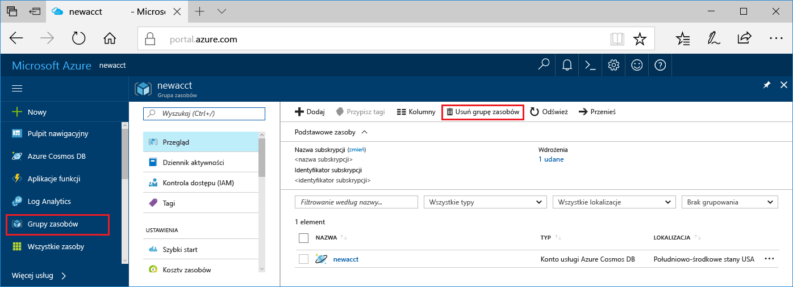

Jeśli nie zamierzasz nadal korzystać z tej aplikacji, należy usunąć wszystkie zasoby utworzone przez tego przewodnika Szybki Start z następujących kroków, nie poniesiesz żadnych dodatkowych opłat:

1. W portalu Azure wybierz **grup zasobów** przy lewej.  

   

2. Z listy grup zasobów, wybierz grupę zasobów utworzone, a następnie kliknij przycisk **Usuń grupę zasobów**.

3. Wpisz nazwę grupy zasobów, aby usunąć, a następnie kliknij przycisk **usunąć**.

