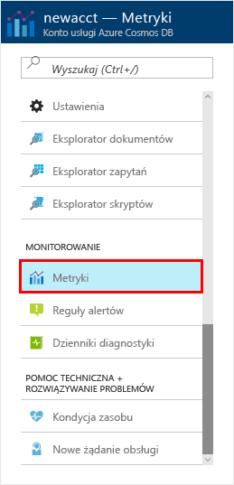
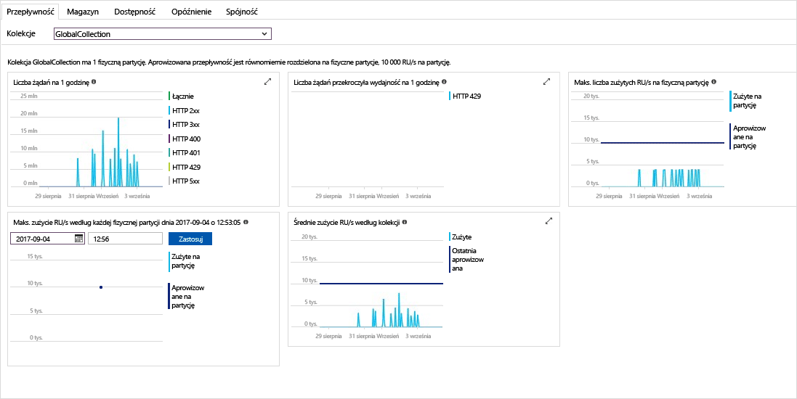

Przepływność, magazynu, dostępności, opóźnienia i spójności zasobów na koncie są monitorowane w portalu Azure. Spójrzmy szybki w tych metryk. 

1. Kliknij przycisk **metryki** w menu nawigacji.

   

2. Kliknij opcję za pośrednictwem każdej z kart, aby znane metryki, będzie stosowany bazy danych Azure rozwiązania Cosmos. 

    Każdy wykres, z którym skojarzony jest [Azure rozwiązania Cosmos DB umowy dotyczące poziomu usług (SLA)](https://azure.microsoft.com/support/legal/sla/cosmos-db/) zawiera wiersz, który zawiera, jeśli dowolne SLA zostały naruszone. Azure DB rozwiązania Cosmos sprawia, że monitorowanie warunków umów SLA przezroczysty z tego zestawu metryki. 

   