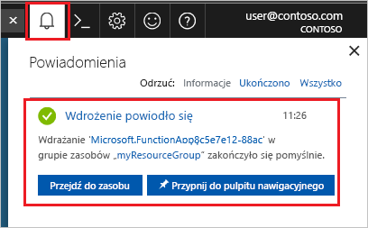

1. Kliknij pozycję **Utwórz zasób** znajdującą się w lewym górnym rogu witryny Azure Portal, a następnie wybierz pozycje **Obliczenia** > **Aplikacja funkcji**. 

    

2. Użyj ustawień aplikacji funkcji podanych w tabeli pod obrazem.

    

    | Ustawienie      | Sugerowana wartość  | Opis                                        |
    | ------------ |  ------- | -------------------------------------------------- |
    | **Nazwa aplikacji** | Nazwa unikatowa w skali globalnej | Nazwa identyfikująca nową aplikację funkcji. Prawidłowe znaki to `a-z`, `0-9` i `-`.  | 
    | **Subskrypcja** | Twoja subskrypcja | Subskrypcja, w ramach której jest tworzona ta nowa aplikacja funkcji. | 
    | **[Grupa zasobów](../articles/azure-resource-manager/resource-group-overview.md)** |  myResourceGroup | Nazwa nowej grupy zasobów, w której ma zostać utworzona aplikacja funkcji. | 
    | **OS** | Windows | Hosting bezserwerowy jest obecnie dostępny tylko w przypadku uruchamiania w systemie Windows. Aby uzyskać informacje o hostingu w systemie Linux, zobacz [Tworzenie pierwszej funkcji działającej w systemie Linux z poziomu interfejsu wiersza polecenia platformy Azure](../articles/azure-functions/functions-create-first-azure-function-azure-cli-linux.md). |
    | **[Plan hostingu](../articles/azure-functions/functions-scale.md)** |   Plan Zużycie | Plan hostingu określający sposób przydzielania zasobów do aplikacji funkcji. W domyślnym planie (**Plan Zużycie**) zasoby są dodawane dynamicznie zgodnie z wymaganiami funkcji. W przypadku tego hostingu [bezserwerowego](https://azure.microsoft.com/overview/serverless-computing/) opłaty są naliczane tylko wtedy, gdy funkcje są uruchomione.   |
    | **Lokalizacja** | Europa Zachodnia | Wybierz [region](https://azure.microsoft.com/regions/) w swojej okolicy lub w pobliżu innych usług, do których Twoje funkcje uzyskują dostęp. |
    | **[Konto magazynu](../articles/storage/common/storage-create-storage-account.md#create-a-storage-account)** |  Nazwa unikatowa w skali globalnej |  Nazwa nowego konta magazynu używanego przez aplikację funkcji. Nazwy kont usługi Magazyn muszą mieć długość od 3 do 24 znaków i mogą zawierać tylko cyfry i małe litery. Możesz także użyć istniejącego konta. |

1. Kliknij pozycję **Utwórz**, aby zainicjować obsługę nowej aplikacji funkcji i wdrożyć ją. Stan wdrożenia można monitorować, klikając ikonę powiadomienia w prawym górnym rogu portalu. 

    

    Kliknięcie pozycji **Przejdź do zasobu** spowoduje przejście do nowej aplikacji funkcji.
