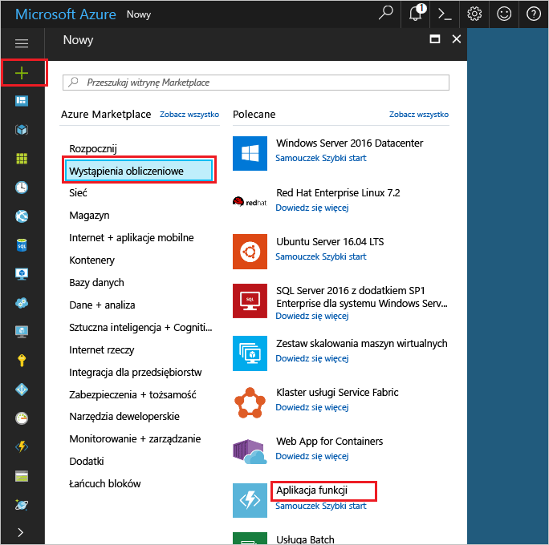
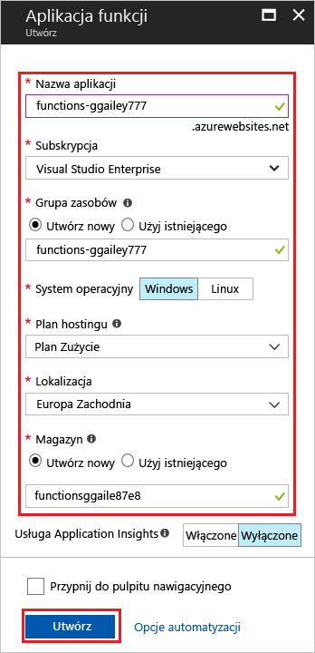

1. Kliknij przycisk **nowy** znaleziono przycisku w lewym górnym rogu portalu Azure, następnie wybierz opcję **obliczeniowe** > **aplikacji funkcji**. 

    

2. Użyj ustawień aplikacji funkcji określoną w tabeli poniżej obrazu.

    

    | Ustawienie      | Sugerowana wartość  | Opis                                        |
    | ------------ |  ------- | -------------------------------------------------- |
    | **Nazwa aplikacji** | Nazwa unikatowa w skali globalnej | Nazwa identyfikująca nową aplikację funkcji. Prawidłowe znaki to `a-z`, `0-9`, i `-`.  | 
    | **Subskrypcja** | Twoja subskrypcja | Subskrypcja, pod którym zostanie utworzona tej nowej funkcji aplikacji. | 
    | **[Grupa zasobów](../articles/azure-resource-manager/resource-group-overview.md)** |  myResourceGroup | Nazwa nowej grupy zasobów, w której ma zostać utworzona aplikacja funkcji. | 
    | **SYSTEM OPERACYJNY** | Windows | Hosting niekorzystającą jest obecnie dostępny tylko podczas uruchamiania w systemie Windows. Do obsługi systemu Linux, zobacz [tworzenie pierwszej funkcji uruchomiony w systemie Linux przy użyciu interfejsu wiersza polecenia Azure](../articles/azure-functions/functions-create-first-azure-function-azure-cli-linux.md). |
    | **[Plan hostingu](../articles/azure-functions/functions-scale.md)** |   Plan Zużycie | Plan hostingu określający sposób przydzielania zasobów do aplikacji funkcji. W domyślnym planie (**Plan Zużycie**) zasoby są dodawane dynamicznie zgodnie z wymaganiami funkcji. W tym [niekorzystającą](https://azure.microsoft.com/overview/serverless-computing/) hostingu płacisz tylko za czas uruchomienia funkcji.   |
    | **Lokalizacja** | Europa Zachodnia | Wybierz lokalizację w swojej okolicy lub w pobliżu innych usług, do których Twoje funkcje będą uzyskiwać dostęp. |
    | **[Konto magazynu](../articles/storage/common/storage-create-storage-account.md#create-a-storage-account)** |  Nazwa unikatowa w skali globalnej |  Nazwa nowego konta magazynu używanego przez aplikację funkcji. Nazwy kont usługi Magazyn muszą mieć długość od 3 do 24 znaków i mogą zawierać tylko cyfry i małe litery. Możesz także użyć istniejącego konta. |

1. Kliknij pozycję **Utwórz**, aby zainicjować obsługę nowej aplikacji funkcji i wdrożyć ją.
