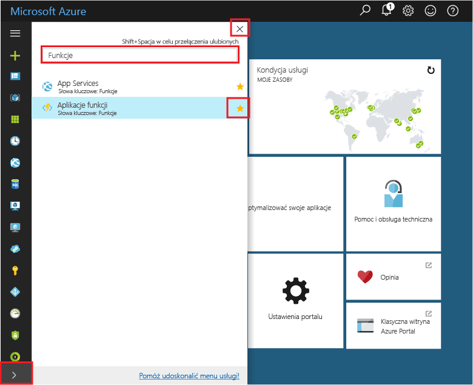
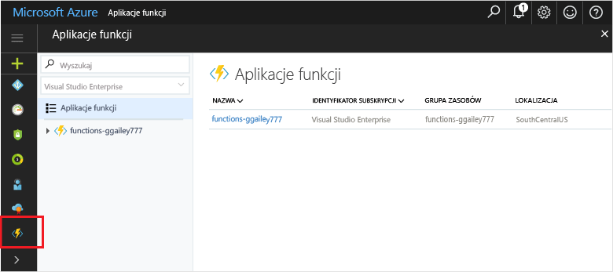

## Funkcje ulubionych w portalu 

Jeśli jeszcze tego nie zrobiono, dodaj aplikację funkcji do ulubionych w witrynie Azure Portal. Ułatwia to znajdowanie aplikacji funkcji. Jeśli już wykonano ten krok, przejdź do kolejnej sekcji. 

1. Zaloguj się do witryny [Azure Portal](https://portal.azure.com/).

2. Kliknij strzałkę w lewym dolnym rogu, aby rozwinąć wszystkie usługi, wpisz `Functions` w polu **Filtr**, a następnie kliknij przycisk gwiazdki obok pozycji **Aplikacje funkcji**.  
 
    

    Powoduje to dodanie ikony Funkcje do menu po lewej stronie portalu.

3. Zamknij menu, a następnie przewiń w dół, aby wyświetlić ikonę Funkcje. Kliknij tę ikonę, aby wyświetlić listę wszystkich aplikacji funkcji. Kliknij aplikację funkcji, aby pracować z funkcjami w tej aplikacji. 
 
    
 
     