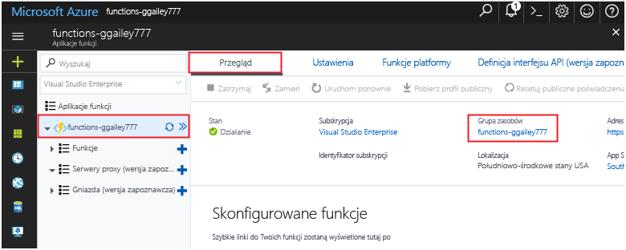

Inne przewodniki Szybki start w tej kolekcji bazują na tym przewodniku. Jeśli planujesz kontynuować pracę z kolejnymi przewodnikami Szybki start lub samouczkami, nie usuwaj zasobów utworzonych w tym przewodniku Szybki start. 

Jeśli nie planujesz kontynuować, kliknij opcję **Grupa zasobów** dla aplikacji funkcji w portalu, a następnie kliknij pozycję **Usuń**. 

