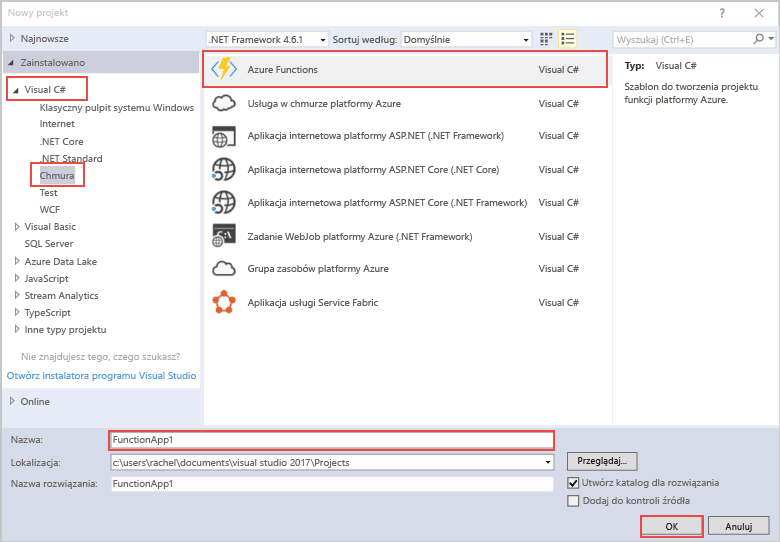

Szablon projektu usługi Azure Functions w programie Visual Studio umożliwia utworzenie projektu, który można opublikować w aplikacji funkcji na platformie Azure. Aplikacja funkcji umożliwia grupowanie funkcji jako jednostki logicznej, co ułatwia wdrażanie i udostępnianie zasobów oraz zarządzanie nimi.   

1. Kliknij prawym przyciskiem myszy węzeł projektu w **Eksploratorze rozwiązań**, a następnie wybierz pozycję **Dodaj** > **Nowy element**. W oknie dialogowym wybierz pozycję **Azure Function**.

2. W oknie dialogowym **Nowy projekt** rozwiń węzeł **Visual C#** > **Chmura**, wybierz pozycję **Azure Functions**, wpisz **nazwę** swojego projektu, a następnie kliknij przycisk **OK**. Nazwa aplikacji funkcji musi być prawidłową nazwą przestrzeni nazw C#, dlatego nie należy używać znaków podkreślenia, łączników ani znaków innych niż alfanumeryczne. 

    