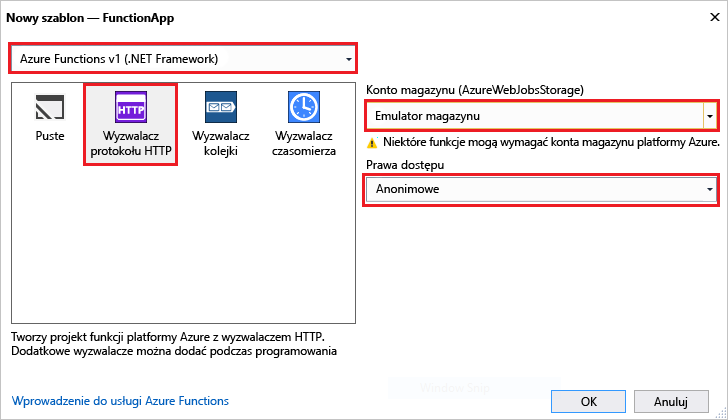

Szablon projektu usługi Azure Functions w programie Visual Studio umożliwia utworzenie projektu, który można opublikować w aplikacji funkcji na platformie Azure. Funkcja umożliwia aplikacji grupy funkcje jako jednostki logicznej do zarządzania, wdrażania i udostępnianie zasobów.   

1. W programie Visual Studio, wybierz **nowy** > **projektu** z **pliku** menu. 

2. W **nowy projekt** okno dialogowe, wybierz opcję **zainstalowana**, rozwiń węzeł **Visual C#** > **chmury**, wybierz pozycję **Azure Funkcje**, wpisz **nazwa** Twojego projektu, a następnie kliknij przycisk **OK**. Nazwa aplikacji funkcji musi być prawidłową nazwą przestrzeni nazw C#, dlatego nie należy używać znaków podkreślenia, łączników ani znaków innych niż alfanumeryczne. 

     

2. Użyj ustawień określonych w tabeli poniżej obrazu.
 
     

    | Ustawienie      | Sugerowana wartość  | Opis                      |
    | ------------ |  ------- |----------------------------------------- |
    | **Wersja** | Środowisko Azure Functions v1  (.NET framework) | Spowoduje to utworzenie projektu funkcja, która używa środowiska wykonawczego w wersji 1 usługi Azure functions. Środowiska wykonawczego w wersji 2, który obsługuje .NET Core, jest obecnie w przeglądzie. Aby uzyskać więcej informacji, zobacz [jak docelowa wersja środowiska uruchomieniowego usługi Azure Functions](../articles/azure-functions/functions-versions.md).   | 
    | **Szablon** | Wyzwalacz HTTP | Spowoduje to utworzenie funkcja wyzwalana przez żądanie HTTP. |
    | **Konto magazynu**  | Emulator magazynu | Wyzwalacz protokołu HTTP nie używa konta połączenia z magazynem. Wszystkie inne typy wyzwalacza wymagają prawidłowe parametry połączenia konta magazynu. |
    | **Prawa dostępu** | Anonimowe | Utworzony funkcja może zostać wyzwolone przez klienta, bez konieczności podawania klucza. To ustawienie autoryzacji ułatwia przetestować nową funkcję. Aby uzyskać więcej informacji na temat kluczy i autoryzacji, zobacz [klucze autoryzacji](../articles/azure-functions/functions-bindings-http-webhook.md#authorization-keys) w [powiązania protokołu HTTP i webhook](../articles/azure-functions/functions-bindings-http-webhook.md). |         
3. Kliknij przycisk **OK** do funkcji tworzenia projektu i HTTP wyzwalane funkcji. 

