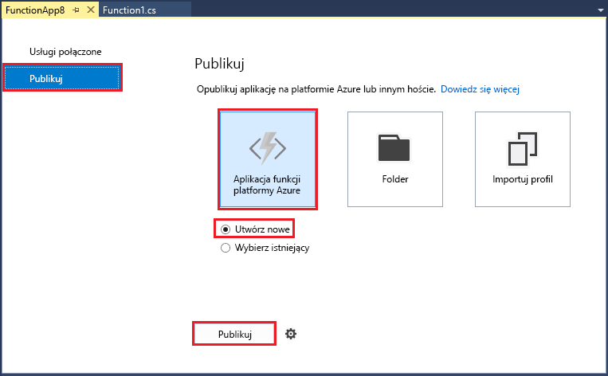
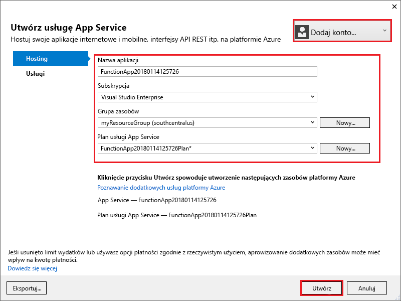
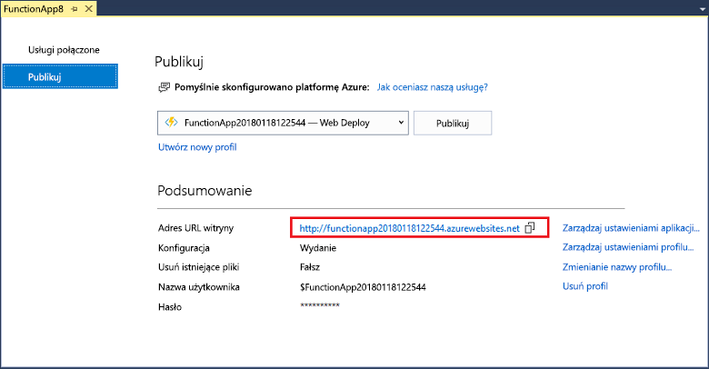

1. W **Eksploratorze rozwiązań** kliknij prawym przyciskiem myszy projekt i wybierz polecenie **Opublikuj**. Wybierz **tworzenia nowych** , a następnie **publikowania**. 

    

2. Jeśli jeszcze nie zostało to jeszcze połączenia programu Visual Studio do konta platformy Azure, wybierz **Dodaj konto...** .  

3. W oknie dialogowym **Tworzenie usługi App Service** użyj ustawień **Hosting** określonych w poniższej tabeli: 

    

    | Ustawienie      | Sugerowana wartość  | Opis                                |
    | ------------ |  ------- | -------------------------------------------------- |
    | **Nazwa aplikacji** | Nazwa unikatowa w skali globalnej | Unikatowa nazwa identyfikująca nową aplikację funkcji. |
    | **Subskrypcja** | Wybierz subskrypcję | Subskrypcja platformy Azure, która ma być używana. |
    | **[Grupa zasobów](../articles/azure-resource-manager/resource-group-overview.md)** | myResourceGroup |  Nazwa grupy zasobów, w której ma zostać utworzona aplikacja funkcji. Wybierz **nowy** Aby utworzyć nową grupę zasobów.|
    | **[Plan usługi App Service](../articles/azure-functions/functions-scale.md)** | Plan Zużycie | Upewnij się, że wybrano **zużycie** w obszarze **rozmiar** po kliknięciu **nowy** Aby utworzyć nowy plan. Możesz także określić **lokalizacji** w [region](https://azure.microsoft.com/regions/) pobliżu lub w jego pobliżu innych usług w funkcji dostępu.  |

    >[!NOTE]
    >Konto magazynu platformy Azure jest wymagane przez środowisko uruchomieniowe Functions. W związku z tym nowe konto magazynu platformy Azure utworzono dla Ciebie podczas tworzenia aplikacji funkcji.

4. Kliknij przycisk **Utwórz** do tworzenia aplikacji funkcji i powiązanych zasobów na platformie Azure przy użyciu tych ustawień i wdrażanie funkcji kodu projektu. 

5. Po zakończeniu wdrażania Zanotuj **adres URL witryny** wartość, która jest adresem aplikacji funkcji na platformie Azure.

    
