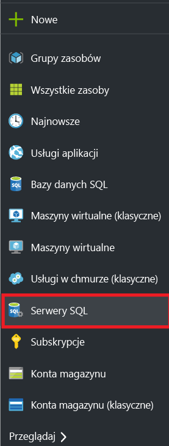
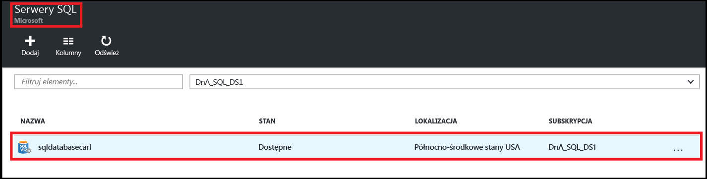
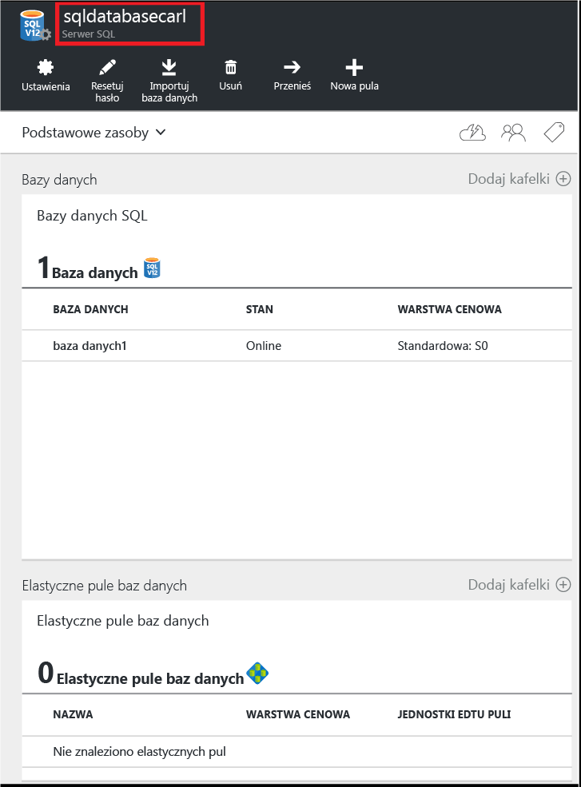
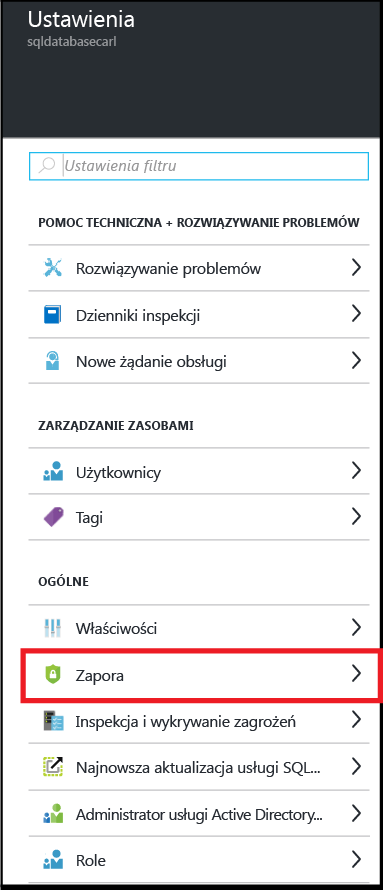
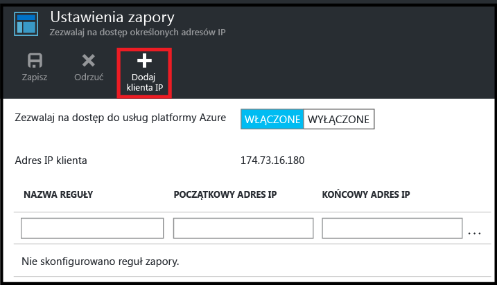
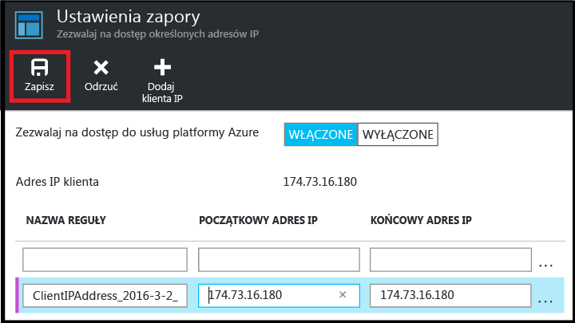

<!--
includes/sql-database-create-new-server-firewall-portal.md

Latest Freshness check:  2016-08-01 , rickbyh.

As of circa 2016-04-11, the following topics might include this include:
articles/sql-database/sql-database-get-started-tutorial.md
articles/sql-database/sql-database-configure-firewall-settings

-->
## Tworzenie nowej zapory poziomu serwera SQL Azure

Wykonaj następujące kroki w witrynie Azure Portal, aby utworzyć regułę zapory na poziomie serwera, która umożliwi połączenia z indywidualnego adresu IP (komputera klienckiego) lub całego zakresu adresów IP z serwerem logicznym usługi SQL Database.

1. Połącz się z [witryną Azure Portal](http://portal.azure.com), jeśli połączenie nie zostało nawiązane już wcześniej.
2. W bloku domyślnym kliknij pozycję **Serwery SQL**.

    

3. W bloku **Serwery SQL** kliknij serwer, na którym ma zostać utworzona reguła zapory.

    

4. Sprawdź właściwości serwera.

    

5. W bloku **Ustawienia** kliknij opcję **Zapora**.

    

    > [AZURE.NOTE] Dostęp do bloku **Ustawienia zapory** na poziomie serwera można uzyskać również z paska narzędzi bloku **Baza danych**.

6. Kliknij opcję **Dodaj adres IP klienta**, aby na platformie Azure została utworzona reguła dotycząca adresu IP klienta.

      

7. Opcjonalnie, aby zezwolić na dostęp dla zakresu adresów IP, kliknij dodany adres IP w celu zmodyfikowania adresu zapory.

      

8. Kliknij przycisk **Zapisz**, aby utworzyć regułę zapory poziomu serwera.

     

    >[AZURE.IMPORTANT] Adres IP klienta może się zmieniać, co spowoduje, że serwer będzie niedostępny do momentu utworzenia nowej reguły zapory. Swój adres IP możesz sprawdzić za pomocą usługi [Bing](http://www.bing.com/search?q=my%20ip%20address). Następnie dodaj pojedynczy adres IP lub zakres adresów IP. Aby uzyskać szczegółowe informacje, zobacz temat [Zarządzanie ustawieniami zapory](sql-database-configure-firewall-settings.md#manage-existing-server-level-firewall-rules-through-the-azure-portal).

<!---HONumber=Sep16_HO3-->
