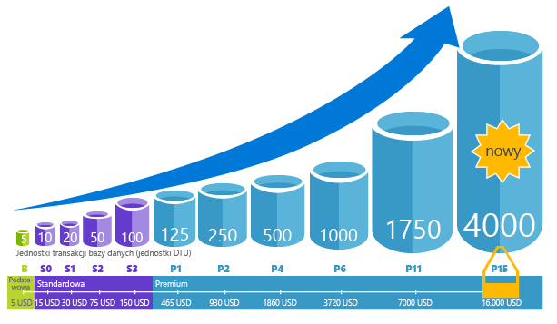
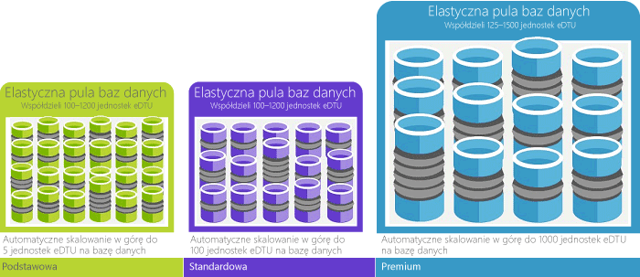

データベース トランザクション ユニット (DTU) は、データベースのトランザクションという実際の測定に基づいたデータベースの相対的な能力を表す SQL Database の測定単位です。 オンライン トランザクション処理 (OLTP) 要求され、何件取引が完全に完了するで 1 秒あたりのロード条件用には、一般的な操作のセットを作成しました (短いバージョンは、厄介な詳細を参照して、 [のベンチマークの概要](../articles/sql-database/sql-database-benchmark-overview.md))。 

Basic データベースは 5 DTU です。つまり、1 秒間に 5 トランザクションを完了できます。一方、Premium P11 データベースは 1750 DTU です。 

### DTU と eDTU

単一のデータベースの DTU は、エラスティック データベースの eDTU に直接変換されます。 たとえば、Basic エラスティック データベース プール内のデータベースが最大 5 eDTU を提供するとします。 これは、Basic 単一データベースと同等のパフォーマンスです。 違いは、エラスティック データベースは必要になるまでプールの eDTU を使用しない点です。 

単純な例を次に示します。 1000 DTU の Basic エラスティック データベース プールがあるとします。プール内には 800 個のデータベースがあります。 同時に使用されているデータベースが 800 個中 200 個のデータベースのみであれば (5 DTU X 200 = 1000)、プールの上限を超えることはなく、データベースのパフォーマンスは低下しません。 この例は、わかりやすくするために単純化しています。 実際には、もう少し複雑な計算が行われます。 ポータルでは自動計算され、データベースの使用履歴に基づいて推奨が表示されます。 参照してください [弾力性データベース プールの価格およびパフォーマンスに関する考慮事項](../articles/sql-database/sql-database-elastic-pool-guidance.md) 使用する方法については、推奨事項、または、自分で計算を行います。 

